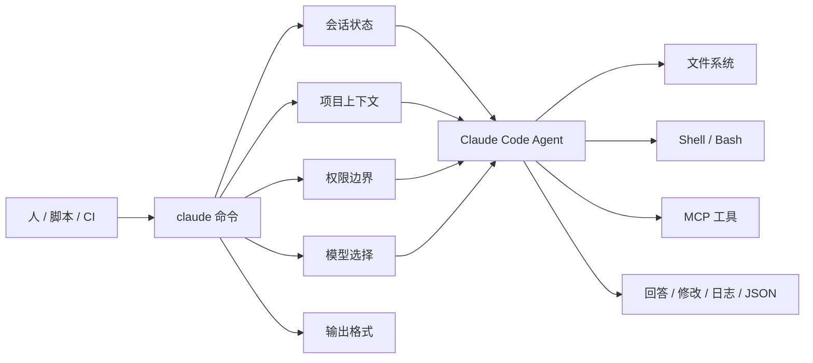
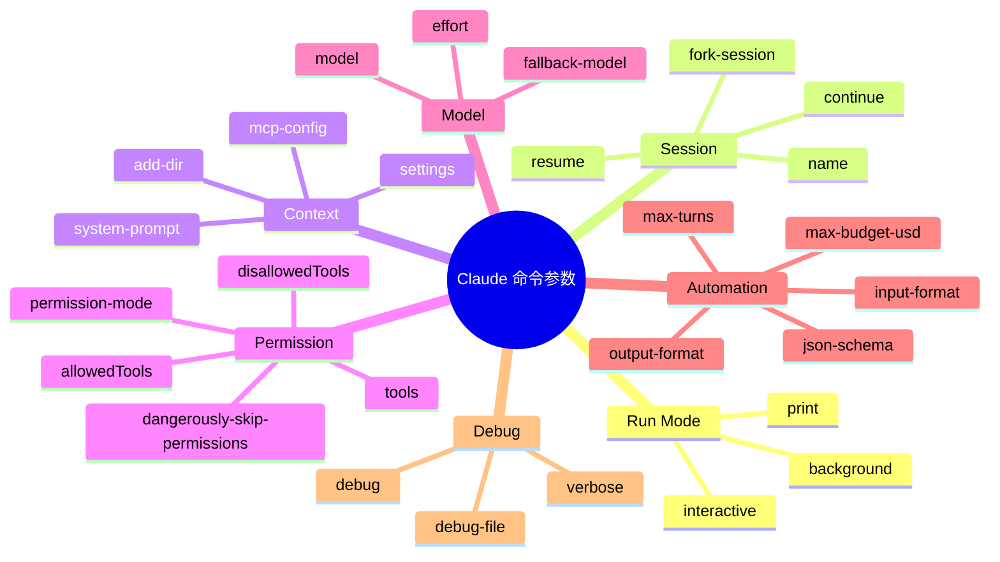
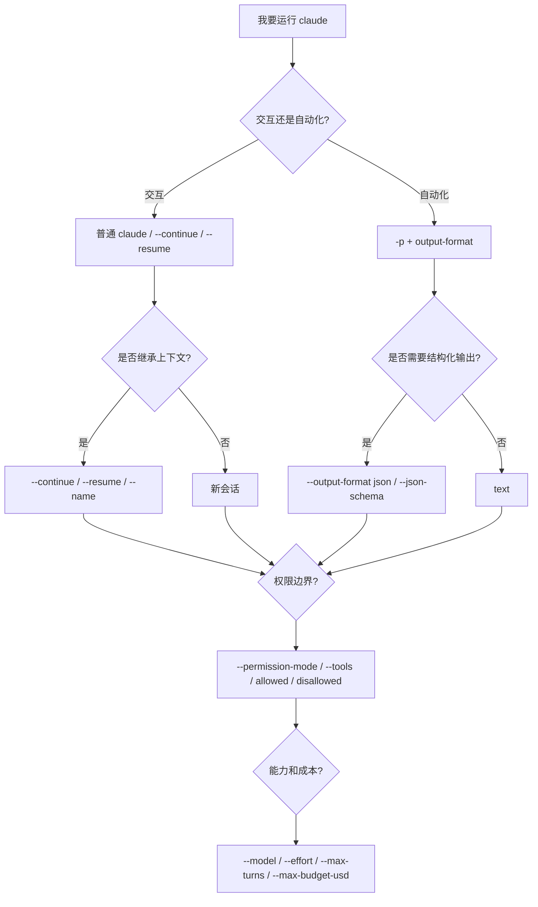

# Claude 命令最重要参数：AI 时代学习地图

> 更新时间：2026-07-29  
> 主题范围：这里的 `claude` 指 Claude Code 命令行工具，而不是 Claude API SDK。

## 1. 本质（Essence）

> Claude 命令参数，本质上是在告诉 Claude Code：这次任务以什么模式运行、能访问什么上下文、能使用哪些工具、是否需要人工确认、输出给人看还是给程序读。

学习 Claude 参数的目标不是背完整参数表，而是建立一个判断模型：

- 这次是交互式协作，还是一次性自动化？
- Claude 应该看到哪些目录和配置？
- Claude 能不能改文件、跑命令、调用工具？
- 结果是给人读，还是给脚本、CI、Agent 系统读？
- 这次会话是否要接上之前的上下文？
- 这次任务需要什么模型、推理强度和成本边界？

没有这些参数时，Claude Code 仍然能工作，但你对“执行边界”的控制会弱很多。参数的价值是把一次 AI 协作变成可控、可复现、可自动化的工程调用。

## 2. 世界模型（World Model）

`claude` 命令位于人、AI Agent、代码仓库、Shell、文件系统、权限系统和自动化流水线之间。

它处理的对象包括：

- 会话：新会话、继续会话、恢复指定会话
- 输入：自然语言、管道输入、JSON 流
- 输出：文本、JSON、流式 JSON
- 上下文：当前目录、额外目录、设置文件、MCP 配置、系统提示词
- 工具：读文件、写文件、运行 Bash、MCP 工具、浏览器或 IDE 集成
- 权限：手动批准、自动批准、计划模式、跳过权限
- 模型：Sonnet、Opus、Haiku、Fable 或完整模型 ID
- 预算：最大轮次、最大花费
- 后台任务：后台 agent、attach、logs、stop、respawn

核心位置是：



## 3. 概念地图（Concept Map）



## 4. 最重要参数分组

### A. 运行模式：决定 Claude 是“陪你聊”还是“执行完退出”

| 参数                     | 作用                         | 什么时候重要                  |
| ---------------------- | -------------------------- | ----------------------- |
| `-p`, `--print`        | 非交互模式，输出结果后退出              | 脚本、CI、批处理、让程序调用 Claude  |
| `--bg`, `--background` | 后台启动一个 Claude 会话           | 长任务、多任务并行、不想占用当前终端      |
| `--exec`               | 配合 `--bg` 运行 Shell 命令型后台任务 | 想让 Claude 管理或启动后台命令     |
| `--cloud`              | 在 claude.ai 创建 Web 会话      | 想把本地任务转到 Claude Web 侧继续 |

最关键的判断：

> 需要来回协作，用交互模式。  
> 需要被脚本调用，用 `-p`。  
> 需要长时间运行，用 `--bg`。

### B. 会话参数：决定是否继承之前的上下文

| 参数                 | 作用            | 什么时候重要         |
| ------------------ | ------------- | -------------- |
| `-c`, `--continue` | 继续当前目录最近一次会话  | 延续刚才的工作        |
| `-r`, `--resume`   | 恢复指定会话 ID 或名称 | 回到某个明确任务       |
| `--name`, `-n`     | 给会话命名         | 多任务并行时避免找不到会话  |
| `--fork-session`   | 恢复时创建新分支会话    | 想复用上下文，但不污染原会话 |
| `--session-id`     | 指定会话 ID       | 程序化管理会话时使用     |

最关键的判断：

> 新问题开新会话，连续工作用 `--continue`，跨天或多任务用 `--resume` + `--name`。

### C. 上下文参数：决定 Claude 能看到什么

| 参数                    | 作用                            | 什么时候重要              |
| --------------------- | ----------------------------- | ------------------- |
| `--add-dir`           | 额外授权 Claude 访问其他目录            | 单仓库依赖另一个本地目录时       |
| `--settings`          | 指定设置文件或内联 JSON                | 临时覆盖默认配置            |
| `--setting-sources`   | 选择加载 user/project/local 哪些设置源 | 排查配置污染，控制配置来源       |
| `--mcp-config`        | 加载 MCP 服务器配置                  | 需要外部工具、数据库、浏览器、服务集成 |
| `--strict-mcp-config` | 只使用本次传入的 MCP 配置               | 保证自动化环境干净可控         |

最关键的判断：

> Claude 的能力边界不是“它知道什么”，而是“本次会话被允许读取和调用什么”。

### D. 权限参数：决定 Claude 能不能直接行动

| 参数                                        | 作用                   | 什么时候重要                   |
| ----------------------------------------- | -------------------- | ------------------------ |
| `--permission-mode`                       | 指定启动权限模式             | 控制 Claude 是计划、手动确认还是自动行动 |
| `--allowedTools`, `--allowed-tools`       | 指定哪些工具可免确认执行         | 放行低风险常用操作                |
| `--disallowedTools`, `--disallowed-tools` | 禁止某些工具或规则            | 阻止删除、写文件、危险 Bash 等       |
| `--tools`                                 | 限制 Claude 可用的内置工具集合  | 精确收窄工具面                  |
| `--dangerously-skip-permissions`          | 跳过权限提示               | 只适合强隔离沙盒或你完全信任的任务        |
| `--allow-dangerously-skip-permissions`    | 把 bypass 权限模式加入可切换模式 | 想保留切换能力，但不一开始跳过权限        |

常见权限模式包括：

- `plan`：先计划，不直接行动
- `default` / `manual`：默认人工确认
- `acceptEdits`：更容易接受编辑
- `auto`：自动模式
- `dontAsk`：减少询问
- `bypassPermissions`：绕过权限提示

最关键的判断：

> 权限参数决定风险边界。越接近自动化，越应该明确限制工具、目录和预算。

### E. 模型与推理参数：决定能力、速度和成本

| 参数                 | 作用                 | 什么时候重要           |
| ------------------ | ------------------ | ---------------- |
| `--model`          | 指定本次会话模型           | 想在速度、成本、能力之间做选择  |
| `--fallback-model` | 主模型不可用时自动降级        | 长任务或自动化流程不能轻易失败  |
| `--effort`         | 设置推理强度             | 复杂重构、疑难 bug、架构分析 |
| `--advisor`        | 启用 advisor 工具并指定模型 | 希望会话内有额外模型辅助判断   |

最关键的判断：

> 模型参数不是“越强越好”，而是任务复杂度、成本、延迟和失败容忍度之间的取舍。

### F. 输出参数：决定结果给谁消费

| 参数                           | 作用                                 | 什么时候重要              |
| ---------------------------- | ---------------------------------- | ------------------- |
| `--output-format`            | 指定输出格式：`text`、`json`、`stream-json` | 脚本解析、CI 集成、Agent 编排 |
| `--input-format`             | 指定输入格式：`text`、`stream-json`        | 程序连续喂输入             |
| `--json-schema`              | 要求最终输出符合 JSON Schema               | 需要结构化、可校验结果         |
| `--verbose`                  | 输出更完整的过程信息                         | 调试、审计、观察 agent 行为   |
| `--include-partial-messages` | 包含部分流式消息                           | 做实时 UI 或流式处理        |

最关键的判断：

> 给人看用 `text`，给程序读用 `json`，做实时系统用 `stream-json`。

### G. 成本与停止条件：决定自动化不会无限跑

| 参数                         | 作用                  | 什么时候重要            |
| -------------------------- | ------------------- | ----------------- |
| `--max-turns`              | 限制 agentic turns 数量 | 防止自动化任务跑太久        |
| `--max-budget-usd`         | 限制 API 调用金额         | CI、批处理、无人值守任务     |
| `--no-session-persistence` | 不保存会话               | 临时任务、隐私敏感任务、干净自动化 |

最关键的判断：

> 只要无人值守，就应该考虑 `--max-turns` 或 `--max-budget-usd`。

### H. 系统提示词参数：决定 Claude 这次“扮演什么工作方式”

| 参数                            | 作用           | 什么时候重要                      |
| ----------------------------- | ------------ | --------------------------- |
| `--append-system-prompt`      | 在默认系统提示后追加规则 | 临时加工作规范                     |
| `--append-system-prompt-file` | 从文件追加规则      | 团队规范、审查规则、输出格式              |
| `--system-prompt`             | 替换默认系统提示     | 构建非 Claude Code 默认身份的 agent |
| `--system-prompt-file`        | 从文件替换系统提示    | 复杂、可版本化的自定义 agent           |

最关键的判断：

> 大多数编码任务应该用 append，而不是 replace。replace 会丢掉 Claude Code 默认工具指导和安全约定。

### I. 调试与隔离参数：决定问题是否容易定位

| 参数             | 作用             | 什么时候重要              |
| -------------- | -------------- | ------------------- |
| `--verbose`    | 显示更完整过程输出      | 看 Claude 为什么这么做     |
| `--debug`      | 开启调试模式，可过滤类别   | 排查 API、hook、MCP 等问题 |
| `--debug-file` | 把 debug 日志写到文件 | 需要保存证据或分享日志         |
| `--safe-mode`  | 禁用大多数自定义配置     | 判断是不是配置、hook、插件导致问题 |
| `--bare`       | 最小模式，跳过自动发现    | 脚本快速启动、减少隐式上下文      |

最关键的判断：

> 行为异常时先区分：是任务问题、模型问题，还是本地配置问题。`--safe-mode` 和 `--bare` 是定位配置污染的关键工具。

## 5. 决策地图（Decision Map）

### 场景 1：我要让 Claude 在脚本里回答一次就退出

Situation

你想在 Shell 脚本、CI 或自动化流程中调用 Claude。

↓

Decision

使用 `claude -p`，必要时加 `--output-format json` 或 `--json-schema`。

↓

Reason

交互式界面适合人，结构化输出适合程序。

↓

Expected Outcome

Claude 的结果可以被后续脚本稳定读取。

### 场景 2：我要让 Claude 继续昨天的工作

Situation

任务还没完成，但上下文已经在之前的会话里。

↓

Decision

使用 `claude --continue` 或 `claude --resume <name-or-id>`。

↓

Reason

恢复会话比重新解释上下文更稳定。

↓

Expected Outcome

Claude 能接着已有计划、文件修改和讨论继续推进。

### 场景 3：我要限制 Claude 的行动范围

Situation

你只希望 Claude 读代码、分析问题，不希望它随意修改或运行危险命令。

↓

Decision

使用 `--permission-mode plan`、`--tools`、`--allowedTools`、`--disallowedTools`。

↓

Reason

AI coding agent 的核心风险不是回答错，而是在错误上下文中执行了真实操作。

↓

Expected Outcome

Claude 的能力边界更清晰，执行风险更可控。

### 场景 4：我要让 Claude 访问 monorepo 之外的目录

Situation

当前项目依赖另一个本地包、文档目录或共享库。

↓

Decision

使用 `--add-dir` 明确加入额外目录。

↓

Reason

Claude 默认主要围绕当前工作目录建立上下文，额外目录需要显式授权。

↓

Expected Outcome

Claude 能跨目录理解依赖关系，但访问边界仍然清楚。

### 场景 5：我要无人值守运行复杂任务

Situation

你想让 Claude 在 CI 或后台处理任务。

↓

Decision

组合使用 `-p` / `--bg`、`--max-turns`、`--max-budget-usd`、`--output-format json`、严格权限参数。

↓

Reason

无人值守任务需要停止条件、预算上限、结构化输出和权限边界。

↓

Expected Outcome

任务可自动运行，也更容易失败后定位问题。

## 6. 搜索空间扩展（Search Space Expansion）

初学者通常不会想到的问题：

- `claude` 当前工作目录会影响它能发现哪些项目上下文。
- 会话恢复不是简单聊天记录，而是恢复一个带任务状态的工作上下文。
- `--print` 不只是“打印”，而是把 Claude Code 变成可编程接口。
- `--output-format json` 比普通文本更适合自动化。
- `--allowedTools` 是放行免确认，不等于限制 Claude 只能用这些工具。
- 真正限制工具集合要看 `--tools` 和 `--disallowedTools`。
- `--dangerously-skip-permissions` 的危险点在于它改变了人机确认边界。
- `--system-prompt` 和 `--append-system-prompt` 的差异很大：一个替换身份，一个补充规则。

专家真正关心的问题：

- 这次任务是否可复现？
- Claude 的输入、输出和权限边界是否可审计？
- 自动化任务是否有预算和轮次上限？
- 任务失败时是否能通过日志复盘？
- 是否存在隐藏配置影响结果？
- 是否应该加载项目设置、用户设置，还是只加载临时设置？
- 是否需要把 MCP 配置收窄到本次任务？
- 是否要用 JSON Schema 约束结果，避免自然语言漂移？

决定上限的问题：

- 你是否能区分“交互协作”和“程序化调用”？
- 你是否能设计 AI Agent 的权限边界？
- 你是否能把 Claude 输出变成稳定数据接口？
- 你是否能让 Claude 在 CI、后台任务、多人项目中可靠运行？
- 你是否能在能力、成本、速度和安全之间做取舍？

## 7. 生态系统（Ecosystem）

### 上游

Claude 命令参数依赖：

- Shell
- 文件系统
- Git 仓库
- Claude Code 配置
- Anthropic 账号或 API 认证
- 本地权限模型
- MCP 配置

### 下游

Claude 命令参数支撑：

- 代码理解
- 文件编辑
- 自动化代码审查
- CI 集成
- 后台 agent
- 多 agent 工作流
- MCP 工具调用
- 结构化 AI 输出

### 替代方案

- Claude Web
- IDE 插件
- Anthropic API / SDK
- GitHub Copilot CLI 类工具
- Codex CLI / 其他 AI coding agent

### 互补方案

- `CLAUDE.md`：长期项目记忆
- `settings.json`：持久配置
- MCP：外部工具和系统连接
- Git worktree：隔离并行任务
- CI：无人值守执行环境
- JSON Schema：稳定结构化输出

## 8. 最小心智模型（Minimum Mental Model）

如果只能记住 18 个参数，按重要性排序：

1. `-p`, `--print`：让 Claude 非交互运行，是自动化入口。
2. `--output-format`：决定输出给人读还是给程序读。
3. `--input-format`：决定输入是普通文本还是流式协议。
4. `--json-schema`：让结果变成可校验数据。
5. `-c`, `--continue`：继续当前目录最近会话。
6. `-r`, `--resume`：恢复指定会话。
7. `--name`：给会话命名，方便长期任务管理。
8. `--add-dir`：扩展 Claude 可访问目录。
9. `--permission-mode`：设置本次会话权限模式。
10. `--allowedTools`：放行某些工具免确认。
11. `--disallowedTools`：禁止某些工具或危险模式。
12. `--tools`：限制内置工具集合。
13. `--model`：指定模型。
14. `--effort`：指定推理强度。
15. `--max-turns`：限制自动化轮次。
16. `--max-budget-usd`：限制花费。
17. `--verbose`：观察完整执行过程。
18. `--safe-mode`：排查配置、插件、hook 影响。

可以把它们压缩成五个问题：



## 9. 常见误区（Common Misconceptions）

### 误区 1：`--allowedTools` 就是限制 Claude 只能用这些工具

更准确的模型：

> `--allowedTools` 是“这些工具可以免确认”，不是完整工具白名单。要限制工具集合，需要关注 `--tools` 和 `--disallowedTools`。

### 误区 2：`--dangerously-skip-permissions` 只是少点几个确认

更准确的模型：

> 它改变的是安全边界，不只是交互体验。

这个参数只适合隔离环境、临时分支、容器、沙盒或你明确知道风险的任务。

### 误区 3：所有任务都应该用最强模型

更准确的模型：

> 模型选择是能力、速度、成本、稳定性之间的取舍。

小任务用高配模型可能浪费，复杂重构用低配模型可能增加返工。

### 误区 4：系统提示词越多越好

更准确的模型：

> 系统提示词应该定义边界和原则，不应该堆积临时细节。

项目长期规则更适合放进 `CLAUDE.md` 或设置文件；单次任务规则才适合用命令参数。

### 误区 5：自动化就是加 `-p`

更准确的模型：

> 真正的自动化需要输入格式、输出格式、权限边界、停止条件、日志和错误处理。

`-p` 只是入口，不是完整自动化设计。

## 10. 实用组合模板

### 快速问一次

```bash
claude -p "解释这个错误日志的根因"
```

### 脚本读取 JSON 结果

```bash
claude -p "总结这个 PR 的风险" --output-format json
```

### 限制最多 3 轮

```bash
claude -p --max-turns 3 "检查这个项目的测试失败原因"
```

### 先计划，不动文件

```bash
claude --permission-mode plan "分析这个重构应该怎么做"
```

### 继续当前目录最近会话

```bash
claude --continue
```

### 恢复命名会话

```bash
claude --resume auth-refactor
```

### 允许读取额外目录

```bash
claude --add-dir ../shared ../docs
```

### 自动化时控制成本

```bash
claude -p --max-turns 5 --max-budget-usd 3.00 --output-format json "完成一次代码审查"
```

## 11. 总结（Summary）

> 我真正获得的不是一张 Claude 参数速查表，  
> 而是控制 AI coding agent 的运行模式、上下文边界、权限风险、输出协议和自动化可靠性的能力。

## 参考资料

- [Claude Code CLI reference](https://code.claude.com/docs/en/cli-usage)

