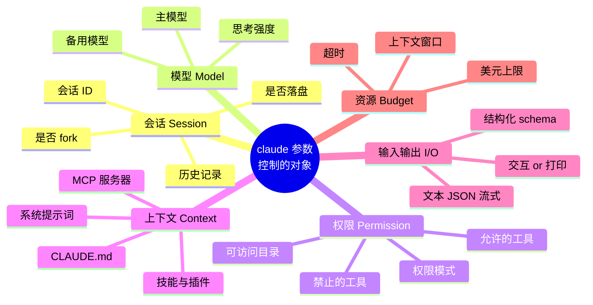
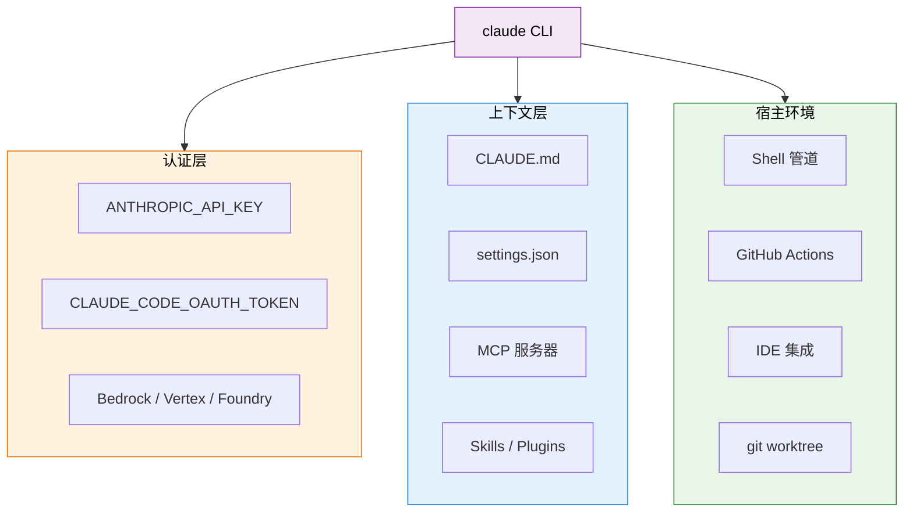
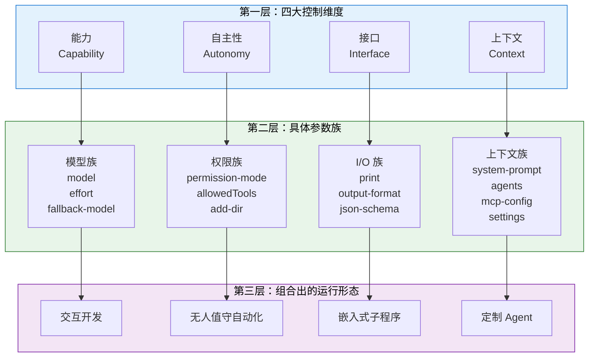
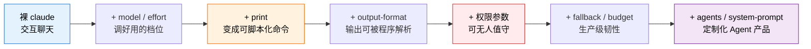
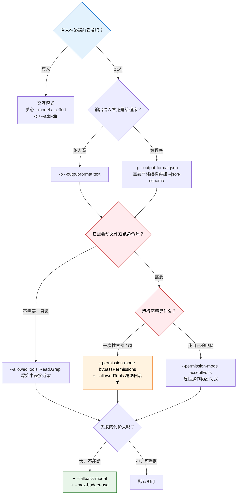
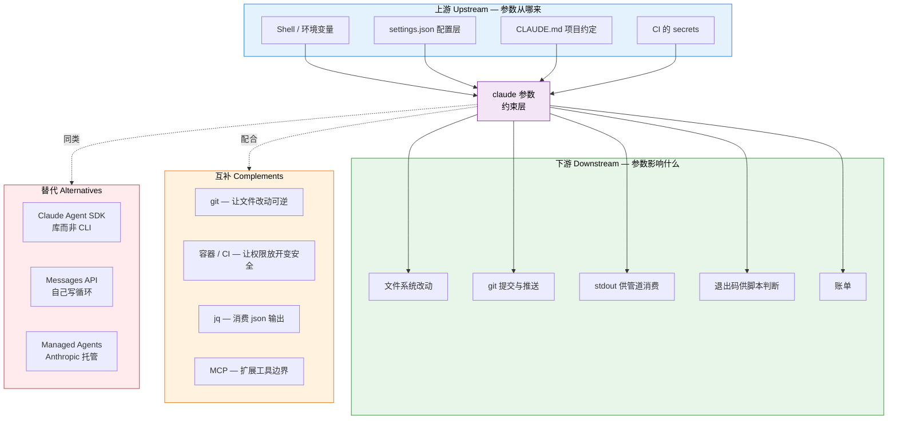
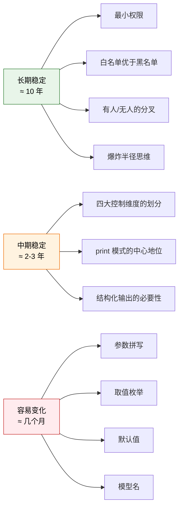
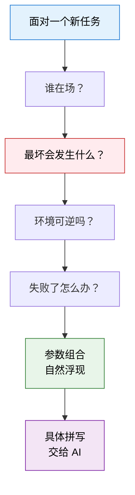

---
vmark:
  id: 019fe01b-cd91-73c1-9f1d-42d323e29392
---
# Claude 命令的最重要参数 · 学习地图

> 本文不教你「怎么用」，而是帮你建立 **心智模型（Mental Model）与世界模型（World Model）**。
> 默认前提：具体的命令拼写、参数顺序、转义写法由 AI 替你完成。你需要拥有的，是**判断力**——知道有哪些控制旋钮、它们各自在控制什么、什么时候必须动它。

---

## 1. 本质（Essence）

> **`claude` 的参数，是你把一个「会自己做决定的智能体」放进你系统时，交给你的那组控制旋钮。**

它不是「功能开关」，而是 **约束器（Constraint）**。每一个参数回答的都是同一类问题：*这个智能体，被允许在多大范围内自主行动？*

### 为什么它存在

传统命令行工具的参数控制的是**确定性行为**：`ls -l` 一定输出长格式，不会有意外。

但 `claude` 启动的是一个 **会自己推理、自己选工具、自己决定下一步** 的程序。它的行为空间是开放的。开放意味着强大，也意味着不可预测。

参数存在的根本原因就是这个矛盾：

```
能力越强 → 行为空间越大 → 越不可预测 → 越需要边界
```

参数就是那些边界。

### 它解决什么根本问题

| 根本问题             | 参数给出的答案                                              |
| ---------------- | ---------------------------------------------------- |
| 我怎么知道它会不会乱改我的文件？ | 权限类参数（`--permission-mode` / `--allowedTools`）        |
| 我怎么让它在没有人的凌晨自动跑？ | 非交互类参数（`-p` / `--output-format`）                     |
| 我怎么控制它花多少钱、想多久？  | 资源类参数（`--model` / `--effort` / `--max-budget-usd`）   |
| 我怎么让它知道这个项目的规矩？  | 上下文类参数（`--add-dir` / `--system-prompt` / `--agents`） |
| 它挂了怎么办？          | 韧性类参数（`--fallback-model` / `--resume`）               |

### 没有它时，人们通常怎么办

在 AI CLI 出现之前，人们只有两个极端：

- **完全手动**：自己写脚本，每一步都明确指定。安全，但不会应变。
- **完全信任的黑盒 SaaS**：把数据交出去，行为不可控，出错无法审计。

`claude` 的参数是第三条路：**可调节的自主性**（tunable autonomy）。你决定给多少缰绳。

### 它带来了哪些新的可能

1. **AI 可以被写进脚本** —— `-p` 让一个会思考的程序变成了一个可以出现在管道里的普通命令。
2. **AI 可以被写进 CI** —— 权限参数让「无人值守时它会不会捅娄子」变成了一个可以事先回答的问题。
3. **AI 的输出可以被机器消费** —— `--output-format json` / `--json-schema` 让下游程序能可靠地解析它。
4. **成本可以被预算约束** —— `--max-budget-usd` 让「AI 会不会烧掉我一个月预算」变成有上限的。
5. ⭐ **同一个 AI 可以被裁剪成很多种不同的 AI** —— `--agents` / `--system-prompt` / `--tools` 让一个二进制文件变成一个 agent 工厂。

> 💡 **一句话记住**：其它 CLI 的参数在说「做什么」，`claude` 的参数在说「你可以做到什么程度」。

---

## 2. 世界模型（World Model）

### 它处理哪些对象（Objects）



### 涉及哪些角色（Actors）

| 角色                    | 它关心哪些参数                                                                                 | 为什么                       |
| --------------------- | --------------------------------------------------------------------------------------- | ------------------------- |
| 👤 **交互式使用者**（你坐在终端前） | `--model`、`--effort`、`-c` / `-r`、`--add-dir`                                            | 关心「好不好用、够不够聪明、能不能接着上次聊」   |
| 🤖 **自动化脚本 / CI**     | `-p`、`--output-format`、`--allowedTools`、`--permission-mode`、`--fallback-model`          | 关心「无人值守时能不能可靠地跑完并被解析」     |
| 🛡️ **安全负责人**         | `--permission-mode`、`--disallowedTools`、`--add-dir`、`--strict-mcp-config`、`--safe-mode` | 关心「爆炸半径有多大」               |
| 💰 **付钱的人**           | `--model`、`--effort`、`--max-budget-usd`、`--autocompact`                                 | 关心「一次运行花多少」               |
| 🔧 **平台/工具搭建者**       | `--agents`、`--system-prompt`、`--mcp-config`、`--json-schema`、`--bare`                    | 关心「怎么把 claude 变成我产品的一个零件」 |

> 🔑 同一个参数在不同角色眼里意义完全不同。`--permission-mode bypassPermissions` 对第 2 类是「让它别再问我」，对第 3 类是「拆掉了所有护栏」。**争论往往来自角色不同，而不是观点不同。**

### 管理哪些状态变化（State）

`claude` 的一次运行会改变四类状态，参数决定它能改哪几类：

| 状态类型       | 举例                 | 谁在控制                                                      | 可逆性          |
| ---------- | ------------------ | --------------------------------------------------------- | ------------ |
| **会话状态**   | 对话历史、session id    | `--session-id` / `-c` / `-r` / `--no-session-persistence` | 可逆           |
| **文件系统状态** | 写文件、改代码            | `--allowedTools` / `--permission-mode` / `--add-dir`      | 有 git 就可逆    |
| **外部世界状态** | git push、发请求、调 MCP | `--allowedTools "Bash(...)"` / `--mcp-config`             | ⚠️ **通常不可逆** |
| **账单状态**   | 消耗的 token          | `--model` / `--effort` / `--max-budget-usd`               | ❌ 不可逆        |

> ⚠️ 从上到下，风险递增。真正需要你谨慎的参数，都是控制下面两行的那些。

### 改变哪些工作流（Workflow）


这是最重要的一次工作性质转移：**你不再描述过程，你描述允许的过程集合。**

### 与哪些系统交互（Systems）



参数的本质作用，就是**在这三层里选择、覆盖或屏蔽**。比如 `--settings` 覆盖上下文层，`--bare` 几乎屏蔽整个上下文层，`--add-dir` 扩大宿主层的可见范围。

### 创造哪些价值（Value）

- **可预测性** —— 同样的参数，同样的边界，行为可复现、可审计。
- **可嵌入性** —— 因为有 `-p` 和 `--output-format`，AI 才能成为大系统里的一个零件而不是终点。
- **风险定价** —— 你可以明确说出「这次运行最坏会发生什么」，而不是祈祷。

---

## 3. 概念地图（Concept Map）

### 三层结构



### 第一层概念详解

#### 维度一：自主性（Autonomy）—— 它能自己决定多少

- **名词**：权限模式、工具白名单、可访问目录
- **动词**：授予（grant）、限制（restrict）、隔离（isolate）
- **目的**：让「无人值守」变成一个可以承担的风险，而不是一次赌博
- **关系**：**自主性是所有维度中唯一带来不可逆后果的那一个**。其它维度出错，重跑一次即可；这一维度出错，文件可能已经没了，push 可能已经发出去了。

关键参数：

| 参数                                     | 它真正在说什么                                                                                                             |
| -------------------------------------- | ------------------------------------------------------------------------------------------------------------------- |
| `--permission-mode`                    | 「遇到需要授权的操作，默认怎么办」。取值：`manual`（每次问）、`acceptEdits`（自动允许改文件）、`dontAsk`、`auto`、`plan`（只规划不执行）、`bypassPermissions`（全部放行） |
| `--allowedTools` / `--disallowedTools` | 「哪些工具它可以碰」。粒度可以细到 `Bash(git *)`                                                                                     |
| `--tools`                              | 「从内置工具集里给它哪几件」，`""` 表示一件都不给                                                                                         |
| `--add-dir`                            | 「除了当前目录，它还能看到哪里」                                                                                                    |
| `--dangerously-skip-permissions`       | 名字里的 dangerously 是设计者的警告，不是修辞                                                                                       |

> ⚠️ `bypassPermissions` 和 `--dangerously-skip-permissions` 在你自己的电脑上和在一次性容器里，是两件完全不同的事。安全性不来自参数本身，来自**参数 + 环境**的组合。

#### 维度二：能力（Capability）—— 它有多聪明、多耐心、多贵

- **名词**：模型、思考强度、预算
- **动词**：选择（select）、降级（fall back）、封顶（cap）
- **目的**：在「质量」「速度」「成本」这个不可能三角里显式表态
- **关系**：能力维度和自主性维度**互相放大**。给一个很弱的模型很高的自主性，是最危险的组合。

| 参数                 | 它真正在说什么                                                     |
| ------------------ | ----------------------------------------------------------- |
| `--model`          | 用哪个大脑。可用别名（`opus` / `sonnet` / `fable`）或全名（`claude-opus-5`） |
| `--effort`         | 让它想多深：`low` / `medium` / `high` / `xhigh` / `max`           |
| `--fallback-model` | 主模型过载时自动换谁顶上（仅 `--print` 下有效）——**自动化的生命线**                  |
| `--max-budget-usd` | 这次最多花多少钱（仅 `--print` 下有效）                                   |
| `--autocompact`    | 上下文快满时的自动压缩窗口                                               |

#### 维度三：上下文（Context）—— 它以什么身份、带着什么记忆开始

- **名词**：系统提示词、CLAUDE.md、MCP 服务器、技能、自定义 agent
- **动词**：注入（inject）、覆盖（override）、屏蔽（isolate）
- **目的**：把一个通用模型，塑造成这个项目、这个任务专用的角色
- **关系**：上下文维度是**唯一能改变「它是谁」的维度**，其它三个只改变「它能做什么」。

| 参数                                           | 它真正在说什么                                                                |
| -------------------------------------------- | ---------------------------------------------------------------------- |
| `--system-prompt` / `--append-system-prompt` | 替换 or 追加它的身份设定                                                         |
| `--agents`                                   | 用 JSON 现场定义一批子 agent                                                   |
| `--mcp-config` / `--strict-mcp-config`       | 接入外部工具服务器 / 只信任我给的这些                                                   |
| `--settings` / `--setting-sources`           | 从哪里加载配置                                                                |
| `--bare`                                     | 🔑 **把所有隐式上下文全部关掉**——不读 CLAUDE.md、不加载插件钩子、不读钥匙串。用于「我要一个完全可预测、无隐藏输入的运行」 |
| `--safe-mode`                                | 关掉所有自定义，用于排查「是不是我的配置坏了」                                                |

#### 维度四：接口（Interface）—— 它怎么和外部世界交换信息

- **名词**：打印模式、输出格式、结构化 schema、会话
- **动词**：管道化（pipe）、序列化（serialize）、恢复（resume）
- **目的**：让 AI 的输出能被**程序**而不只是**人**消费
- **关系**：接口维度是「AI 能否成为基础设施」的分水岭。没有 `-p`，claude 只是一个聊天窗口。

| 参数                                | 它真正在说什么                                           |
| --------------------------------- | ------------------------------------------------- |
| `-p` / `--print`                  | 🔑 **最重要的一个参数**：从「交互式会话」切换为「一次性命令」。所有自动化的起点       |
| `--output-format`                 | `text`（给人看）/ `json`（给程序解析）/ `stream-json`（实时流式消费） |
| `--json-schema`                   | 强制输出符合指定 JSON Schema —— 结构化输出的保证                  |
| `-c` / `-r`                       | 续上一次 / 恢复指定会话                                     |
| `--session-id` / `--fork-session` | 精确控制会话身份                                          |

### 第二层：参数之间的真实依赖

| 参数                           | 依赖于                                       | 为什么                    |
| ---------------------------- | ----------------------------------------- | ---------------------- |
| `--fallback-model`           | `--print`                                 | 交互模式下你自己就能换模型          |
| `--max-budget-usd`           | `--print`                                 | 交互会话没有天然的「一次运行」边界      |
| `--output-format`            | `--print`                                 | 交互模式的输出是渲染给人的          |
| `--include-partial-messages` | `--print` + `--output-format=stream-json` | 部分消息只在流式协议里有意义         |
| `--tmux`                     | `--worktree`                              | 要先有 worktree 才有东西可以开面板 |

> 💡 这些依赖不是随意规定的。它们都指向同一件事：**一大批参数只在「一次性、非交互运行」这个语境下才有意义**。这本身就说明了 `-p` 的中心地位。

### 第三层：从参数到运行形态的演进链



> 🔑 这条链就是「从玩具到生产系统」的完整路径。你所在的位置，决定了你该关心哪些参数。

---

## 4. 决策地图（Decision Map）

### 决策树总览



### 真实场景推演

#### 场景 A：每天定时生成一份报告，无人值守

```
Situation
  GitHub Actions 每天早上跑一次，没有人能回答权限弹窗
    ↓
Decision
  -p + --output-format text + --permission-mode bypassPermissions
  + --allowedTools "Read,Write,Bash,WebSearch,WebFetch"
  + --model sonnet --fallback-model haiku
    ↓
Reason
  · 没人在场 → 必须 -p，任何交互提示都会导致挂起直到超时
  · bypassPermissions 在这里是安全的，因为环境是一次性 VM，跑完即销毁
  · allowedTools 仍然要写 —— 它不是防黑客，是防「模型自己想多了」
  · fallback 是关键：主模型过载时不该让整天的任务失败
    ↓
Expected Outcome
  每天稳定产出，失败时是明确的非零退出码，而不是静默挂起
```

> 🤖 这正是你自己的 `daily-ai-news` 项目在做的事。它两个月无人干预地运行，靠的就是这组参数选择。

#### 场景 B：让 AI 分析代码但绝对不许改任何东西

```
Situation
  想让它审查一个不熟悉的开源仓库，但完全不信任它
    ↓
Decision
  -p --allowedTools "Read,Grep,Glob" --permission-mode manual
    ↓
Reason
  白名单是「默认拒绝」模型 —— 没列出的一律不可用
  比「先放开再禁止」安全一个数量级
    ↓
Expected Outcome
  最坏情况只是读了一堆文件，没有任何状态被改变
```

#### 场景 C：输出要被下游脚本消费

```
Situation
  想让 AI 提取信息，然后交给 Python 处理
    ↓
Decision
  -p --output-format json --json-schema '{...}'
    ↓
Reason
  自然语言输出对程序是不可靠的 —— 今天有个句号，明天多个前言
  schema 把「大概是这个格式」变成「一定是这个格式」
    ↓
Expected Outcome
  下游 json.loads() 可以直接信任，不需要写正则清洗
```

#### 场景 D：怀疑自己的配置把 Claude 搞坏了

```
Situation
  昨天还好好的，今天行为很怪，装了几个插件和 hook
    ↓
Decision
  --safe-mode 跑一次；仍然怪就用 --bare
    ↓
Reason
  这是排除法：先切断所有自定义输入，看问题还在不在
  在 → 不是你的配置；不在 → 二分查找是哪个自定义
    ↓
Expected Outcome
  把「玄学问题」变成「可定位问题」
```

#### 场景 E：想让它并行做几件互不干扰的事

```
Situation
  三个改动想同时试，但不想互相污染工作区
    ↓
Decision
  -w / --worktree（可配 --tmux）
    ↓
Reason
  隔离的不是 AI，是文件系统状态
  git worktree 让三个分支同时存在于不同目录
    ↓
Expected Outcome
  失败的那条直接删掉 worktree，零残留
```

---

## 5. 搜索空间扩展（Search Space Expansion）

### 初学者通常不会想到的问题

- ❓ **参数和配置文件冲突时谁赢？** —— 命令行参数通常覆盖 `settings.json`，但你必须知道优先级链条（policy > 命令行 > local > project > user），否则会出现「我明明加了参数怎么没生效」。
- ❓ **`--allowedTools` 里的 `Bash` 到底有多大？** —— `Bash` 是一整个宇宙。`--allowedTools "Bash"` 和 `--allowedTools "Bash(git status)"` 的风险差了几个数量级。
- ❓ **不加 `-p` 会怎样？** —— 在 CI 里会进入交互模式并挂起，直到 job 超时。这是最经典的第一个坑。
- ❓ **`--model` 和 `--effort` 哪个更影响质量？** —— 它们是两个独立的旋钮：模型决定「大脑级别」，effort 决定「愿意想多久」。小模型高 effort 有时优于大模型低 effort。
- ❓ **CLAUDE.md 是自动读的吗？** —— 是。这意味着**你的运行结果依赖一个你没在命令行里写出来的文件**。`--bare` 就是为了消除这种隐式依赖。
- ❓ **会话数据存在哪？** —— 存在全局 `~/.claude/projects/<路径编码名>/`，不在你的项目目录里。

### 专家真正关心的问题

- 🔬 **可复现性**：同样的命令，一周后在另一台机器上能得到同样的行为吗？（答案取决于有多少隐式上下文没被参数固定住）
- 🔬 **爆炸半径**：这次运行最坏能造成什么后果？能不能事先写下来？
- 🔬 **失败模式**：它是会明确失败（非零退出码），还是会静默地产出一个看起来对但其实错的结果？
- 🔬 **幂等性**：重复跑会不会产生重复副作用？（这不是参数能解决的，得靠你的脚本设计）
- 🔬 **成本可观测性**：跑完之后我知道花了多少吗？`--output-format json` 会带用量信息。
- 🔬 **权限的最小集**：不是「够用就行」，而是「能不能再减一个」。

### 下一步值得探索的问题

1. **配置优先级的完整链条**（policy / 命令行 / local / project / user）
2. **`--allowedTools` 的模式匹配语法**（`Bash(git *)` 这类细粒度写法能做到多细）
3. **`--agents` 的 JSON 结构** —— 这是从「用 AI」跨到「造 AI 产品」的门槛
4. **MCP 与 `--strict-mcp-config`** —— 外部工具接入的信任边界
5. **`stream-json` 双向协议** —— `--input-format stream-json` + `--replay-user-messages` 组合出的实时交互能力
6. **`claude agents` / `--bg`** —— 后台常驻智能体，和一次性运行是完全不同的形态

### 哪些问题决定了这个领域的上限

> 🔑 **上限问题只有一个：你能否在事前，准确地写下「这次运行允许发生什么、不允许发生什么」。**

能写下来，AI 就能进入生产系统、进入你不看着它的时段、进入有真实后果的场景。写不下来，AI 就永远只能是一个需要人盯着的玩具。

**所有参数，都是这句话的具体化。**

第二个上限问题是：**你能否把「隐式的东西」全部变成「显式的」。** CLAUDE.md、settings.json、插件、hook、环境变量、钥匙串——每一个没写在命令行里的输入，都是一次可复现性的泄漏。`--bare` 的存在就是承认这个问题真实存在。

---

## 6. 生态系统（Ecosystem）



### 替代方案怎么选

| 方案                    | 你写什么         | 谁提供运行循环      | 什么时候选它                  |
| --------------------- | ------------ | ------------ | ----------------------- |
| **`claude` CLI + 参数** | 一行命令         | CLI 自带       | 想让 AI 出现在 shell、脚本、CI 里 |
| **Claude Agent SDK**  | 代码 + options | SDK 自带       | 想把同样的能力嵌进自己的程序          |
| **Messages API**      | 自己写循环        | 你自己          | 需要完全自定义的控制流             |
| **Managed Agents**    | agent 配置     | Anthropic 托管 | 不想自己管运行环境和状态            |

> 💡 参数思维在这四者之间是**可迁移的**。CLI 的 `--allowedTools` 对应 SDK 的 options、对应 API 的 `tools` 数组。**旋钮换了名字，控制的东西没变。**

### 互补关系里最重要的一条

**git 是 `--permission-mode` 的安全网。**

在一个干净的 git 仓库里放开写权限，和在一个没有版本控制的目录里放开写权限，是完全不同的风险等级。很多人以为安全性只来自参数，其实：

```
实际安全性 = 参数约束 × 环境可逆性
```

任一因子为零，结果就是零。

---

## 7. 可迁移原则（Transferable Principles）

### 第一性原理（几乎永远不变）

1. **最小权限原则（Principle of Least Privilege）** —— 只给完成任务所需的最小能力。这条比计算机还老。
2. **默认拒绝优于默认允许** —— 白名单（`--allowedTools`）在结构上就比黑名单安全。
3. **显式优于隐式** —— 每一个没写在命令里的输入，都是未来某次「为什么这次不一样」的根源。
4. **能力与约束成对增长** —— 任何提升自主性的功能，都必须同时提供限制它的手段，否则不可用于生产。
5. **不可逆操作需要更高的授权门槛** —— 读文件和 `git push` 不该是同一个信任级别。

### 可迁移的方法论（换个工具依然有用）

- **先问「谁在场」** —— 有人 / 无人是所有配置决策的第一分叉点。这对任何自动化工具都成立。
- **先问「最坏会怎样」** —— 用爆炸半径而不是便利性来选配置。
- **把风险外推给环境** —— 与其纠结参数要不要放开，不如换一个放开也安全的环境（容器、worktree、一次性 VM）。
- **为失败设计而非为成功设计** —— `--fallback-model` 体现的思路适用于一切生产系统。
- **让隐式变显式** —— 排障时先切断所有隐式输入（`--bare` / `--safe-mode` 思路），这是通用的二分定位法。

### 当前实现细节（会变，别背）

- 具体的参数拼写（`--allowedTools` 还是 `--allowed-tools`，两个都接受）
- `--permission-mode` 当前有哪 6 个取值
- 哪些参数「只在 `--print` 下生效」
- 模型别名有哪些
- 具体的默认值

> ⚠️ 这些每个版本都可能变。**`claude --help` 永远是唯一权威**，任何文章（包括这篇）都可能过期。

### 长期稳定 vs 容易变化



> 🔑 **学习策略**：把精力全部投在绿色和橙色。红色的部分，交给 AI 和 `--help`。

---

## 8. 最小心智模型（Minimum Mental Model）

如果只能记住 14 个概念：

| #  | 概念                                       | 为什么它排在这里                                   |
| -- | ---------------------------------------- | ------------------------------------------ |
| 1  | **参数 = 约束，不是功能**                         | 这是整个心智模型的地基。想错这一条，后面全错                     |
| 2  | **`-p` / `--print`：交互 vs 一次性**           | 最大的一个分水岭。所有自动化从这里开始，一半的参数只在这边有意义           |
| 3  | **爆炸半径（Blast Radius）**                   | 选权限参数唯一正确的思考方式                             |
| 4  | **最小权限 / 白名单默认拒绝**                       | `--allowedTools` 背后的原理，也是所有安全设计的原理         |
| 5  | **`--permission-mode` 的六档**              | 从 `manual` 到 `bypassPermissions` 是一条自主性连续谱 |
| 6  | **安全 = 参数 × 环境**                         | 同一个参数在容器里和在你电脑上是两回事                        |
| 7  | **四大控制维度：自主性 / 能力 / 上下文 / 接口**           | 面对任何陌生参数，先问它属于哪一维                          |
| 8  | **`--model` 与 `--effort` 是两个独立旋钮**       | 一个是脑子大小，一个是想多久                             |
| 9  | **`--output-format`：给人看 vs 给程序解析**       | AI 能否成为基础设施的分界                             |
| 10 | **`--fallback-model`：为失败而设计**            | 无人值守场景的生命线                                 |
| 11 | **隐式上下文的存在（CLAUDE.md / settings / 插件）**  | 你的命令行不是全部输入。不知道这条，就会遇到不可复现的玄学              |
| 12 | **`--bare` / `--safe-mode`：切断隐式输入来定位问题** | 通用排障方法的具体化                                 |
| 13 | **状态的四层与可逆性**                            | 会话 / 文件 / 外部世界 / 账单，风险递增                   |
| 14 | **参数依赖关系（很多参数需要 `--print`）**             | 解释了为什么有些参数「加了没反应」                          |

### 三句话版本

> 1. **参数在回答「允许它自主到什么程度」，不是在回答「让它做什么」。**
> 2. **先问有没有人在场（决定 `-p`），再问最坏会怎样（决定权限），最后问失败了怎么办（决定 fallback）。**
> 3. **安全来自参数和环境的乘积，不来自参数本身。**

---

## 9. 常见误区（Common Misconceptions）

### 误区 1：参数是「高级功能开关」，新手用不到

- **为什么会这么想**：其它 CLI 的参数确实多半是可选增强（`ls -l` 不加也能用）。
- **更准确的模型**：`claude` 的核心参数是**安全边界**，不是增强。新手恰恰最需要它们——因为新手最不知道 AI 会做什么。`--allowedTools "Read"` 是新手的朋友，不是专家的玩具。

### 误区 2：`bypassPermissions` 就是危险，永远别用

- **为什么会这么想**：名字听起来就吓人，很多文章也这么写。
- **更准确的模型**：它在一次性容器 / CI 里是**正确选择**，在你的主力电脑上是**灾难**。危险的不是参数，是「参数与环境的错配」。你的 `daily-ai-news` 天天在用它，而且是对的。

### 误区 3：加了 `--allowedTools` 就安全了

- **为什么会这么想**：白名单听起来是个强保证。
- **更准确的模型**：`--allowedTools "Bash"` 里的 `Bash` 几乎等于「整台电脑」。白名单的安全性完全取决于**粒度**。不写清楚范围的白名单，只是心理安慰。

### 误区 4：命令行参数一定覆盖配置文件

- **为什么会这么想**：多数工具确实如此。
- **更准确的模型**：多数情况是，但存在企业 policy 层级会反过来压住命令行。遇到「参数没生效」，第一反应应该是查优先级链条，而不是怀疑参数写错了。

### 误区 5：不加 `-p` 只是「输出好看点」

- **为什么会这么想**：本地跑一次，两者看起来差别不大。
- **更准确的模型**：`-p` 切换的是**运行模型本身**——交互模式会等待输入。在 CI 里不加 `-p`，结果不是输出难看，而是**job 挂起到超时**。这是自动化的第一个必踩坑。

### 误区 6：`--model` 选最强的就一定最好

- **为什么会这么想**：直觉如此。
- **更准确的模型**：三个反例——(a) 简单任务上强模型只是更贵更慢；(b) 强模型在高峰期更容易过载，没有 `--fallback-model` 就是单点故障；(c) `--effort` 常常比换模型影响更大。**选模型是在三角里表态，不是找最优解。**

### 误区 7：只要命令一样，行为就一样

- **为什么会这么想**：这是所有传统 CLI 的性质。
- **更准确的模型**：`claude` 会自动读取 CLAUDE.md、settings.json、插件、hook、MCP 配置。**同样的命令在两个目录里可以行为完全不同。** 想要真正的可复现，需要 `--bare` 级别的显式化。

### 误区 8：参数是记忆题

- **为什么会这么想**：CLI 学习的传统方式就是背。
- **更准确的模型**：在 AI 时代，拼写和取值让 AI 写、让 `--help` 查。你需要的是**知道存在哪些控制维度**，这样你才会在正确的时刻想到「这里应该有个旋钮」。**想不到，AI 就帮不了你。**

---

## 10. 总结（Summary）

> **我真正获得的不是 ~~一串可以粘贴的命令行参数~~，**
> **而是 一套「如何安全地把自主智能体放进真实系统」的授权思维——知道有哪些维度可以约束、知道每次运行的爆炸半径有多大、知道安全来自参数与环境的乘积，从而能在事前写下「这次允许发生什么」。**

### 收束成一张图



> 🔑 **最后一句**：你不需要记住参数。你需要记住**在什么时刻应该停下来问一句「这里的边界是什么」**——剩下的，AI 会替你写。

---

*生成模型：Claude Opus 5 ｜ 生成日期：2026-08-08*
*参数信息来源：本机 `claude --help` 实际输出，非记忆。版本更新后请以 `claude --help` 为准。*
