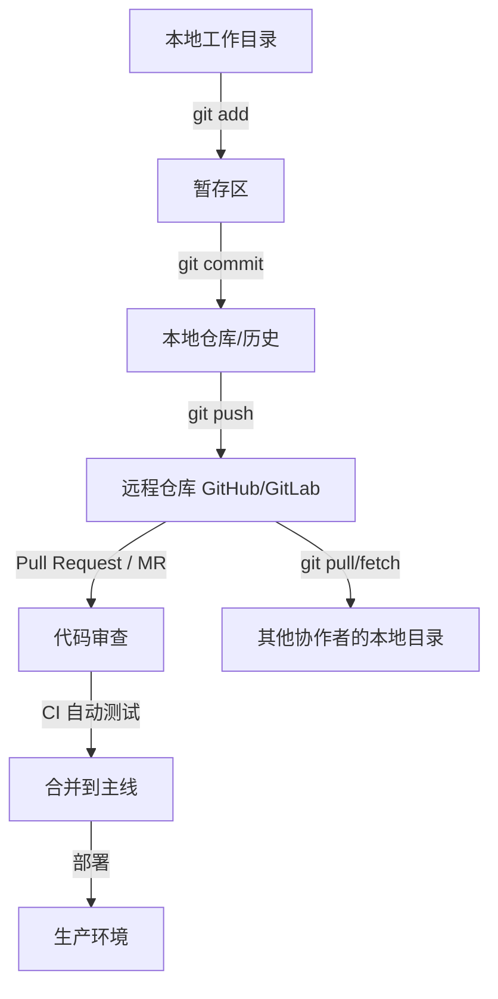
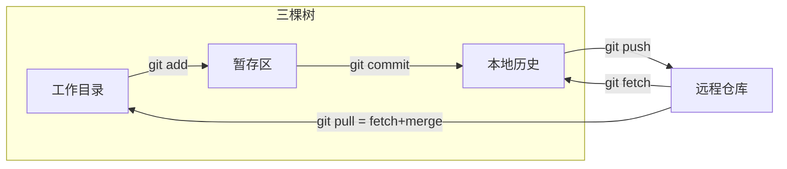
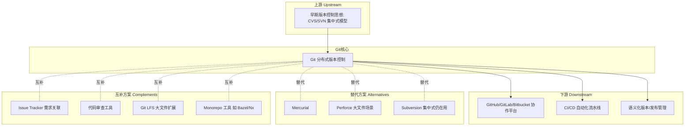

# Git 版本控制 —— 心智模型指南

> 目标不是教你 `git add / commit / push` 怎么敲，而是让你理解 Git 到底在解决什么问题、如何思考。

---

## 1. 本质（Essence）

> **一句话：Git 是一个记录"状态如何随时间演变"并允许多条演变路径并行存在、随时对比与合并的系统。**

- **为什么它存在？** 软件是团队协作、持续演化的产物。人们需要：知道"现在是什么状态"、知道"过去发生了什么"、能"安全地尝试新方向"而不破坏已有成果、能"多人同时改同一样东西"而不互相覆盖。
- **它解决的根本问题：** 不是"存文件"，而是**"变化的管理"**——谁在什么时候基于什么状态做了什么改动，以及这些改动如何与别人的改动共存。
- **没有它时人们怎么办？** 文件命名法（`v1_final_真的final.doc`）、整个项目复制粘贴备份、口头/邮件同步"谁改了什么"、改坏了没法回退。这些方法在单人、低频修改场景下勉强够用，一旦涉及并行分支和多人协作就会失控。
- **它带来的新可能：** 大胆实验（分支是免费的、可丢弃的）、并行开发多个功能而不互相干扰、精确追溯任何一行代码的来源（`blame`/`bisect` 背后的能力）、去中心化协作（每个人都有完整历史，不依赖中心服务器才能工作）。

**重点：Git 的价值在于"Why"——它把"变化"变成了一等公民（first-class citizen），而不是把文件当作一等公民。**

---

## 2. 世界模型（World Model）

| 维度 | 内容 |
|---|---|
| **对象（Objects）** | 快照（snapshot）、提交（commit）、分支（指针）、标签、工作区文件、暂存区内容 |
| **角色（Actors）** | 作者（author）、提交者（committer）、审阅者（reviewer）、维护者（maintainer） |
| **状态（State）** | 工作目录（正在改的东西）→ 暂存区（打算记录的东西）→ 历史（已经记录的东西）→ 远端（共享的记录） |
| **工作流（Workflow）** | 改动 → 暂存 → 提交 → 分支/合并 → 推送/拉取 → 审查（PR/MR）→ 集成到主线 |
| **交互系统** | GitHub/GitLab（协作+代码审查+CI）、CI/CD（自动构建/测试）、Issue Tracker（需求↔提交关联） |
| **创造的价值** | 可追溯性、可回退性、可并行性、去中心化协作、审计与合规能力 |

**Git 在生态系统中的位置：**

Git 本身只管"版本"这一层；它上面叠加了社交层（GitHub 的 PR、评论）、自动化层（CI/CD）、追溯层（Issue 关联）。**理解 Git 本质，是理解现代软件协作平台的地基。**

---

## 3. 概念地图（Concept Map）

### 第一层：核心对象

| 概念 | 名词 | 动词 | 目的 | 与其他概念的关系 |
|---|---|---|---|---|
| **Commit（提交）** | 一个不可变的快照 | 记录 | 固化某一时刻的完整状态 | 每个 commit 指向一个（或多个）父 commit，形成链 |
| **Branch（分支）** | 一个可移动的指针 | 指向 | 标记一条独立的演化路径 | 指向某个 commit；移动分支=创造新 commit |
| **Tag（标签）** | 一个固定的指针 | 标记 | 永久标记某个重要节点（如发布版本） | 类似分支但不移动 |
| **HEAD** | 一个特殊指针 | 表示"我现在在哪" | 决定下一次提交会接到谁后面 | 通常指向当前分支 |

### 第二层：状态转换机制

| 概念 | 名词 | 动词 | 目的 | 关系 |
|---|---|---|---|---|
| **Working Directory** | 你看到的文件 | 编辑 | 实际改动发生的地方 | 与暂存区/历史对比得出"diff" |
| **Staging Area（Index）** | 待提交的改动集合 | 挑选 | 让你可以"部分提交"，精确控制一个 commit 里包含什么 | 是 Working Dir 和 Commit 之间的缓冲层 |
| **Merge** | 把两条历史合成一条 | 合并 | 整合并行开发的成果 | 产生一个有两个父节点的 commit |
| **Rebase** | 把一条历史"嫁接"到另一条上 | 重写 | 让历史看起来是线性的 | 改写 commit 的父节点，等于重写历史 |
| **Remote** | 别处的仓库引用 | 同步 | 实现协作 | fetch=拉数据不改工作区；pull=fetch+merge |

### 第三层：冲突与协作机制

| 概念 | 名词 | 动词 | 目的 | 关系 |
|---|---|---|---|---|
| **Conflict** | 同一处被不同方式改动 | 需要人工裁决 | 保证合并结果的正确性由人确认，而非机器猜测 | 发生在 merge/rebase 时 |
| **Fork/Clone** | 仓库的完整副本 | 复制 | 去中心化协作的基础 | 每个副本都有完整历史 |
| **Pull Request** | 对"合并这条分支"的提议 | 审查 | 在代码进入主线前加一道人工关卡 | Git 之上的协作层（平台功能，非 Git 本身） |

**核心洞察：Git 的所有概念都围绕"指针指向不可变快照"这一个底层结构展开。** 分支、标签、HEAD 本质上都只是指针；真正不可变、值钱的是 commit 快照本身。

---

## 4. 决策地图（Decision Map）

> 专业人士在什么情境下会"自然想到"某个 Git 概念/操作？

**情境 1：我要开发一个新功能，但主线代码还要保持可用**
↓
决策：创建新分支
↓
理由：分支是隔离层，让实验性改动不影响他人和已发布代码
↓
预期结果：可以自由提交、失败也可以直接丢弃分支，零成本

**情境 2：我改了很多东西，但只想把其中一部分逻辑相关的改动打包成一次提交**
↓
决策：使用暂存区做部分添加（`git add -p` 之类的精细挑选）
↓
理由：一次 commit 应该是一个逻辑完整、可独立回退的单元
↓
预期结果：历史清晰，日后能精确定位"哪次提交引入了这个改动"

**情境 3：生产环境出现 bug，怀疑是某次改动引入的，但不知道是哪次**
↓
决策：二分查找历史提交（bisect 思维）
↓
理由：commit 历史是有序、可枚举的状态序列，可以二分定位
↓
预期结果：用 O(log n) 次测试定位到确切的引入提交

**情境 4：两个人同时改了同一个文件的同一部分**
↓
决策：触发 merge conflict，人工裁决
↓
理由：Git 无法猜测"哪个改动的语义优先"，必须由人确认
↓
预期结果：合并后的结果同时满足两边的意图（或明确取舍）

**情境 5：想让功能分支的历史看起来像是"顺着主线一路开发下来的"，方便审查**
↓
决策：使用 rebase 而非 merge
↓
理由：线性历史更易读，但代价是重写了 commit，不能用于已推送给别人的分支
↓
预期结果：干净的、单线的提交历史，但需团队约定何时允许 rebase

**情境 6：想发布一个正式版本，未来永远能找回这个确切状态**
↓
决策：打 tag
↓
理由：tag 不随开发继续而移动，是"钉死"的历史坐标
↓
预期结果：无论后续如何演化，`v1.0.0` 永远指向那一刻的快照

**情境 7：不确定某个大改动是否可行，想先探索**
↓
决策：新建分支实验，而不是直接改主分支
↓
理由：分支创建和切换几乎零成本，失败代价极低
↓
预期结果：鼓励探索行为——这是 Git 从"设计上"改变工作方式的地方

---

## 5. 搜索空间扩展（Search Space Expansion）

**初学者通常不会想到的问题：**
- "Commit 到底是什么，是存了整个项目的副本吗？"（其实是快照+内容寻址去重，不是每次都存全量拷贝）
- "分支切换的时候文件去哪了？"（其实工作目录内容会随分支切换而替换）
- "撤销一次提交和撤销一次推送，代价一样吗？"（本地历史可安全重写，已推送/被他人拉取的历史重写代价极高）
- "merge 和 rebase 到底有什么区别，为什么大家吵这个？"

**专家真正关心的问题：**
- 历史应该"忠实记录发生了什么"还是"整理成易读的叙事"？（merge 派 vs rebase 派的哲学分歧）
- 什么样的 commit 粒度是"好的"？（一个 commit = 一个可独立理解、可独立回退的逻辑单元）
- 何时该重写历史（本地未推送时安全），何时绝对不该（已被他人基于其继续开发时）
- 大型仓库的性能问题（大文件、深历史、monorepo 场景下 Git 的局限）
- 如何设计分支策略（Git Flow / Trunk-Based Development）以匹配团队的发布节奏

**下一步值得探索的问题：**
- Git 的对象模型（blob / tree / commit 三种对象如何构成整个历史）——这是理解"为什么 Git 这么快、这么省空间"的关键
- 分布式协作的信任模型：为什么每个 clone 都是对等的完整仓库，而不是"减配版"
- CI/CD 如何把"提交事件"变成自动化触发点，把 Git 从"版本工具"升级为"工程流程的骨架"

**决定这个领域上限的问题：**
- 你的团队能否就"分支策略"和"提交粒度规范"达成一致？（Git 本身很少是瓶颈，团队协作规范才是）
- 你是否理解"历史可变性"的边界？（这决定了你敢不敢做危险操作、能否安全协作）

---

## 6. 生态系统（Ecosystem）

- **上游：** CVS/SVN 的集中式模型暴露的痛点（单点故障、离线不可用、分支代价高）直接催生了 Git 的分布式设计。
- **下游：** GitHub 等平台把 Git 的"数据模型"包装成"协作产品"（PR、Review、Actions）；CI/CD 把"提交"变成自动化触发信号。
- **替代方案：** Mercurial（理念相近，生态更小）、Perforce（更适合超大二进制资产，如游戏行业）、SVN（仍在部分传统企业中）。
- **互补方案：** Git LFS 补足 Git 不擅长大文件的短板；Issue Tracker 补足"为什么改"的语义层（Git 只记录"改了什么"）。

---

## 7. 可迁移原则（Transferable Principles）

| 层次 | 内容 |
|---|---|
| **第一性原理** | 状态变化应当被显式记录、可追溯、可回退；并行演化路径应当能独立存在再择机合并 |
| **可迁移的方法论** | "小而完整的变更单元"思维（不止用于代码提交，也适用于任何需要审计的流程变更）；"分支隔离风险"思维（先在沙盒里验证，再合入主线）——这也是特性开关（feature flag）、金丝雀发布等工程实践的思想源头 |
| **当前实现细节** | 具体命令行语法（`git rebase -i`）、`.git` 目录内部文件格式、暂存区的具体交互方式 —— 这些会随工具版本变化，甚至可能被更好的 UI/AI 辅助工具取代 |
| **长期稳定的知识** | 内容寻址存储（content-addressable storage，用哈希标识内容）、有向无环图（DAG）历史模型、三路合并算法思想 |
| **容易变化的知识** | 具体平台功能（GitHub 界面如何操作 PR）、特定团队的分支策略约定 |

---

## 8. 最小心智模型（Minimum Mental Model）

按重要性排序，若只能记住这些：

1. **Commit = 不可变快照**，是 Git 唯一"值钱"的东西
2. **分支只是一个指向 commit 的可移动指针**，不是文件夹的副本
3. **历史是一个有向无环图（DAG）**，不是一条直线
4. **工作目录 → 暂存区 → 历史，是三个层级的状态**，不是一步到位
5. **本地历史可以安全重写，已共享的历史重写代价极高**——这是判断"能不能用 rebase/force push"的唯一标准
6. **Merge 保留两条历史的真实交叉过程；Rebase 制造一条假想的线性历史**
7. **冲突发生是因为机器无法猜测语义优先级**，本质上是"请人类决策"的信号，不是错误
8. **远程仓库只是"别处的一份完整副本"**，没有特殊地位（去中心化的核心含义）
9. **Tag 是固定坐标，Branch 是移动坐标**
10. **一个好的 commit 应该是逻辑完整、可独立理解、可独立回退的最小单元**
11. **`fetch` 只拉数据，`pull = fetch + merge`**（区分"看看远端有什么"和"把远端合入本地"）
12. **Git 本身只管版本历史；协作流程（PR、Review、CI）是平台叠加的社交层**，不要混淆两者
13. **分支创建/切换几乎零成本**——这个事实本身鼓励了"大胆实验"的工作方式
14. **`.git` 之外的一切都可以重来，`.git` 里已提交的东西很难真的丢失**（安全感的来源）

---

## 9. 常见误区（Common Misconceptions）

| 误区 | 为什么会产生 | 更准确的心智模型 |
|---|---|---|
| "Git 就是云盘/备份工具" | 只用过"提交=保存"的表层操作 | Git 管理的是**变化的历史结构**，而非单纯的文件存储；重点在"能回到任意历史状态、能并行演化" |
| "分支切换很危险，会丢文件" | 没理解工作目录只是"某个 commit 的物化视图" | 切换分支只是把工作目录替换成另一个快照的内容；未提交的改动才可能丢失，已提交的永远在历史里 |
| "Merge 和 Rebase 只是语法不同，结果一样" | 只看最终代码内容，没看历史结构 | 两者产生的**历史图结构完全不同**：merge 保留分叉的事实，rebase 抹去分叉制造假象的线性叙事；这直接影响未来 `bisect`/`blame` 的可读性 |
| "撤销提交很危险，能不动就不动" | 混淆了"本地未推送的历史"和"已共享的历史" | 本地历史重写是安全、常规的操作（`amend`、交互式变基）；危险的只是**重写已被他人拉取的历史** |
| "Git 只是给程序员用的，跟我关系不大" | 只见过命令行界面这一层 | 只要"多人协作 + 需要追溯变化 + 需要并行版本"，这套思维模型就适用（写作、设计稿、数据科学笔记本都在借用这套心智） |
| "远程仓库（如 GitHub 上那份）是'正版'，本地是'副本'" | 被"中心化"直觉误导 | Git 是**去中心化**的：本地仓库拥有完整、平等的历史；GitHub 只是大家约定的"协作汇合点"，不是技术上的权威源 |

---

## 10. 总结（Summary）

> 我真正获得的不是 **一套记忆命令行语法的技能**，
> 而是 **一种把"变化"当作一等公民来管理的思维方式——用不可变快照记录事实、用可移动指针表达意图、用分支隔离风险、用合并整合成果，从而能够放心地并行实验、协作与追溯任何一次决策**。
