---
vmark:
  id: 019fe030-0112-7a83-ba19-92ed6b0dbc47
---
# Git 版本控制 · 学习地图

> 本文不教你「怎么用」，而是帮你建立 **心智模型（Mental Model）与世界模型（World Model）**。
> 默认前提：具体的命令、参数、冲突解决的操作步骤由 AI 替你完成。你需要拥有的，是**判断力**——知道它在管什么、为什么这样设计、什么时候该想到它。

---

## 1. 本质（Essence）

> **Git 是一台「状态时间机器」：它把你的项目在每个时刻的完整样子存下来，并让你在这些时刻之间自由移动、比较、合并。**

注意这句话里没有出现「代码」。Git 管的是**文件状态的历史**，代码只是最常见的一种文件。

更精确一点的定义：

> Git 是一个**内容寻址的、只追加的、有向无环图（DAG）数据库**，图上的每个节点是项目某一刻的完整快照。

这句话看起来学术，但它解释了 Git 几乎所有「奇怪」的行为。后面会反复回到它。

### 为什么它存在

因为软件开发有三个**根本性**的困难，而它们都是关于**时间**和**并行**的：

| 根本困难      | 具体表现                      |
| --------- | ------------------------- |
| **时间不可逆** | 改坏了想回到昨天，但昨天已经没了          |
| **多人并行**  | 两个人改同一个项目，怎么合并而不互相覆盖      |
| **意图丢失**  | 三个月后看到一行奇怪的代码，不知道当初为什么这么写 |

在没有版本控制的世界里，这三件事各自有一个笨办法，而且都很糟糕。

### 没有它时，人们通常怎么办

```
项目最终版.doc
项目最终版_v2.doc
项目最终版_v2_真的最终.doc
项目最终版_v2_真的最终_改完了别再改了.doc
```

这个笑话是真实的历史。它同时暴露了三个问题：

1. **没有可靠的历史** —— 你不知道 v2 和 v1 到底差在哪
2. **没有并行能力** —— 两个人同时改，只能靠「你先改完发给我」
3. **没有意图记录** —— 文件名承载不了「为什么改」

而且它有一个更隐蔽的代价：**因为回退很痛苦，人会变得不敢改。** 这才是最贵的成本。

### 它解决什么根本问题

> 🔑 **Git 真正解决的问题是：让「改动」这件事的成本，从「可能毁掉一切」降到「随时可以撤销」。**

一旦撤销变得廉价，人的行为就会改变——你会更敢于尝试、更敢于重构、更敢于让 AI 帮你大改。**Git 是一种心理基础设施，不只是技术基础设施。**

### 它带来了哪些新的可能

1. **分支变得廉价** —— 可以同时探索五个方案，失败的直接扔掉，零代价。
2. **协作可以异步** —— 全球开发者互不认识，也能协同改同一个项目（开源模式因此成立）。
3. **历史成为可查询的数据** —— 「这行代码是谁、什么时候、为什么加的」变成一次查询而不是考古。
4. **代码可以自动化流转** —— CI/CD 的触发器全是 git 事件：push、PR、tag。没有 Git 就没有现代自动化流水线。
5. ⭐ **AI 可以放手改你的代码** —— 因为任何改动都能一键回退。**Git 是让 AI 编程变得安全的那个前提条件。**

> 💡 第 5 点值得停一下：你之所以敢让 Claude 直接改你的文件，本质上是因为背后有 git 兜底。**没有版本控制的目录里，AI 的写权限是不可接受的风险。**

---

## 2. 世界模型（World Model）

### 它处理哪些对象（Objects）

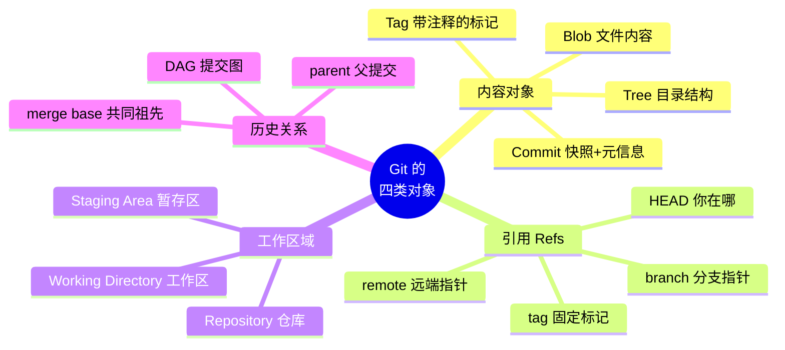

> 🔑 **最关键的认知**：Git 里只有**对象**和**指针**两种东西。分支不是文件夹，不是副本，就是**一个指向某个提交的指针**，内容只有 40 个字符。这就是为什么建分支几乎不花时间。

### 涉及哪些角色（Actors）

| 角色                        | 关心什么          | 典型动作                         |
| ------------------------- | ------------- | ---------------------------- |
| 👤 **作者（Author）**         | 我的改动能不能安全保存   | commit、branch、stash          |
| 👥 **协作者（Collaborator）**  | 怎么和别人的改动合到一起  | merge、rebase、pull            |
| 👁️ **审查者（Reviewer）**     | 这次改了什么、为什么    | diff、log、blame、PR            |
| 🏛️ **维护者（Maintainer）**   | 主干的健康、发布节奏    | tag、release、protected branch |
| 🤖 **自动化（CI/CD）**         | 触发条件与可复现的检出点  | checkout、push 事件、commit SHA  |
| 🔬 **考古者（Archaeologist）** | 这个 bug 是哪次引入的 | bisect、blame、log -S          |

> 🤖 **AI Agent 是这里的新角色**，而且它同时扮演了作者和考古者。它需要 git 提供两样东西：**可回退的写入**（安全网）和**可查询的历史**（上下文来源）。你的 `daily-ai-news` 项目里，那个每天在 GitHub VM 里出生又消失的 Claude，最后一步做的就是 `git commit && git push`——**git 是它唯一留下的痕迹。**

### 管理哪些状态变化（State）

这是 Git 最容易搞混、也最重要的一块。**Git 里有三个「地方」，你的文件同时存在于其中若干个：**

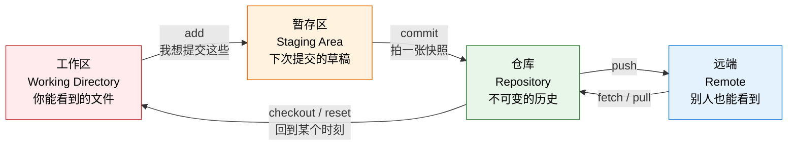

**为什么要有暂存区这个中间层？** 这是初学者最不理解的设计。答案是：

> 你这次改了 5 个文件，但其中只有 3 个属于同一件事。暂存区让你能**把一次混乱的编辑，整理成几次干净的提交**。

暂存区的存在，是 Git 在说：**提交的单位应该是「一个完整的意图」，不是「我这段时间碰过的所有文件」。**

### 状态的可逆性阶梯

| 状态位置               | 丢了能找回吗            | 风险等级   |
| ------------------ | ----------------- | ------ |
| 工作区未保存的编辑          | ❌ 找不回             | 🔴 最危险 |
| 工作区已保存未 add        | ⚠️ 大概率找不回         | 🔴 危险  |
| 已 add 到暂存区         | ✅ 通常能找回           | 🟡 中   |
| 已 commit（哪怕后来删了分支） | ✅ 几乎一定能找回（reflog） | 🟢 安全  |
| 已 push 到远端         | ✅ 别人那里也有          | 🟢 最安全 |

> 💡 **这张表比任何命令都重要。** 它推出一条实用法则：**commit 是免费的保险。犹豫的时候就先 commit，历史可以事后整理，丢失的工作找不回来。**

### 改变哪些工作流（Workflow）

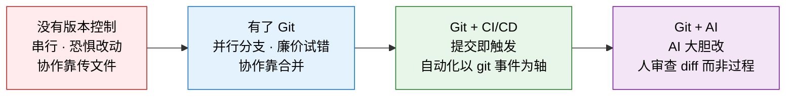

> ⭐ 注意第四阶段的工作性质转移：**当 AI 写代码时，人的主要工作从「写」变成了「读 diff」。** Git 恰好是那个把「变化」变成一等公民的系统——这是它在 AI 时代反而更重要的原因。

### 与哪些系统交互（Systems）

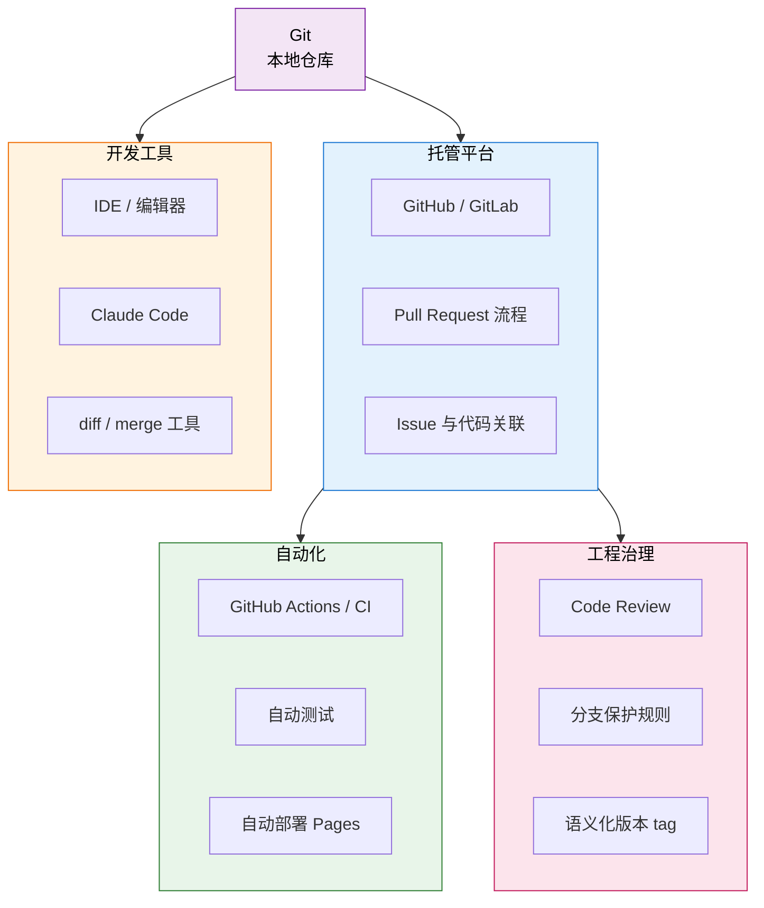

> 🔑 注意这张图的形状：**Git 在最中间，所有东西都挂在它上面。** 这不是巧合。整个现代软件工程的自动化和协作体系，都是以「代码状态的变化」为轴心构建的，而 Git 是唯一记录这个变化的系统。

### 创造哪些价值（Value）

- **可逆性（Reversibility）** —— 把「不敢动」变成「随便试」。这是最大的价值，也是最被低估的。
- **可追溯性（Traceability）** —— 每一行代码都能回答「谁、何时、为何」。
- **并行性（Parallelism）** —— 多条思路同时推进而不互相污染。
- **协作的可扩展性** —— 从 2 人到 2000 人用的是同一套机制。
- **自动化的锚点** —— commit SHA 是一个精确、不可变、可复现的坐标。

---

## 3. 概念地图（Concept Map）

### 三层结构

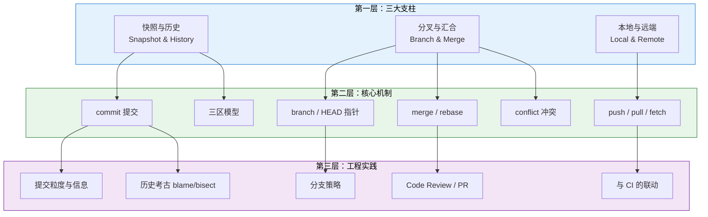

### 第一层概念详解

#### 支柱一：快照与历史（Snapshot & History）

- **名词**：commit（提交）、object（对象）、SHA（哈希）、history（历史）
- **动词**：拍快照（commit）、比较（diff）、回溯（checkout / reset）
- **目的**：让每一个「时刻」都成为可以被精确指认、精确回到的坐标
- **关系**：这是 Git 的**地基**。分支和远端都建立在「快照序列」之上——分支只是指向某个快照的指针，push 只是把快照复制到另一台机器。

**一个关键的误解要在这里纠正**：Git 存的是**完整快照**，不是「改动差异」。你看到的 diff 是 Git **当场算出来给你看的**，不是它存储的方式。

> 💡 为什么这重要？因为它解释了为什么 `checkout` 到任何一次提交都同样快——每个提交都是完整的，不需要「从头累加差异」。

**commit 到底包含什么**：

| 组成部分     | 作用                            |
| -------- | ----------------------------- |
| 完整的文件树快照 | 项目那一刻的全部样子                    |
| 父提交指针    | 它从哪来 —— **这条边构成了整个历史图**       |
| 作者、时间    | 谁、什么时候                        |
| 提交信息     | 🔑 **为什么** —— 唯一一个代码本身无法表达的信息 |

> ⭐ 提交信息是 commit 里**唯一不能从代码推导出来的部分**。改了什么，diff 能告诉你；为什么改，只有提交信息能告诉你。这是 commit message 值得认真写的根本原因——不是礼貌，是**信息论上的不可替代**。

#### 支柱二：分叉与汇合（Branch & Merge）

- **名词**：branch（分支）、HEAD、merge base（共同祖先）、conflict（冲突）
- **动词**：分叉（branch）、切换（checkout/switch）、合并（merge）、变基（rebase）
- **目的**：让多条思路能同时存在、独立演进，最后再决定要不要汇合
- **关系**：分支依赖快照（支柱一）——没有稳定的提交，就没有可分叉的点。分支同时是协作（支柱三）的**基本单位**。

**理解分支的唯一正确方式**：

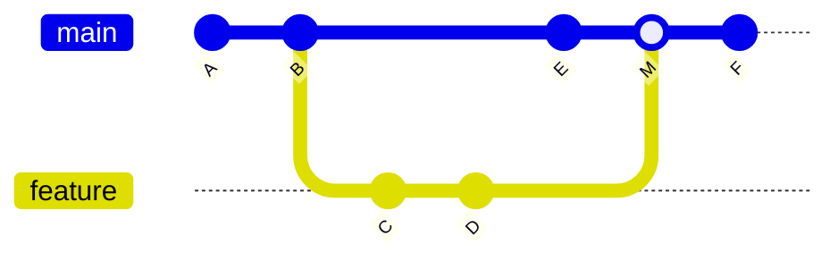

- `main` 和 `feature` 都只是**指针**
- 提交 `M` 是一个有**两个父提交**的特殊 commit，这就是「合并」的全部含义
- `merge base` 是 B —— Git 靠它来判断「你们各自改了什么」

**冲突的真正含义**：

> ⚠️ 冲突不是 Git 出故障，是 Git 在说：**「这里两个人对同一段内容有不同的意图，我不能替你决定谁对。」**

Git 能自动合并的前提是**改动不重叠**。重叠时，它拒绝猜测——这是**正确的设计**。自动猜测的代价是静默的错误，那比让你手动决定糟糕得多。

**merge vs rebase 的本质区别**：

|       | merge            | rebase              |
| ----- | ---------------- | ------------------- |
| 做什么   | 造一个新的合并提交，保留两条历史 | 把你的提交「搬」到另一个基点上重放   |
| 历史形状  | 有分叉，真实           | 一条直线，整洁             |
| 保留了什么 | 真实发生的过程          | 逻辑上的叙述              |
| 代价    | 历史图复杂            | ⚠️ **重写了提交，SHA 变了** |
| 何时用   | 合并到公共分支          | 整理自己还没分享出去的提交       |

> 🔑 **黄金法则：不要 rebase 已经推送给别人的提交。** 因为 rebase 创造的是**新的提交**（旧的被丢弃），别人手里那份就成了孤儿。这条法则背后是一个更普遍的原理：**已经公开的历史是别人的依赖，不能单方面重写。**

#### 支柱三：本地与远端（Local & Remote）

- **名词**：remote、origin、上游分支（upstream）、克隆（clone）
- **动词**：推送（push）、抓取（fetch）、拉取（pull）、克隆（clone）
- **目的**：让同一份历史存在于多台机器，且能对账
- **关系**：远端建立在快照和分支之上——同步的单位是**提交**，对齐的对象是**分支指针**。

**Git 是分布式的，这句话的真实含义**：

> 你本地的 `.git` 目录里，装着**完整的项目历史**。不是缓存，不是部分副本，是全量。GitHub 挂了，你的历史一点都不少。

这带来一个关键推论：**Git 的绝大多数操作不需要网络。** commit、branch、diff、log、blame 全部是本地操作，所以它们才这么快。只有 push / fetch / clone 需要网络。

> 💡 初学者常把 GitHub 当成「Git 的服务器」。更准确的模型是：**GitHub 只是众多副本中约定俗成的「那一份」**。它的特殊性来自社会约定，不来自技术。

### 第二层：概念之间的依赖关系

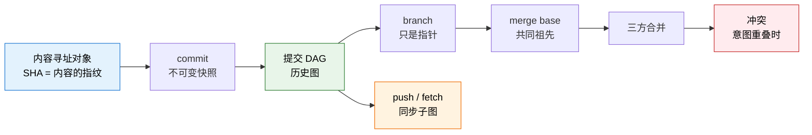

> 🔑 从左到右读这张图，你会发现**整个 Git 是从一个想法推导出来的**：「用内容的哈希来标识内容」。因为提交的 SHA 包含了父提交的 SHA，所以历史一旦形成就不能悄悄改——改任何一处，后面所有 SHA 全变。**Git 的不可篡改性不是加上去的功能，是数据结构的副产品。**

### 第三层：从概念到实践的演进链

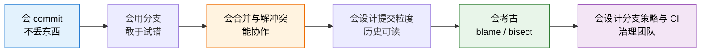

> 💡 大多数人卡在 S3 到 S4 之间。原因是：S1–S3 是「让 Git 能用」，S4 之后是「让历史对未来的人有用」——后者需要的是**表达能力**，不是操作能力。而这恰好是 AI 最难替你做的部分。

---

## 4. 决策地图（Decision Map）

### 决策树总览

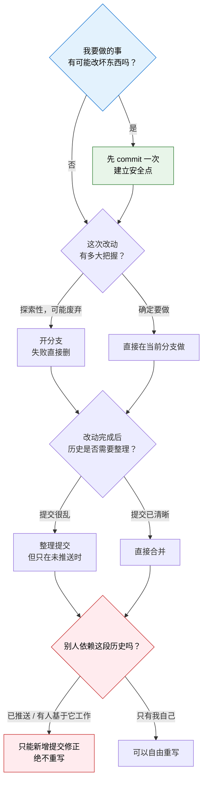

### 真实场景推演

#### 场景 A：准备让 AI 大改一批文件

```
Situation
  想让 Claude 重构整个项目结构，涉及几十个文件
    ↓
Decision
  动手前先 commit（哪怕信息只写 "before refactor"）
  最好再开一个分支
    ↓
Reason
  · AI 的改动是批量的、快速的，肉眼来不及逐个确认
  · commit 之后，无论它做了什么，一条命令就能全部退回
  · 分支让你能把 AI 版本和原版并排比较，而不是二选一
    ↓
Expected Outcome
  把「让 AI 改代码」从一次赌博，变成一次可撤销的实验
```

> 🤖 **这是 AI 时代最重要的 Git 场景。** 上一篇讲 Claude 参数时提到的公式在这里得到印证：
> **实际安全性 = 权限约束 × 环境可逆性** —— git 就是那个「环境可逆性」因子。

#### 场景 B：写到一半，突然要处理紧急问题

```
Situation
  功能改了一半，代码跑不起来，但线上出了 bug 要立刻修
    ↓
Decision
  把当前工作暂存起来（stash），或者干脆提交到临时分支
    ↓
Reason
  · 半成品不能提交到主干，但也不能丢
  · Git 的三区模型让「未完成的工作」有地方安放
  · 修 bug 需要一个干净的工作区作为起点
    ↓
Expected Outcome
  两条思路互不污染，修完 bug 能原样回到半成品
```

#### 场景 C：一个 bug 不知道是什么时候引入的

```
Situation
  三个月前功能是好的，现在坏了，中间有 400 次提交
    ↓
Decision
  二分查找（bisect）——Git 自动在历史中二分，你只需回答「这个版本好还是坏」
    ↓
Reason
  · 400 次提交，二分只需要约 9 次判断
  · 这是「历史作为可查询数据」的直接兑现
  · 前提是：每次提交都是可运行的状态
    ↓
Expected Outcome
  精确定位到引入问题的那一次提交，连带看到当时的提交信息和作者
```

> 💡 场景 C 反过来解释了「为什么每次提交都应该是可工作的状态」——不是洁癖，是为了让未来的二分查找成立。**提交纪律是在为未来的自己买保险。**

#### 场景 D：看到一行看不懂的代码

```
Situation
  代码里有一个奇怪的判断，删掉好像也没事
    ↓
Decision
  先查这行是哪次提交引入的（blame），再看那次提交的完整信息
    ↓
Reason
  · 「看起来没用的代码」往往是某个 bug 的修复
  · 提交信息里可能写着「修复 XX 情况下的崩溃」
  · 这是唯一能恢复「当初的意图」的途径
    ↓
Expected Outcome
  要么理解了它存在的理由，要么确认它确实过时了 —— 两种都是知情决策
```

#### 场景 E：项目要自动化发布

```
Situation
  希望每次改动能自动测试、自动部署
    ↓
Decision
  以 git 事件为触发轴心：push 触发测试，合并到主干触发部署，tag 触发发布
    ↓
Reason
  · 自动化需要一个精确、不可变、可复现的坐标 —— commit SHA 正是
  · 「代码在什么状态」这个问题，只有 Git 能权威回答
    ↓
Expected Outcome
  部署产物与某个具体提交一一对应，出问题能精确回滚到上一个 SHA
```

> 🤖 你的 `daily-ai-news` 就是这个形态：Claude 生成文件 → 校验 → `git commit && git push` → GitHub Pages 自动更新。**整条流水线的每一步交接，都是通过 git 状态完成的。**

#### 场景 F：两个人改了同一个文件

```
Situation
  合并时 Git 报冲突
    ↓
Decision
  逐处查看两边的意图，人工决定保留什么，然后标记为已解决
    ↓
Reason
  · Git 不猜是对的 —— 猜错会造成静默的逻辑错误
  · 冲突处需要的是「理解两边想干什么」，这是语义判断不是文本操作
    ↓
Expected Outcome
  合并结果同时保留了两边的意图，而不是简单的谁覆盖谁
```

---

## 5. 搜索空间扩展（Search Space Expansion）

### 初学者通常不会想到的问题

- ❓ **Git 存的是差异还是完整快照？** —— 完整快照。diff 是算出来的。这个认知会改变你对很多操作的理解。
- ❓ **删掉的分支，提交真的没了吗？** —— 通常没有。Git 有 reflog 记录 HEAD 的移动轨迹，「丢失」的提交往往还在，只是没有指针指着它。**「Git 里几乎什么都能找回来」在很大程度上是真的。**
- ❓ **为什么需要暂存区这个多余的步骤？** —— 因为它让你能把混乱的编辑整理成有意图的提交。这是 Git 在强推一种工作观念。
- ❓ **合并冲突为什么会发生？Git 不能自己判断吗？** —— 不能，也不应该。冲突是「意图重叠」的信号，不是故障。
- ❓ **`.gitignore` 为什么重要？** —— ⚠️ 因为**提交进去的东西很难真正删干净**（历史里还在）。API key 一旦被提交并推送，唯一安全的做法是**当作已泄漏并立刻更换**，而不是删掉再提交一次。
- ❓ **提交信息真的有人看吗？** —— 三个月后的你会看，而且那时它是唯一的线索。
- ❓ **Git 只能管代码吗？** —— 不是。文档、配置、笔记、写作都适用。凡是「文本 + 需要历史」的东西都适用。

### 专家真正关心的问题

- 🔬 **提交粒度**：一次提交应该包含多少？标准是「一个完整、可回退、可描述的意图」——不是时间长度，也不是文件数量。
- 🔬 **历史的可读性**：三个月后有人读这段历史，能理解发生了什么吗？历史是写给未来的人看的文档。
- 🔬 **每次提交是否可运行**：这决定了 bisect 能不能用，也决定了任意提交能否成为回滚点。
- 🔬 **分支策略与团队规模的匹配**：一个人的项目和五十人的项目需要完全不同的策略。照搬大厂流程到个人项目是常见的过度工程。
- 🔬 **什么该进版本控制，什么不该**：生成物、依赖包、密钥、大文件——每一类都有讲究。
- 🔬 **历史重写的边界**：能力上什么都能改，纪律上「公开的历史不可重写」。
- 🔬 **仓库的边界**：一个仓库放一个项目还是多个（monorepo）？这是架构决策，不是工具决策。

### 下一步值得探索的问题

1. **reflog 与「找回丢失的提交」** —— 会了这个，你对 Git 的恐惧会大幅下降
2. **交互式暂存** —— 同一个文件里只提交一部分改动，这是提交粒度的关键工具
3. **bisect 的实战用法** —— 把「找 bug」变成机械的二分过程
4. **分支策略光谱** —— trunk-based / GitHub Flow / Git Flow，各自适合什么规模
5. **Pull Request 作为社会机制** —— 它是 Git 之上的协作协议，不是 Git 本身
6. **`git worktree`** —— 同一个仓库同时检出多个分支到不同目录（和 Claude Code 的 `--worktree` 是同一个东西）
7. **密钥泄漏的应急处理** —— 提交历史里的密钥怎么处理

### 哪些问题决定了这个领域的上限

> 🔑 **上限问题一：你的提交历史，是「操作记录」还是「决策记录」？**

只记录「改了什么」的历史，价值随时间迅速衰减——因为 diff 本来就能告诉你改了什么。记录「为什么改」的历史，价值随时间**增长**——它成了项目唯一的决策档案。

> 🔑 **上限问题二：你的团队是把 Git 当保险箱，还是当协作协议？**

当保险箱用，Git 只是个备份工具，价值有限。当协作协议用（分支约定、PR 规范、提交规范、CI 联动），Git 成了整个工程流程的骨架。

> ⭐ **上限问题三（AI 时代新增）：你的历史能否让 AI 理解这个项目？**

AI 读你的代码时，也在读你的提交历史。清晰的历史让 AI 能理解「这个模块为什么长这样」；混乱的历史（一堆 "update"、"fix"）让它只能靠猜。**在 AI 协作的时代，提交信息的读者多了一个，而且这个读者读得比人更认真。**

---

## 6. 生态系统（Ecosystem）

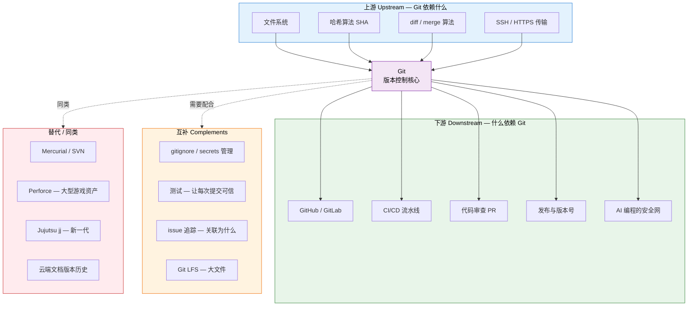

### 关于替代方案

| 方案               | 特点                | 什么时候它更合适              |
| ---------------- | ----------------- | --------------------- |
| **Git**          | 分布式、分支廉价、生态最大     | 几乎所有文本类项目——事实标准       |
| **SVN**          | 集中式、线性、简单         | 遗留系统；需要严格集中控制的场景      |
| **Perforce**     | 擅长超大二进制资产         | 游戏、影视——几百 GB 的美术资源    |
| **Jujutsu (jj)** | 兼容 Git 仓库，操作模型更简洁 | 想要更好的用户体验，又不放弃 Git 生态 |

> 💡 值得知道的一点：**Git 赢下市场靠的不只是技术，还有 GitHub 带来的网络效应。** 理解这一点能让你对「技术选型」有更真实的认识——最好的技术不一定赢，生态最大的通常赢。

### 互补关系里最重要的两条

**1. 测试是提交的信用担保。** 没有测试，「每次提交都可运行」只是愿望；有了测试 + CI，它变成可强制执行的规则，bisect 也才真正可用。

**2. Git 与「不该进版本控制的东西」是一体两面。** ⚠️ Git 的「什么都留着」特性，对密钥来说是灾难。你之前关掉 iCloud 同步是出于同样的担忧——**存储系统的持久性，对秘密而言是风险而不是优点。** 处理密钥的正确方式是让它从来没进过仓库（环境变量 / secrets），而不是事后删除。

---

## 7. 可迁移原则（Transferable Principles）

### 第一性原理（几乎永远不变）

1. **不可变历史 + 可移动指针** —— 历史只追加不修改，「你在哪」由一个可移动的指针表示。这个模式在数据库日志、区块链、事件溯源架构里是同一个东西。
2. **内容寻址（Content Addressing）** —— 用内容的哈希做标识。相同内容自动去重，任何篡改自动暴露。
3. **可逆性降低试错成本，试错成本决定创新速度** —— 这条超出技术范畴，适用于一切实验性活动。
4. **拒绝猜测优于静默出错** —— 冲突时停下来问人，比自动合出一个错误答案好。这是所有可靠系统的设计原则。
5. **分布式副本消除单点故障** —— 每个克隆都是完整备份。
6. **公开的东西不可单方面重写** —— 一旦别人依赖了，它就不再只属于你。这是 API 版本管理、公共协议演进的同一条原则。

### 可迁移的方法论（换个工具依然有用）

- **动手前先建立安全点** —— 改配置前先备份，重构前先提交，升级前先快照。这是通用的风险管理动作。
- **把工作切成可独立回退的单元** —— 无论是提交、任务还是部署，「单元」的正确大小都是「一个完整、可撤销的意图」。
- **记录 why 而不只是 what** —— 提交信息、代码注释、决策文档、会议纪要，都是同一件事。
- **让状态显式化** —— 「现在处于什么状态」应该能被精确指认，而不是靠记忆。
- **二分查找定位问题** —— bisect 的思路适用于任何「知道好的起点和坏的终点」的排查。

### 当前实现细节（会变，别背）

- 具体命令拼写（`checkout` 已经被拆成 `switch` 和 `restore`）
- 默认分支叫 `master` 还是 `main`
- 哈希算法（SHA-1 正在迁移到 SHA-256）
- 各种命令的参数组合、撤销操作的具体写法
- GitHub 界面长什么样

> ⚠️ 这一层就是应该交给 AI 的部分。**Git 的命令行界面公认设计得不好**——同一个命令做好几件不相关的事，撤销操作有七八种写法。这恰恰是 AI 帮你最省力的地方：你描述意图（「我想撤销刚才那次提交但保留改动」），AI 给出命令。

### 长期稳定 vs 容易变化

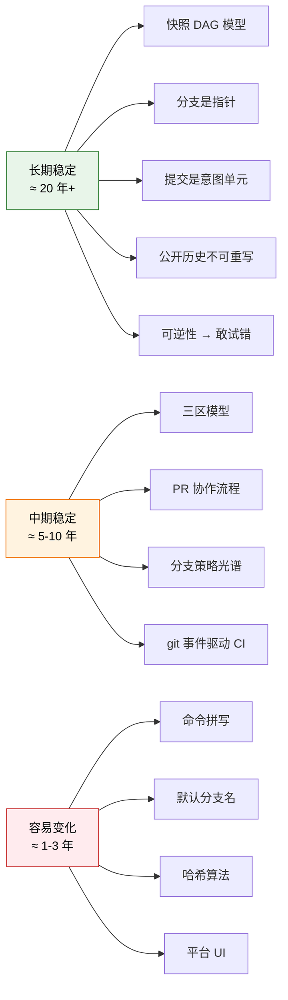

> 🔑 **学习策略**：绿色部分学一次管二十年，值得反复琢磨。红色部分交给 AI 和搜索。橙色部分随着你的项目规模变化而调整。

---

## 8. 最小心智模型（Minimum Mental Model）

如果只能记住 15 个概念：

| #  | 概念                          | 为什么它排在这里                     |
| -- | --------------------------- | ---------------------------- |
| 1  | **Git 存的是完整快照，不是差异**        | 地基认知。想错这条，后面对分支、切换、合并的理解全都会偏 |
| 2  | **commit 是一个安全点，而且是免费的**    | 推出最实用的一条纪律：犹豫就先提交            |
| 3  | **分支只是一个指针**                | 解释了为什么分支廉价，也解释了合并到底在合并什么     |
| 4  | **可逆性阶梯：未提交 → 已提交 → 已推送**   | 判断「我现在有多安全」的唯一标尺             |
| 5  | **三区模型：工作区 / 暂存区 / 仓库**     | 解释了 Git 大部分「奇怪」的行为           |
| 6  | **提交信息记录 why，diff 记录 what** | 提交信息是唯一无法从代码推导的信息            |
| 7  | **冲突 = 意图重叠，不是故障**          | 把「解决冲突」从恐惧变成一项正常工作           |
| 8  | **公开的历史不可重写**               | 唯一一条会真正伤害别人的红线               |
| 9  | **Git 是分布式的，本地就有完整历史**      | 解释了为什么大部分操作这么快、不需要网络         |
| 10 | **几乎所有提交过的东西都能找回（reflog）**  | 消除恐惧，让你敢用 Git 的高级功能          |
| 11 | **⚠️ 提交过的密钥要当作已泄漏**         | 唯一一个「Git 帮不了你」的场景，代价最高       |
| 12 | **一次提交 = 一个完整、可回退的意图**      | 提交粒度的判断标准                    |
| 13 | **commit SHA 是精确不可变的坐标**    | 所有自动化和回滚的锚点                  |
| 14 | **merge 保留过程，rebase 重述叙事**  | 两者不是好坏之分，是意图之分               |
| 15 | **⭐ Git 是 AI 编程的安全网**       | 决定了你敢不敢放手让 AI 改代码            |

### 三句话版本

> 1. **Git 是一条只能往后长的快照链，分支只是指着链上某点的指针。**
> 2. **提交是免费的保险，犹豫的时候就先提交——历史可以事后整理，丢失的工作找不回来。**
> 3. **Git 真正的产品不是备份，是「敢改」这件事本身。**

---

## 9. 常见误区（Common Misconceptions）

### 误区 1：Git 是「代码备份工具」

- **为什么会这么想**：最直观的用途确实是防丢失。
- **更准确的模型**：备份只是副产品。Git 的核心产品是**并行探索的能力**和**历史作为可查询数据**。如果只当备份用，你会 90% 的时间只用 commit 和 push，永远不碰分支——那等于买了汽车只当仓库使。

### 误区 2：分支是「项目的一个副本」

- **为什么会这么想**：切换分支时文件确实全变了，看起来像换了个文件夹。
- **更准确的模型**：分支只是**一个 40 字符的指针**。文件变化是 Git 根据指针指向的快照重新铺开工作区的结果。理解了这点，「为什么建分支是瞬间的」「合并到底在合并什么」都自然通了。

### 误区 3：Git 存的是每次的改动差异

- **为什么会这么想**：因为界面上到处都在显示 diff。
- **更准确的模型**：存的是**完整快照**（配合内容去重，所以并不浪费空间）。diff 是需要时当场计算的**视图**，不是存储格式。

### 误区 4：合并冲突说明我做错了什么

- **为什么会这么想**：冲突提示看起来像错误信息，而且解决起来麻烦。
- **更准确的模型**：冲突是 Git 在**正确地拒绝替你做语义判断**。它意味着两个人对同一段内容有不同意图——这是协作的正常产物。⚠️ 真正糟糕的设计是自动猜一个，那会产生静默的错误。

### 误区 5：GitHub 就是 Git

- **为什么会这么想**：大多数人是通过 GitHub 认识 Git 的。
- **更准确的模型**：Git 是本地的分布式版本控制系统，GitHub 是一个托管平台加上一层社交/协作功能（PR、Issue、Actions）。**PR 不是 Git 的概念，是 GitHub 加的协作协议。** 断网状态下你依然可以完整地使用 Git。

### 误区 6：提交信息写什么无所谓

- **为什么会这么想**：写的时候你什么都记得，看不出价值。
- **更准确的模型**：提交信息是 commit 里**唯一不能从代码推导出来的部分**。三个月后它是唯一的线索，而且现在 AI 读你的项目时也在读它。写 "update" 等于**主动销毁信息**。

### 误区 7：删了分支/回退了提交，东西就永久没了

- **为什么会这么想**：删除操作在别处通常是不可逆的。
- **更准确的模型**：Git 的 reflog 记录了 HEAD 的所有移动。只要提交过，绝大多数情况都能找回。**这个认知的价值在于消除恐惧**——知道有后路，你才敢用 Git 的更多能力。（唯一真正危险的是**从未提交过**的工作。）

### 误区 8：rebase 比 merge「更高级」，应该优先用

- **为什么会这么想**：直线历史看起来更专业整洁。
- **更准确的模型**：它们是**不同意图**，不是不同水平。merge 保留真实发生的过程，rebase 重述一个更好读的叙事。⚠️ 而且 rebase 有明确红线：**不能用在已经推送给别人的提交上**。盲目追求整洁历史而重写公共分支，是团队里最容易引发事故的操作。

### 误区 9：把敏感文件提交了，删掉再提交一次就行了

- **为什么会这么想**：文件确实从当前版本消失了。
- **更准确的模型**：⚠️ **历史里还在，而且如果已经推送，别人的克隆里也还在。** 正确做法是**立刻把那个密钥作废并更换**，把清理历史当作次要动作。**Git 的持久性对代码是优点，对秘密是灾难。**

### 误区 10：Git 只适合程序员和代码

- **为什么会这么想**：所有教程都在讲代码。
- **更准确的模型**：Git 适合**一切「文本 + 需要历史 + 可能协作」的东西**——文档、笔记、配置、写作、提示词模板。你现在正在积累的这些学习笔记，就是一个典型的适用场景。

---

## 10. 总结（Summary）

> **我真正获得的不是 ~~一套保存和回退代码的命令~~，**
> **而是 一种「让改动变得廉价可逆」的工作方式——因为任何状态都能被精确记录、精确回到、并行探索，我才敢于大胆尝试、敢于重构、敢于让 AI 动我的项目；而这些提交叠加起来，最终成了这个项目唯一的决策档案。**

### 收束成一张图

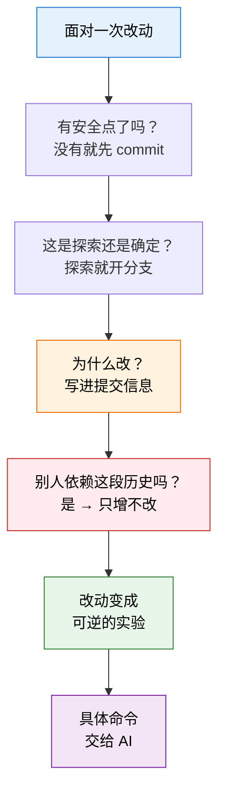

> 🔑 **最后一句**：Git 的命令你不用背——它的命令行界面连专家都嫌乱，本来就该交给 AI。你需要留在脑子里的只有一件事：**「我现在处于历史的哪个位置，退回去要付多大代价。」** 能随时回答这个问题，你就已经会用 Git 了。

---

*生成模型：Claude Opus 5 ｜ 生成日期：2026-08-08*
