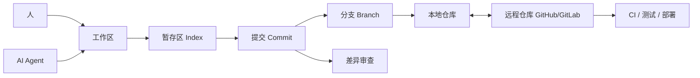
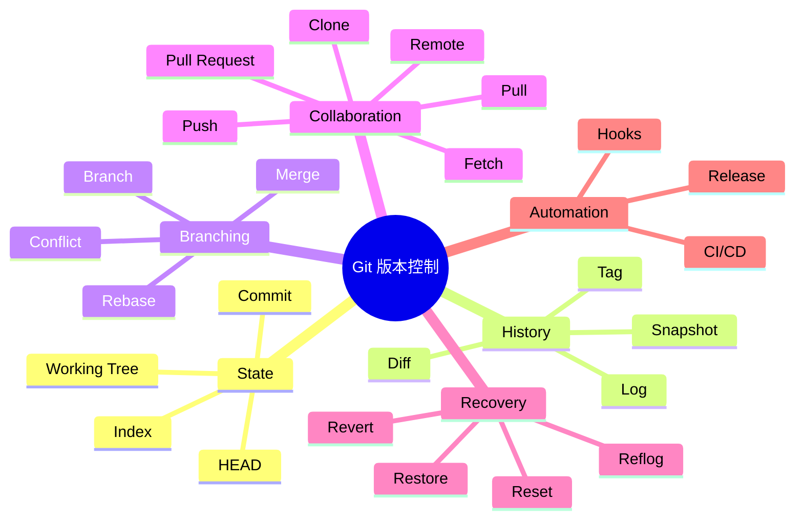
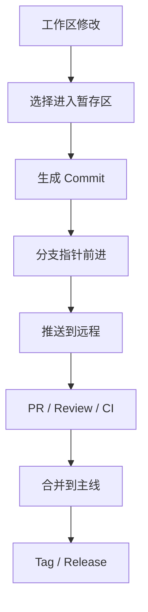
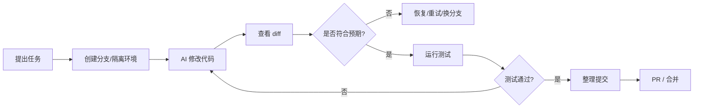

# Git 版本控制基础：AI 时代学习地图

## 1. 本质（Essence）

> Git 本质上是一个记录、比较、分支和合并文件历史的分布式版本数据库。

它存在的原因不是为了让人记住 `add`、`commit`、`push` 这些命令，而是为了解决一个根本问题：

> 当很多人、很多 AI Agent、很多实验方向同时修改同一批文件时，如何让变化可追踪、可回退、可比较、可合并、可协作？

没有 Git 时，人们通常会这样做：

- 复制文件夹：`project-final`、`project-final-v2`、`project-real-final`
- 手工记录修改说明
- 靠聊天记录同步变更
- 用网盘保存多个版本
- 依赖 IDE 或操作系统的局部历史

这些方式的问题是：历史不精确、差异不可验证、协作容易覆盖、回滚成本高。

Git 带来的新可能是：

- 每次重要变化都有一个可引用的快照
- 多条开发路线可以并行存在
- 人类和 AI 都可以在隔离分支里实验
- 错误修改可以定位、回退、重放
- 团队可以围绕差异而不是整份文件协作
- 软件交付流程可以自动化：代码审查、测试、发布、回滚

## 2. 世界模型（World Model）

Git 位于“文件系统 / 开发者 / AI Agent / 代码托管平台 / CI/CD / 发布系统”之间，是现代软件协作的历史层和协调层。

它处理的对象包括：

- 文件内容
- 目录结构
- 提交历史
- 分支
- 标签
- 差异
- 合并结果
- 远程仓库
- 作者、时间、说明信息

涉及的角色包括：

- 开发者：写代码、审查、合并
- AI Agent：修改代码、生成补丁、解释历史
- Reviewer：比较差异、判断风险
- CI 系统：根据提交运行测试
- Release Manager：根据 tag 或分支发布版本
- 代码托管平台：GitHub、GitLab、Bitbucket 等

Git 管理的核心状态变化是：

- 工作区文件被修改
- 修改被选择进入暂存区
- 暂存内容被保存为提交
- 分支指针移动
- 远程仓库同步本地历史
- 多条历史被合并或重放
- 错误提交被撤销或恢复

Git 改变的工作流是：

> 从“谁改了哪个文件，我凭记忆判断”
> 变成
> “每个变化都有证据、上下文、作者、时间、差异和可恢复路径”。

## 3. 概念地图（Concept Map）

### 核心概念关系

| 概念 | 动词 | 目的 | 关系 |
|---|---|---|---|
| Repository | 存储 | 保存项目历史 | Git 管理的完整历史数据库 |
| Working Tree | 修改 | 承载当前文件状态 | 人和 AI 实际编辑的地方 |
| Index / Staging Area | 选择 | 决定下一次提交包含什么 | 位于工作区和提交之间 |
| Commit | 固化 | 保存一次有意义的快照 | Git 历史的基本单位 |
| HEAD | 指向 | 表示当前所在位置 | 通常指向当前分支的最新提交 |
| Branch | 分叉 | 表示一条开发路线 | 本质是指向某个提交的可移动指针 |
| Diff | 比较 | 展示变化 | 审查、调试、回滚都依赖差异 |
| Merge | 合并 | 汇合两条历史 | 保留分支并行发展的结构 |
| Rebase | 重放 | 改写提交基底 | 让历史更线性，但会改变提交身份 |
| Conflict | 暴露冲突 | 要求人类或 AI 决策 | 两边改到同一逻辑位置时出现 |
| Remote | 同步 | 与他人共享历史 | 本地仓库的外部副本 |
| Pull Request | 协商 | 围绕差异审查和合并 | 是团队协作中的决策界面 |
| Tag | 标记 | 锚定重要版本 | 常用于发布版本 |
| Reflog | 追踪指针移动 | 找回丢失位置 | 是本地恢复的重要安全网 |

## 4. 决策地图（Decision Map）

### 场景 1：我准备让 AI 大幅修改代码

Situation

你要让 AI 做重构、修 bug、批量改文件，变化范围不确定。

↓

Decision

先创建独立分支或 worktree。

↓

Reason

Git 的分支让实验和主线隔离，AI 出错时可以比较、回退或丢弃。

↓

Expected Outcome

AI 可以大胆执行，你仍然保留清晰的恢复边界。

### 场景 2：我想保存当前进度，但还没有完成

Situation

你完成了一组局部修改，但功能还没完全收尾。

↓

Decision

做一次小而明确的 commit，或者先暂存工作状态。

↓

Reason

Git 的价值来自明确历史点。越早形成可恢复边界，越容易继续实验。

↓

Expected Outcome

后续修改出问题时，可以回到这个中间状态。

### 场景 3：我需要判断这次改动是否安全

Situation

你或 AI 修改了很多文件，需要判断风险。

↓

Decision

先看 diff，再看测试，再看提交粒度。

↓

Reason

Git 的审查模型是围绕“变化”而不是“文件”展开的。

↓

Expected Outcome

你能识别意外改动、无关改动、危险改动和缺失测试。

### 场景 4：多人同时改了同一个功能

Situation

不同分支都修改了相同模块，合并时可能冲突。

↓

Decision

根据团队历史策略选择 merge 或 rebase，并逐个解决冲突。

↓

Reason

冲突不是 Git 失败，而是 Git 暴露了两个变化之间的语义竞争。

↓

Expected Outcome

最终历史既包含双方工作，又明确解决了冲突。

### 场景 5：线上版本出问题

Situation

某次发布导致 bug，需要快速定位和恢复。

↓

Decision

通过 tag、commit、diff、revert 找到引入点并生成反向修复。

↓

Reason

Git 让软件发布从“当前文件状态”变成“可追溯的历史事件”。

↓

Expected Outcome

团队可以定位责任提交、回滚风险变化，并保留审计记录。

## 5. 搜索空间扩展（Search Space Expansion）

初学者通常不会想到的问题：

- Git 保存的不是“文件夹备份”，而是一组内容快照和历史关系。
- 分支不是复制一份项目，而是一个轻量指针。
- commit 不是越大越好，也不是越频繁越好，而是应该表达一个有意义的变化单元。
- `pull` 不是单纯下载，它可能引入合并或重放。
- 冲突不是坏事，它说明两个变化需要语义决策。
- 远程仓库不是“真正的仓库”，本地仓库也有完整历史。
- Git 能恢复很多误操作，但不是所有未提交内容都能恢复。
- AI 改代码前，最重要的是建立清晰的 Git 边界。

专家真正关心的问题：

- 这次提交是否表达一个清晰意图？
- diff 是否只包含相关变化？
- 历史是否便于审查、定位和回滚？
- 分支策略是否匹配团队发布节奏？
- rebase 是否会改写别人已经依赖的历史？
- revert、reset、restore 的风险边界是否清楚？
- 是否有 tag 锚定可发布版本？
- CI 是否绑定在正确的分支、commit 或 PR 上？
- AI 生成的变更是否被 Git diff 充分审查？

决定这个领域上限的问题：

- 你是否能把工作拆成可审查的变化单元？
- 你是否理解 Git 是快照图，而不是线性文件备份？
- 你是否能在分支之间安全移动、合并和恢复？
- 你是否能区分内容变化、历史变化和远程同步变化？
- 你是否能设计适合团队的分支、审查和发布流程？
- 你是否能让 AI Agent 在 Git 边界内高效工作？

## 6. 生态系统（Ecosystem）

### 上游

Git 依赖：

- 文件系统
- 文本文件和二进制文件
- Shell / 命令行
- diff 和 patch 思想
- 哈希与内容寻址
- 用户身份和时间戳

### 下游

Git 支撑：

- 代码审查
- Pull Request / Merge Request
- CI/CD
- 发布管理
- 版本回滚
- 开源协作
- AI coding agent 工作流
- 软件供应链追踪

### 替代方案

- 手工文件备份
- 网盘版本历史
- IDE 局部历史
- SVN 等集中式版本控制
- Mercurial 等其他分布式版本控制

### 互补方案

- GitHub / GitLab / Bitbucket：托管、PR、Issue、Actions
- GitHub Actions / GitLab CI：基于 commit 触发自动化
- Conventional Commits：规范提交信息
- Semantic Versioning：版本号策略
- Changelog：发布说明
- Code Review：围绕 diff 的人工判断
- AI Agent：生成变更，但由 Git 提供边界和证据

## 7. 可迁移原则（Transferable Principles）

### 第一性原理

- 软件工作本质上是在不断改变一组文件和状态。
- 协作需要知道“谁在什么时候为什么改变了什么”。
- 可恢复性来自明确的历史点。
- 并行工作需要分支，汇合工作需要合并策略。
- 自动化系统需要稳定、可引用的版本锚点。

### 可迁移的方法论

- 小步提交，降低审查和回滚成本。
- 每次提交表达一个意图。
- 先看 diff，再提交或合并。
- 大改动先开分支。
- 危险操作前先确认当前状态。
- 合并前跑测试。
- 发布版本用 tag 锚定。
- 让 AI 修改前先建立隔离边界。

### 当前实现细节

这些容易变化：

- 具体 Git 命令参数
- GitHub / GitLab 界面
- 团队分支命名规则
- PR 模板
- CI 配置语法
- IDE Git 插件交互方式

### 长期稳定的知识

这些更稳定：

- commit 是历史快照
- branch 是指针
- diff 是变化证据
- merge 是历史汇合
- rebase 是历史重写
- remote 是同步目标
- tag 是版本锚点
- 冲突需要语义决策
- Git 的核心价值是可追踪、可恢复、可协作

## 8. 最小心智模型（Minimum Mental Model）

如果只能记住 18 个概念，按重要性排序：

1. **Repository**：保存项目历史的数据库。
2. **Working Tree**：你当前看到和编辑的文件状态。
3. **Index / Staging Area**：下一次提交的候选区。
4. **Commit**：一次有意义的历史快照。
5. **Diff**：当前变化与历史之间的差异。
6. **HEAD**：你当前所在的历史位置。
7. **Branch**：一条开发路线，本质是可移动指针。
8. **Merge**：把两条历史合到一起。
9. **Rebase**：把一组提交重放到新的基底上。
10. **Conflict**：两个变化需要人工或 AI 做语义选择。
11. **Remote**：用于共享和同步的外部仓库。
12. **Fetch**：拿到远程变化，但不直接改当前工作。
13. **Pull**：拿到远程变化并整合到当前分支。
14. **Push**：把本地历史发送到远程。
15. **Tag**：给某个提交打上稳定版本标记。
16. **Revert**：用新提交反向撤销旧提交。
17. **Reset**：移动当前分支指针，风险更高。
18. **Reflog**：本地指针移动记录，用于找回位置。

核心图景是：

## 9. 常见误区（Common Misconceptions）

### 误区 1：Git 就是云备份

更准确的模型：

> Git 是版本历史数据库，远程仓库只是同步和协作节点。

本地 Git 仓库本身就保存完整历史。GitHub 不是 Git 的本体，而是围绕 Git 建立的协作平台。

### 误区 2：分支就是复制一份代码

更准确的模型：

> 分支是指向某个 commit 的轻量指针。

这也是为什么 Git 创建分支很快，适合实验、并行开发和 AI 任务隔离。

### 误区 3：commit 只是保存一下

更准确的模型：

> commit 是一个可审查、可回滚、可解释的变化单元。

好的 commit 应该能回答：为什么改、改了什么、影响范围是什么。

### 误区 4：冲突说明我用错了 Git

更准确的模型：

> 冲突是 Git 发现自己不能安全替你做语义判断。

Git 能比较文本，但不能永远理解业务意图。冲突是在提醒你：这里需要决策。

### 误区 5：reset、restore、revert 都是撤销

更准确的模型：

> 它们撤销的是不同层级的状态。

- `restore` 更偏向恢复文件内容。
- `reset` 更偏向移动分支或暂存状态。
- `revert` 更偏向用新提交撤销旧提交，适合共享历史。

### 误区 6：AI 时代 Git 不重要了

更准确的模型：

> AI 时代 Git 更重要，因为 AI 会更快地产生更多变化。

Git 是你约束 AI、审查 AI、回退 AI、并行使用多个 AI Agent 的基础设施。

## 10. Git 与 AI 协作的关键模型

AI coding agent 最容易带来的问题不是“它不会改”，而是“它改得太快、太多、太隐蔽”。

Git 在 AI 协作中的作用是：

- 开始前：建立干净工作区和独立分支
- 修改中：通过 diff 观察 AI 实际改变了什么
- 修改后：用测试和审查验证变化
- 不满意：丢弃分支、还原文件或回退提交
- 多方案：让不同 AI Agent 在不同分支并行尝试
- 合并前：把 AI 产物整理成可读、可审查的提交

## 11. 总结（Summary）

> 我真正获得的不是一组 Git 命令，  
> 而是管理变化、历史、协作、风险和 AI 代码修改边界的能力。

