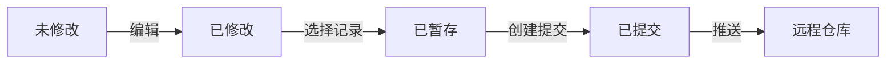
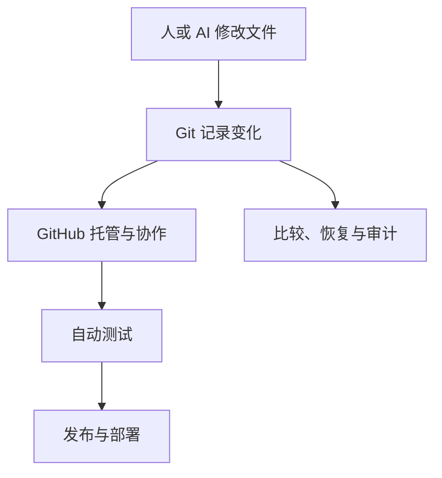
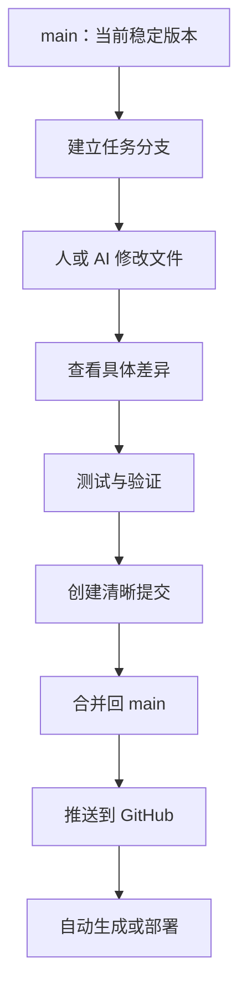

# Git 版本控制学习地图

> 按照“AI 时代学习地图”的思路整理：先建立心智模型，再学习具体命令。

## 1. 本质：Git 究竟是什么？

一句话：

> Git 是一个记录文件变化、保存项目历史，并支持多人并行协作的分布式版本管理系统。

它不只是“代码备份工具”。更准确的理解是：

> Git 管理的不是一个文件，而是一个项目在不同时间点的一系列状态。

例如，你正在开发“每日 AI 要闻”项目：

```text
7月28日：只能生成 Markdown
7月29日：增加 HTML 生成
7月30日：增加内容验证
7月31日：修复链接错误
```

Git 可以保存这些状态，并记录：

- 哪些文件发生了变化；
- 谁修改了它们；
- 为什么修改；
- 修改发生在什么时候；
- 不同修改之间是什么关系。

### 为什么需要 Git？

没有 Git 时，人们经常这样保存文件：

```text
每日AI要闻
每日AI要闻-修改版
每日AI要闻-最终版
每日AI要闻-最终版2
每日AI要闻-真的最终版
每日AI要闻-最终版-不要再改
```

这种方法有几个问题：

- 不知道两个版本之间改了什么；
- 不知道为什么修改；
- 很难准确恢复；
- 多人修改时容易互相覆盖；
- 很难同时尝试不同方案；
- 文件名越来越混乱。

Git 将这种人工管理转变成结构化的版本历史。

### Git 带来的新可能

有了 Git，你可以：

- 安全地尝试新方案；
- 随时查看历史；
- 准确比较修改；
- 恢复到以前的状态；
- 同时发展多个方案；
- 让多人并行工作；
- 审查 AI 生成的修改；
- 把项目状态同步到 GitHub。

---

## 2. 世界模型：Git 在现实世界中的位置

### Git 处理的对象

| 对象 | 含义 |
|---|---|
| 文件 | 项目中的代码、文档和配置 |
| 变化 | 文件增加、删除或内容修改 |
| 快照 | 项目在某个时刻的完整状态 |
| 提交 | 带说明的正式历史记录 |
| 分支 | 从某个历史节点开始的发展路线 |
| 仓库 | 项目文件加上完整的 Git 历史 |
| 远程仓库 | 位于 GitHub 等平台上的仓库副本 |

Git 最核心的管理对象并不是“文件”，而是：

> 文件状态的变化及其历史关系。

### 涉及的角色

| 角色 | 主要责任 |
|---|---|
| 开发者 | 修改项目并提交版本 |
| 项目维护者 | 审查、合并和发布 |
| 团队成员 | 在不同分支并行工作 |
| AI 编程助手 | 生成或修改文件 |
| Git | 记录历史和管理版本关系 |
| GitHub | 托管远程仓库并提供协作流程 |
| 自动化系统 | 测试、验证、部署项目 |

### Git 管理的状态变化

一个文件通常会经历这样的过程：



这里最关键的不是记住术语，而是理解：

> Git 不会因为你修改了文件，就自动认为这个修改应该成为正式历史。

你要经过三次判断：

1. 我改了什么？
2. 哪些修改值得纳入下一次记录？
3. 这次记录应该表达什么完整意图？

---

## 3. 概念地图

### 第一层：项目状态

#### 工作区（Working Tree）

- **名词：**你当前看到和编辑的项目文件。
- **动词：**创建、修改、删除。
- **目的：**进行实际工作。
- **关系：**工作区里的修改还没有成为正式历史。

工作区就像你的书桌。你正在修改的文件都摊在桌面上。

#### 暂存区（Staging Area）

- **名词：**准备放入下一次提交的变化集合。
- **动词：**选择、组合、取消选择。
- **目的：**决定下一次提交具体包含什么。
- **关系：**位于工作区和正式历史之间。

暂存区像“准备装订的材料夹”。

你可以修改十个文件，但只把其中三个相关修改放入一次提交。

#### 仓库（Repository）

- **名词：**项目文件及其完整版本历史。
- **动词：**提交、查询、恢复。
- **目的：**长期保存项目状态。
- **关系：**提交进入仓库后，才成为正式版本历史。

仓库可以理解为项目的“档案馆”。

### 第二层：历史结构

#### 提交（Commit）

- **名词：**带有说明的项目快照。
- **动词：**创建、比较、恢复。
- **目的：**记录一次有意义的变化。
- **关系：**多个提交按照前后关系组成历史。

一次好的提交不是“今天做了一些事情”，而应该表达一个清楚的意图，例如：

```text
增加简报链接有效性检查
修复移动端标题显示问题
更新项目部署说明
```

提交不是单纯的存档点，它还应该回答：

> 为什么项目从上一个状态变成了现在这个状态？

#### 分支（Branch）

- **名词：**指向某条开发路线最新提交的可移动标签。
- **动词：**创建、切换、合并。
- **目的：**隔离不同任务或不同方案。
- **关系：**分支从某个提交出发，形成新的历史路线。

例如：

```text
main
├── feature/mobile-html
├── fix/broken-links
└── experiment/new-layout
```

你可以：

- 在主分支维持稳定版本；
- 在功能分支开发手机版 HTML；
- 在修复分支处理链接问题；
- 在实验分支测试新布局。

分支不是复制出几个项目文件夹，而是在同一个历史系统中发展不同路线。

#### 合并（Merge）

- **名词：**不同历史路线的结合。
- **动词：**整合。
- **目的：**把一个分支的成果纳入另一个分支。
- **关系：**连接原本分开的开发历史。

#### 冲突（Conflict）

- **名词：**Git 无法自动判断的修改矛盾。
- **动词：**识别、选择、重写。
- **目的：**由人决定最终内容。
- **关系：**通常在合并不同分支时出现。

冲突不代表 Git 坏了，而是：

> Git 发现两套修改都合理，但它没有足够的信息替你作决定。

### 第三层：协作与分发

#### 本地仓库

保存在自己电脑上，拥有完整的项目历史。

#### 远程仓库

保存在 GitHub、GitLab 等平台上，用于：

- 备份；
- 同步；
- 协作；
- 展示；
- 审查；
- 自动化。

#### 推送（Push）

把本地已有的提交发送到远程仓库。

#### 拉取（Pull）

把远程仓库的新历史取回本地，并整合到当前工作中。

#### 克隆（Clone）

把远程仓库的项目文件和版本历史复制到本地。

---

## 4. 决策地图：什么时候应该想到 Git？

### 场景一：准备让 AI 大范围修改项目

**Situation**  
AI 将修改很多代码和配置文件

↓

**Decision**  
先确认当前状态已经被 Git 记录

↓

**Reason**  
AI 修改不一定全部正确

↓

**Expected Outcome**  
可以准确审查修改，也可以安全恢复

Git 在 AI 时代的重要价值是：

> 为低成本生成的大量修改，提供可审查、可比较、可恢复的边界。

### 场景二：准备开发新功能

**Situation**  
准备给“每日 AI 要闻”增加邮件推送

↓

**Decision**  
建立独立分支

↓

**Reason**  
新功能可能失败，不能影响当前稳定版本

↓

**Expected Outcome**  
实验与正式运行互不干扰

### 场景三：项目出现故障

**Situation**  
昨天还可以运行，今天突然失败

↓

**Decision**  
比较最近几个提交

↓

**Reason**  
故障往往来自最近发生的变化

↓

**Expected Outcome**  
快速缩小问题范围

Git 不一定直接告诉你怎样修复，但它可以告诉你：

- 什么发生了变化；
- 变化从哪里开始；
- 哪个提交最可能导致问题。

### 场景四：准备发布新版本

**Situation**  
项目已经通过测试，准备公开

↓

**Decision**  
确定一个明确的提交或版本标签

↓

**Reason**  
发布内容必须能够被准确识别和重新获得

↓

**Expected Outcome**  
以后可以知道线上运行的究竟是哪一版

### 场景五：多人或多个 AI 同时工作

**Situation**  
人、Claude、Codex 分别修改不同部分

↓

**Decision**  
让不同任务在独立分支进行

↓

**Reason**  
避免多个修改互相覆盖

↓

**Expected Outcome**  
每项成果都能独立审查和合并

---

## 5. 搜索空间扩展

### 初学者通常不会想到的问题

#### 1. Git 保存的是文件副本吗？

从使用效果上看像是在保存版本，但更准确地说，Git 保存的是项目快照以及快照之间的关系。

#### 2. 为什么需要暂存区？

因为“一次编辑过程”和“一次有意义的版本记录”不是同一回事。

你可能同时：

- 修复一个错误；
- 修改 README；
- 调整页面颜色；
- 临时加入调试信息。

这些修改不一定应该放进同一个提交。

#### 3. 提交应该多大？

专业人士关注的不是修改行数，而是：

> 这个提交是否只表达一个清楚、完整、可审查的意图？

#### 4. 什么文件不应该进入 Git？

例如：

- 密码；
- API Key；
- 访问令牌；
- 临时缓存；
- 自动生成且可轻松重建的文件；
- 含有个人隐私的数据；
- 体积很大的运行产物。

这也是 `.gitignore` 存在的重要原因。

#### 5. Git 历史是否可以随便修改？

技术上可以，尤其是尚未共享的本地历史。

但是已经推送并被别人使用的历史，修改时必须非常谨慎，因为其他人的工作可能建立在这些提交上。

### 专家真正关心的问题

专家通常不只关心“怎么提交”，而会关心：

- 历史是否容易理解？
- 每个提交是否能够独立审查？
- 分支策略是否适合团队规模？
- 主分支是否始终可以运行？
- 敏感信息是否可能进入历史？
- 发布版本能否准确追溯？
- 自动测试是否与提交和合并绑定？
- 出现问题时能否快速回退？
- AI 生成的修改经过了什么验证？
- 谁可以修改或合并关键分支？

Git 使用水平的上限，并不是掌握多少命令，而是：

> 能否把复杂的项目变化组织成清晰、可信、可协作的历史。

---

## 6. 生态系统

### 上游：Git 管理什么？

Git 的上游是实际的创造活动：

- 编写代码；
- 修改文档；
- 调整配置；
- 修复错误；
- 设计功能；
- AI 生成修改。

这些活动制造变化，Git 负责管理这些变化。

### Git 本身

Git 负责：

- 记录版本；
- 比较差异；
- 组织分支；
- 合并历史；
- 恢复状态；
- 同步仓库。

### 下游：Git 支撑什么？

Git 的历史可以进一步驱动：

- GitHub 协作；
- Pull Request 审查；
- 自动测试；
- 自动部署；
- 版本发布；
- 问题追踪；
- 项目审计；
- 开源协作。

整体关系可以理解为：



### Git 与 GitHub 的区别

这是最常见的混淆之一。

| Git | GitHub |
|---|---|
| 版本控制系统 | 在线代码托管与协作平台 |
| 可以完全在本地运行 | 通常通过网络使用 |
| 管理提交、分支、合并 | 提供仓库托管、审查、权限和自动化 |
| 核心是版本历史 | 核心是围绕仓库进行协作 |

可以类比为：

> Git 是写作和修订历史系统，GitHub 是存放作品并让大家共同审阅的平台。

即使没有 GitHub，Git 仍然可以使用；但 GitHub 的核心功能建立在 Git 之上。

### 替代方案

其他版本控制系统包括：

- Subversion（SVN）
- Mercurial
- Perforce

普通文件备份、网盘历史版本也能解决部分问题，但通常无法完整替代 Git 的分支、合并和协作能力。

### 互补方案

Git 经常和下面这些系统一起使用：

- GitHub Issues：管理任务；
- Pull Request：审查修改；
- GitHub Actions：自动测试与部署；
- `.gitignore`：排除不应记录的文件；
- 测试工具：验证提交是否正确；
- CI/CD：持续集成和持续部署；
- 项目文档：解释运行方式和协作规则。

---

## 7. 可迁移原则

### 第一性原理

#### 变化必须可以追溯

任何重要修改都应该能够回答：

- 改了什么？
- 为什么改？
- 谁改的？
- 从哪个状态变成哪个状态？

#### 实验应该与稳定状态隔离

新想法可能成功，也可能失败。专业系统会为实验提供隔离空间。

#### 恢复能力比“不犯错误”更现实

任何人和 AI 都会犯错。好的系统不是假设永远不犯错，而是保证出错后能够定位和恢复。

#### 历史也是项目的一部分

项目不仅包括当前文件，还包括它为什么变成今天这样。

### 可迁移的方法论

这些原则也适用于文档、设计和数据分析：

- 小步修改；
- 一次只表达一个明确意图；
- 修改前保留稳定基线；
- 修改后进行比较；
- 合并前先审查；
- 发布内容必须可追溯；
- 重要操作必须能够恢复。

### 长期稳定的知识

- 提交表示项目状态；
- 分支表示不同发展路线；
- 合并表示路线整合；
- 冲突需要人为判断；
- 本地和远程是不同仓库；
- Git 管理历史，GitHub 管理在线协作。

### 容易变化的知识

- GitHub 的界面；
- 各种 Git 客户端的按钮位置；
- 团队采用的分支命名；
- 自动化工作流；
- AI 编程工具；
- 平台权限与收费方案。

所以，不要把“会点 GitHub 页面按钮”误认为理解了 Git。

---

## 8. 最小心智模型：最重要的 16 个概念

按重要性排序：

1. **仓库：**文件与完整历史的集合。
2. **变化：**Git 管理的核心对象。
3. **快照：**项目在一个时间点的整体状态。
4. **提交：**进入正式历史的项目快照。
5. **提交说明：**解释为什么发生这次变化。
6. **工作区：**当前正在编辑的文件。
7. **暂存区：**下一次提交的候选修改集合。
8. **历史：**由提交关系组成的项目演化过程。
9. **分支：**独立的发展路线。
10. **主分支：**项目主要的稳定路线，通常叫 `main`。
11. **合并：**把不同路线的成果组合起来。
12. **冲突：**Git 无法自动作出的内容选择。
13. **差异：**两个状态之间具体改了什么。
14. **远程仓库：**用于同步和协作的仓库副本。
15. **推送与拉取：**本地和远程之间交换提交。
16. **标签：**给重要提交添加固定名称，常用于发布版本。

如果只能记住一条主线，可以记成：

> 在工作区制造变化，在暂存区选择变化，通过提交记录变化，利用分支隔离变化，通过合并整合变化，最后与远程仓库同步变化。

---

## 9. 常见误区

### 误区一：Git 就是 GitHub

**为什么误解：**很多人第一次接触 Git，是从 GitHub 开始的。

**准确模型：**

> Git 是版本控制系统，GitHub 是围绕 Git 仓库建立的在线协作平台。

### 误区二：保存文件就等于提交

**为什么误解：**普通软件保存后，修改已经写入磁盘。

**准确模型：**

> 保存只是更新工作区文件；提交才是把选中的修改纳入 Git 历史。

### 误区三：推送才算保存版本

**为什么误解：**用户把 GitHub 当作唯一存储位置。

**准确模型：**

> 提交时版本已经保存在本地 Git 仓库；推送只是把这些提交发送给远程仓库。

### 误区四：Git 会自动备份所有内容

**为什么误解：**把 Git 当成网盘同步软件。

**准确模型：**

> Git 只记录被跟踪并正式提交的内容。没有提交的修改仍可能丢失。

### 误区五：分支就是复制文件夹

**为什么误解：**过去常用“复制一份项目”进行实验。

**准确模型：**

> 分支是历史路线的指针，不是简单复制整个项目目录。

### 误区六：冲突意味着操作失败

**为什么误解：**看到冲突提示就认为项目损坏了。

**准确模型：**

> 冲突只是多个修改之间存在需要人类判断的选择。

### 误区七：提交越大越省事

**为什么误解：**认为少提交几次更简单。

**准确模型：**

> 提交过大反而难以审查、定位和恢复。提交应围绕一个完整意图组织。

### 误区八：用了 Git 就不会丢失代码

**准确模型：**

> Git 只能保护已经提交的内容；远程仓库还能进一步降低本地设备损坏造成的风险。

### 误区九：AI 修改正确就可以直接提交

**准确模型：**

> AI 可以快速制造变化，但 Git 只负责记录变化，不负责证明变化正确。测试和人工审查仍然必要。

---

## 10. 用“每日 AI 要闻”理解 Git

可以把你的项目想象成一本不断修订的书。

| 项目行为 | Git 中的概念 |
|---|---|
| 这本书和全部修订历史 | 仓库 |
| 当前正在修改的稿件 | 工作区 |
| 挑出准备纳入新版的修改 | 暂存 |
| 正式保存一次修订版本 | 提交 |
| 尝试一种新的章节结构 | 分支 |
| 把新结构纳入正式稿 | 合并 |
| 两个人改了同一段文字 | 冲突 |
| 将项目同步到 GitHub | 推送 |
| 获取 GitHub 上的新修改 | 拉取 |
| 标记“正式版 1.0” | 标签 |

你的实际工作流可以抽象成：



在这里，Git 的价值不是让你记住很多命令，而是让你始终知道：

- 现在处于哪个版本；
- 正在修改什么；
- 修改是否经过验证；
- 哪些内容已经正式记录；
- 哪些内容已经同步到 GitHub；
- 出错后应该退回哪里。

---

## 11. 总结

> 我真正获得的不是一套 Git 命令，  
> 而是一种管理变化、控制风险、组织协作和保存项目演化过程的能力。

今后看到 Git，可以先不要想到 `add`、`commit`、`push` 这些命令，而要想到四件事：

> **记录变化、隔离实验、整合成果、保留退路。**
