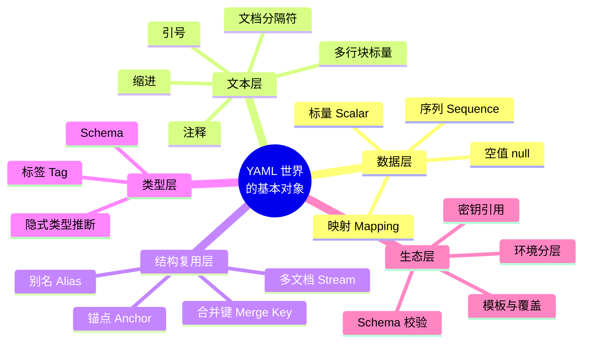
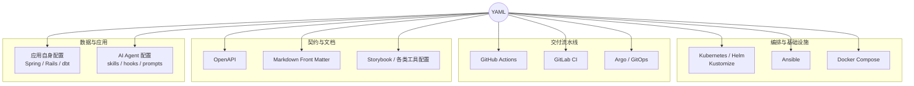
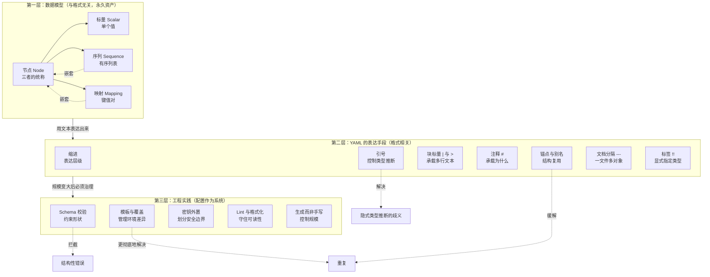
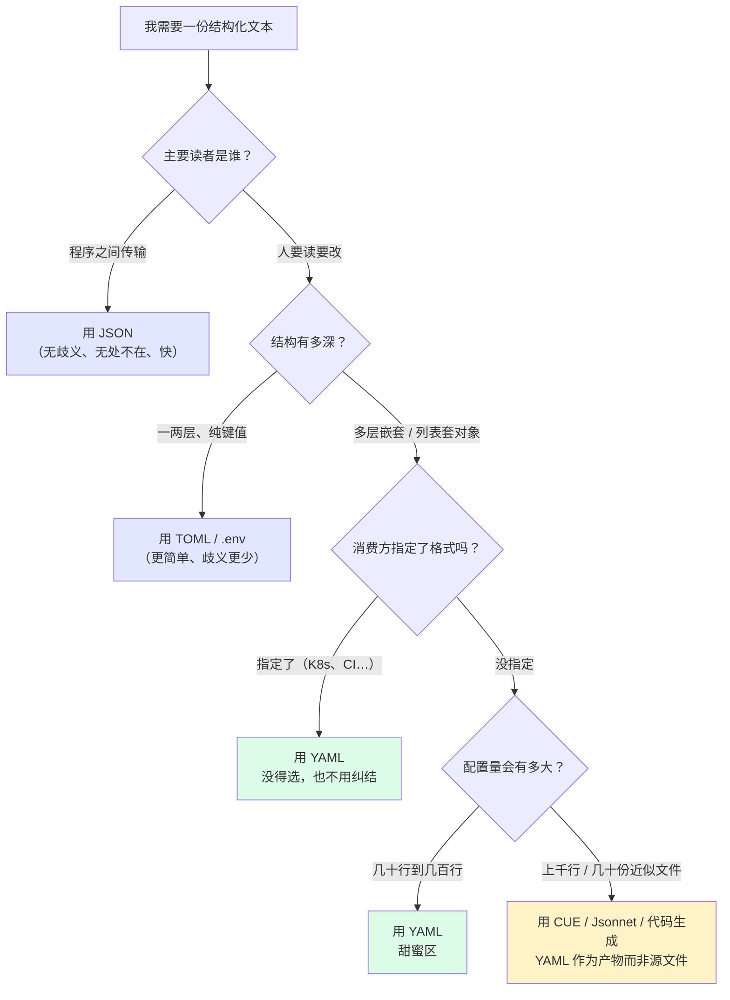
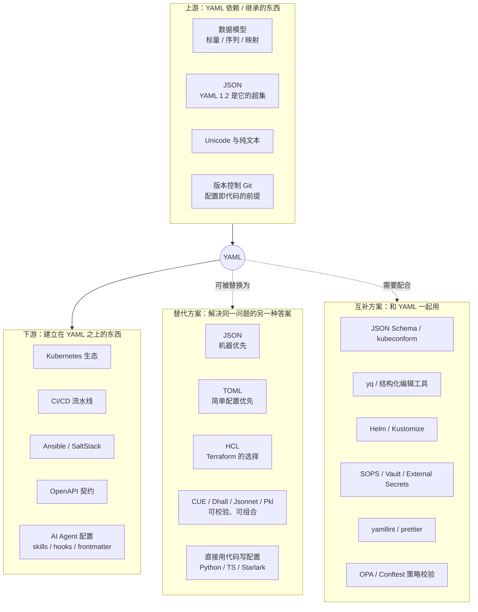
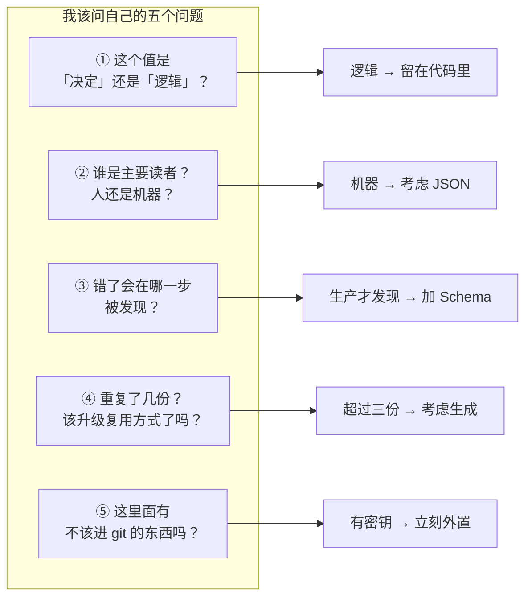

# YAML · 学习地图

> 本文不教你「YAML 怎么写」，而是帮你建立**心智模型（Mental Model）与世界模型（World Model）**。
> 默认前提：缩进、引号、锚点语法这些具体操作由 AI 替你完成。你需要拥有的，是**判断力**——知道它是什么、为什么存在、什么时候该想到它、什么时候该离开它。

---

## 1. 本质（Essence）

> **一句话：YAML 是一种「让人类可以直接读写、也能被机器精确加载」的数据书写格式——它存在的意义，是把软件里「会变的那部分决定」从代码中抽出来，变成一份人可以评审、可以 diff、可以进版本库的文本。**

注意这句话里没有出现「配置文件」。YAML 本身不是配置格式，它是**数据序列化格式**。它成为事实上的配置标准，是一个历史结果，不是一个定义。这个区分后面会反复用到。

### 为什么它存在？

计算机领域有一条长期存在的裂缝：

**机器需要精确的结构，人类需要低摩擦的书写。**

这两个需求方向相反，于是历史上出现了两批格式：

- **偏机器一端**：XML、Protobuf、JSON。结构严谨、解析明确，但人写起来很吵——尖括号、成对标签、逗号、引号、不能写注释
- **偏人类一端**：INI、properties、各种自制 DSL。写起来轻松，但表达能力弱到只能撑住两层结构，一旦配置变复杂就崩溃

YAML 的立场非常明确：**它选择了人类那一端，然后尽力保留机器所需的结构。**

它做的取舍是：
- 用**缩进**代替括号——因为人本来就靠缩进理解层级
- 允许**注释**——因为配置的「为什么」比「是什么」更值钱
- 让引号**可省略**——因为大多数值就是普通文本
- 支持**多行文本**——因为配置里经常要塞脚本、证书、SQL

这些取舍带来了它全部的优点，也带来了它全部的坑。**YAML 的坑不是设计失误，是它设计目标的影子。**

### 它解决什么根本问题？

**「软件的行为，有一部分不应该藏在代码里。」**

想象你要部署一个服务。这里面有两种知识：

| 知识类型 | 例子 | 谁该拥有它 |
|---------|------|-----------|
| **逻辑**：怎么做 | 如何建立连接、如何重试 | 代码，程序员 |
| **决定**：做成什么样 | 副本数 3、超时 30s、跑在哪个区域 | 配置，运维 / 团队 / 评审流程 |

如果「决定」写死在代码里，那么改一个副本数就要走一遍编译、测试、发版。更糟的是：**没有任何人能一眼看出这个系统当前被配置成了什么样子。**

YAML 解决的，就是把这些「决定」提取出来，放进一个**人类可以直接阅读、可以在 PR 里逐行评审、可以被 git 记录每一次变更**的地方。

> 关键点：YAML 的价值不在「机器能读」——JSON 也能。它的价值在**「人能在评审时看懂并提出异议」**。

### 没有它时，人们通常怎么办？

| 场景 | 没有 YAML 时的做法 | 后果 |
|------|------------------|------|
| 存少量参数 | 硬编码进源码 | 改个数字要发版；配置不可见 |
| 存扁平参数 | `.ini` / `.properties` | 只能两层，嵌套一来就变成 `a.b.c.d=1` 这种伪层级 |
| 存结构化数据 | XML | 结构够用，但人写起来痛苦，一半字符是标签 |
| 存结构化数据（现代） | JSON | 机器友好，但**不能写注释**、末尾逗号报错、所有 key 都要引号 |
| 存多环境差异 | 复制粘贴多份文件 | 改一处要改五处，漂移必然发生 |
| 表达「期望状态」 | 写一段部署脚本 | 脚本描述的是**过程**，读脚本的人得在脑子里模拟才知道**结果** |

最后一行是最重要的一行。**从「写脚本」到「写 YAML」，不只是格式变了，是思维方式从命令式变成了声明式。**

### 它带来了哪些新的可能？

1. **配置即代码（Configuration as Code）**：配置进了 git，于是有了历史、有了 blame、有了回滚、有了 code review
2. **声明式基础设施**：Kubernetes 的整个模型建立在「你写下期望状态，系统负责收敛」之上，而期望状态的载体就是 YAML
3. **流水线即代码**：GitHub Actions、GitLab CI 让「怎么构建」这件事从 Jenkins 里的网页表单，变成了仓库里可评审的文本
4. **跨语言的通用配置层**：同一份 YAML 能被 Go、Python、Java、Rust 加载，配置不再绑定语言
5. **可组合的配置**：锚点、多文档、overlay、模板，让配置本身有了「复用」的概念
6. **⭐ 人与 AI 的共享接口**：YAML 同时对人和 LLM 都高度可读，它正在成为「你和 AI 描述期望状态」的天然媒介

> 💡 **在 AI 时代，YAML 的角色发生了微妙但重要的变化。**
>
> 过去 YAML 的主要读者是「运维同事」，所以它优化的是人类书写效率。
> 现在它的读者多了一个：**AI**——而且 AI 既读它，也写它。
>
> 这带来两个后果：
> 1. **手写 YAML 的价值下降了**。让 AI 生成一份 200 行的 K8s manifest 是几秒钟的事，你不需要记住 `readinessProbe` 的字段拼写
> 2. **审阅 YAML 的价值上升了**。AI 生成的配置在语法上几乎总是对的，**在语义上却可能是危险的**——一个多打的零、一个错误的 namespace、一个 `latest` 标签，语法检查器全都不会报错
>
> 换句话说：**YAML 的写作交给 AI，YAML 的判断留给你。** 你要建立的心智模型，是判断力的模型，不是语法的模型。

---

## 2. 世界模型（World Model）

YAML 不是一个「文件格式」这么简单。它处在一条**从人的意图到系统行为**的传输链上。要理解它，先理解这条链上有什么。

### 它处理哪些对象（Objects）



**关键认知：中间那三层（文本层 / 结构复用层 / 类型层）是 YAML 独有的，数据层不是。**

数据层的三件套——标量、序列、映射——是 JSON、TOML、HCL、Python 字典**共有的**。这意味着：你学到的「数据建模」能力可以完整迁移到其他格式，而缩进规则不能。**先分清哪部分知识是永久资产，哪部分是一次性开销。**

### 涉及哪些角色（Actors）

| 角色 | 在这个系统里做什么 | 关心什么 |
|------|------------------|---------|
| **配置作者**（人 / AI） | 写下期望状态 | 表达是否清晰、是否易改 |
| **评审者** | 在 PR 里判断这个改动安全吗 | **可读性、diff 的清晰度** |
| **解析器**（PyYAML / go-yaml / SnakeYAML…） | 文本 → 内存对象 | 语法合法性、类型推断规则 |
| **Schema 校验器** | 判断这份数据结构是否符合约定 | 字段名、类型、必填、取值范围 |
| **模板 / 渲染层**（Helm、Kustomize、envsubst） | 由一份写多份、按环境覆盖 | 复用与差异管理 |
| **消费方运行时**（K8s、CI、Ansible、应用） | 把数据变成实际行为 | 语义正确性 |
| **密钥系统**（Vault、SOPS、Secrets Manager） | 补上不该进 git 的那部分 | 安全边界 |
| **AI** | 生成、修改、解释、批量重构配置 | 上下文是否完整 |

> 注意一个反直觉的事实：**解析器不止一个，而且它们行为不完全一致。** 同一份 YAML，PyYAML（YAML 1.1）和 Go 的某些库（趋向 1.2）可能给出**不同的结果**。这是 YAML 世界最容易被忽略的结构性风险。

### 管理哪些状态变化（State）

YAML 的生命周期，是一条**逐步失去自由度、逐步获得确定性**的管线：


**这条链上有两处不可逆的信息损失，必须刻进心智模型：**

1. **B → C：注释和格式全部蒸发。** 解析器只交出数据。这意味着任何「读 YAML → 改 → 写回」的程序，**默认会把你的注释和排版全部抹掉**（除非用专门的 round-trip 库）。所以：不要让程序随意重写人类维护的 YAML。
2. **C → D：如果没有 Schema，这一步根本不存在。** 没有 Schema 的 YAML，错误会一路滑到 F 才被发现——也就是**在生产环境里被发现**。

> **这条管线解释了 YAML 的全部工程实践**：linter 守 B，schema 守 D，dry-run / plan 守 E，监控守 F。每一道关卡都是在把失败点往左移。

### 改变哪些工作流（Workflow）

| 工作流 | YAML 之前 | YAML 之后 |
|--------|----------|-----------|
| 修改线上参数 | 登录服务器改文件 / 改代码发版 | 提 PR → 评审 → 合并 → 自动生效 |
| 新环境搭建 | 照着 wiki 一步步点 | 复制一份配置，改几个值 |
| 变更审计 | 「谁改的？」——不知道 | `git log`，精确到人和行 |
| 回滚 | 凭记忆改回去 | `git revert` |
| 知识传递 | 老员工口头讲 | 配置里的注释 + 提交历史 |
| 事故复盘 | 猜是不是配置问题 | diff 两个版本，一目了然 |

**核心变化：配置从「一次性操作」变成了「有历史的资产」。**

### 与哪些系统交互（Systems）



看这张图要看出的**不是「YAML 用得很广」**，而是：

> **这些系统之所以都选 YAML，是因为它们都在做同一件事——让人声明「我要什么」，让系统负责「怎么做到」。**
>
> YAML 是**声明式思维的默认书写载体**。你在任何地方看到 YAML，都可以先假设：这里正在发生一次「意图 → 期望状态」的表达。

### 创造哪些价值（Value）

1. **可评审性**：让「系统被配置成什么样」成为一个可以被人讨论的对象
2. **可追溯性**：每一次行为变化都有作者、时间、原因
3. **可复现性**：同一份文本，在任何地方产生同样的结果
4. **降低协作门槛**：不写代码的人也能参与系统的定义
5. **人机共同语言**：人、程序、AI 都能读写的中间层

---

## 3. 概念地图（Concept Map）

整个 YAML 领域可以按三层理解。**重点是层与层之间的关系，而不是孤立的定义。**



### 第一层：数据模型（Entity / Action / Purpose / Relationship）

| 概念 | 名词（是什么） | 动词（做什么） | 目的 | 与其他概念的关系 |
|------|--------------|--------------|------|----------------|
| **标量 Scalar** | 一个单独的值 | 承载 | 表达最小的事实 | 是树的**叶子**；类型由 schema 推断决定 |
| **序列 Sequence** | 有序集合 | 排列 | 表达「多个同类事物」和它们的顺序 | 元素可以是任意节点 → **递归** |
| **映射 Mapping** | 键 → 值 | 命名 | 表达「一个事物的多个属性」 | 值可以是任意节点 → **递归** |
| **节点 Node** | 上述三者的统称 | 组合 | 使结构可以无限嵌套 | **整个 YAML 文件 = 一棵节点树** |

> **这一层是整个领域的地基**：YAML、JSON、TOML、Python dict、Go struct，本质上都在表达同一棵树。学会用这棵树思考，你换任何格式都不需要重新学。

### 第二层：YAML 的表达手段

| 概念 | 它真正解决的问题 | 关系与代价 |
|------|----------------|-----------|
| **缩进** | 用视觉层级代替括号 | 换来了可读性，**代价是空白字符变得有语义**（tab 被禁用即源于此） |
| **引号** | 阻止隐式类型推断 | 与「类型层」直接耦合；不加引号 = 把类型判断权交给解析器 |
| **块标量 `\|` / `>`** | 把脚本、证书、SQL 原样塞进配置 | `\|` 保留换行，`>` 折叠换行；配置里最常见的多行内容载体 |
| **注释 `#`** | 保存「为什么是这个值」 | **YAML 相对 JSON 最被低估的优势**；但解析后即丢失 |
| **锚点 / 别名 / 合并键** | 同一文件内消除重复 | **只在单文件内有效**，跨文件复用要靠第三层；过度使用会严重损害可读性 |
| **多文档 `---`** | 一个文件放多个独立对象 | K8s 的常见形态；意味着「一个文件」≠「一个对象」 |
| **标签 `!!str` / `!Ref`** | 显式声明类型或自定义语义 | 是**扩展点**，也是**安全风险来源**（见第 5 节） |

### 第三层：工程实践（配置规模化之后的必修课）

| 概念 | 在解决什么 | 什么时候必须引入 |
|------|-----------|----------------|
| **Schema 校验**（JSON Schema、CUE、kubeconform） | 拼错字段、类型错误、缺必填项 | **配置一旦影响生产，就该有** |
| **模板与覆盖**（Helm、Kustomize、profile） | 多环境之间的差异管理 | 出现第二个环境时 |
| **密钥外置**（SOPS、Vault、External Secrets） | 密码不该进 git | **第一天就该有** |
| **Lint / 格式化**（yamllint、prettier） | 缩进混乱、重复 key、行尾空格 | 多人协作时 |
| **生成而非手写**（Jsonnet、CUE、脚本、AI） | 几十份高度相似的配置 | 手写重复超过三份时 |

> **三层之间的核心关系一句话概括**：
> 第一层决定你**能表达什么**，第二层决定你**写起来是否舒服**，第三层决定你**在规模变大后是否还活着**。
> 初学者只学第二层，专家主要在第一层和第三层工作。

---

## 4. 决策地图（Decision Map）

**不是「YAML 有什么功能」，而是「专业人士在什么处境下会自然想到它、或自然拒绝它」。**

### 决策 1：某个值该不该从代码里挪出来

```
Situation：代码里有一个写死的数字/开关，产品说以后可能要调
    ↓
Decision：把它移进 YAML 配置文件
    ↓
Reason：它属于「决定」不属于「逻辑」；改它不该触发一次发版；
        更重要的是——它应该对非程序员也可见
    ↓
Expected Outcome：调整参数变成改一行配置 + 一次评审，而不是一次发版
```

**反向的决策同样重要：**

```
Situation：有人提议「把这段判断逻辑也做成可配置的」
    ↓
Decision：拒绝，让它留在代码里
    ↓
Reason：一旦配置里出现 if / 循环 / 表达式，你就是在用一门
        没有类型检查、没有调试器、没有测试的语言编程
    ↓
Expected Outcome：避免制造出一个「YAML 写的解释器」——这是配置系统最经典的死法
```

> ⚠️ **判据：配置回答「是什么」，代码回答「怎么做」。当你的 YAML 开始回答「怎么做」，它已经越界了。**

### 决策 2：选 YAML 还是别的格式



**这张图最重要的一条路径是最右下角那条**：当配置多到需要复用和抽象时，**正确答案不是「更努力地写 YAML」，而是让 YAML 降级为「生成出来的中间产物」**。这是从初级到高级最关键的一次认知跃迁。

### 决策 3：这个值要不要加引号

```
Situation：写一个版本号 1.10、一个国家码 no、一个端口映射 22:22
    ↓
Decision：加引号
    ↓
Reason：YAML 会做隐式类型推断。不加引号时，1.10 可能变成浮点数 1.1，
        no 在 YAML 1.1 解析器里会变成布尔 false，22:22 在 1.1 里
        可能被当成 60 进制整数
    ↓
Expected Outcome：值原样保留；避免一类「语法完全合法、语义完全错误」的事故
```

> 心法：**只要这个值「长得像另一种类型」，就加引号。** 版本号、国家码、电话号、纯数字 ID、时间、`yes/no/on/off/true/false`、以 0 开头的数字——全都属于高危区。

### 决策 4：多环境差异怎么处理

```
Situation：dev / staging / prod 三套配置，90% 相同，10% 不同
    ↓
Decision：先用「基础 + 覆盖」，不要复制三份，也不要一上来就上模板引擎
    ↓
Reason：复制三份必然漂移（改了两份忘了第三份）；
        但过早引入模板语言会让配置从「可读的数据」退化成「难读的程序」
    ↓
Expected Outcome：差异集中在少数几个明确的地方，评审时一眼能看出
                「这个环境和别的环境到底哪里不一样」
```

### 决策 5：AI 生成了一份 300 行的配置

```
Situation：让 AI 生成了 K8s manifest / CI 流水线，语法没问题，看起来很专业
    ↓
Decision：不看语法，只审四类东西——
        ① 数量级（副本数、内存、超时、重试）
        ② 作用域（namespace、环境、分支、权限范围）
        ③ 版本固定（是不是用了 latest / 浮动版本）
        ④ 密钥（有没有把敏感信息写成了明文）
    ↓
Reason：AI 在语法层面几乎不出错，出错必然出在语义和上下文层面——
        而这四类恰好是「语法检查器永远不会报警、出事却最贵」的地方
    ↓
Expected Outcome：把有限的注意力放在机器查不出的地方，而不是重读一遍缩进
```

> **这是 AI 时代最该内化的一条决策规则。** 你的角色从「书写者」变成了「审阅者」，审阅的重点必须相应转移。

### 决策 6：这份 YAML 该由谁维护

```
Situation：一份配置越来越大，快 1000 行了
    ↓
Decision：停下来问——它现在是「人写机器读」，还是「机器写机器读」？
    ↓
Reason：如果已经没人真的逐行读它，那么它作为 YAML 存在的唯一理由
        （人类可读性）已经消失了
    ↓
Expected Outcome：要么拆分让它重新变得可读，要么承认它是产物、
                去维护它的上游（模板 / 代码 / schema）
```

---

## 5. 搜索空间扩展（Search Space Expansion）

**这一节的目的不是回答问题，而是让你看见「你不知道自己不知道」的那片区域。**

### 初学者通常不会想到的问题

| 问题 | 为什么重要 |
|------|-----------|
| **同一份 YAML，不同语言的库会解析出同样的结果吗？** | 不一定。YAML 1.1 与 1.2 的类型推断规则不同，而不同库实现的版本不同 |
| **`no` / `off` / `yes` 会被当成布尔值吗？** | 在 YAML 1.1 里会。挪威的国家码是 `NO`——著名的 "Norway problem" |
| **重复的 key 会怎样？** | 规范说非法，但很多解析器**静默采用最后一个**，你的第一处配置就这样消失了 |
| **为什么不能用 Tab 缩进？** | 因为缩进有语义，而 Tab 的显示宽度在不同环境下不同，会导致歧义 |
| **程序读完 YAML 再写回去，注释还在吗？** | 默认全部丢失。这决定了「谁可以重写这个文件」 |
| **锚点能跨文件引用吗？** | 不能。锚点的作用域是单个文档/文件 |
| **YAML 和 JSON 是什么关系？** | YAML 1.2 是 JSON 的超集——**任何合法 JSON 都是合法 YAML** |
| **加载 YAML 会执行代码吗？** | 用错 API 会。Python 的 `yaml.load` 历史上可实例化任意对象，必须用 `safe_load` |
| **YAML 会不会被当作攻击面？** | 会。"billion laughs"：嵌套锚点可让几十字节的文件在解析时膨胀到吃光内存 |
| **超长的数字 ID 会怎样？** | 可能被解析成数字并**丢失精度**（尤其是雪花 ID、大整数） |
| **前导零的数字呢？** | 可能被当成八进制。邮编 `01234` 是经典受害者 |
| **空值有几种写法？** | `null`、`~`、`Null`、以及**什么都不写**——四种写法一个含义，读代码时容易看漏 |

> 上面这一列的共同结构值得注意：**它们全都是「隐式类型推断」和「人类友好的省略」带来的副作用。** 记住这个共同根源，比记住十二条规则更有用。

### 专家真正关心的问题

| 问题 | 属于哪个层次 |
|------|------------|
| 这份配置的 **schema 在哪里？谁来保证它被遵守？** | 正确性 |
| 配置错误会在**哪一步**被发现——提交时、CI 时，还是生产事故时？ | 反馈时机 |
| 从「改了配置」到「系统真的变了」，**中间隔着多少不可见的步骤？** | 可观测性 |
| **实际运行状态**和仓库里的 YAML 是否一致？（配置漂移） | 一致性 |
| 复用是用锚点、模板还是生成？**各自的可读性代价是多少？** | 可维护性 |
| 谁有权改这份配置？改动需要几个人批准？ | 安全与治理 |
| 这份配置里，哪些字段是**不可逆操作**（删数据、换主键、缩容有状态服务）？ | 风险 |
| 我们是不是正在**用 YAML 写程序**？ | 架构信号 |
| 配置的**默认值**在哪里定义？没写的字段会变成什么？ | 隐式行为 |

> 注意专家问题的共性：**几乎没有一个是关于语法的。** 全部是关于**反馈、一致性、权限和可维护性**。这就是初学者与专家的搜索空间差异。

### 下一步值得探索的问题

1. **JSON Schema** —— 如何给自己的 YAML 定义并强制一份 schema
2. **声明式 vs 命令式** —— 为什么现代基础设施集体转向声明式
3. **GitOps** —— 把「git 仓库的状态」作为系统的唯一真相来源
4. **配置漂移与收敛** —— 期望状态与实际状态如何持续对齐
5. **CUE / Dhall / Jsonnet / Pkl** —— 当 YAML 撑不住时，人们发明了什么
6. **十二要素应用（12-Factor）中的 Config 一节** —— 配置与代码分离的经典论述
7. **密钥管理** —— SOPS、Sealed Secrets、External Secrets 的不同信任模型
8. **策略即代码**（OPA / Conftest）—— 用规则拦住「语法正确但违反组织规范」的配置

### 哪些问题决定了这个领域的上限

> 这四个问题，决定了你的配置体系最终能长到多大而不崩溃：

1. **配置错误能被多早发现？**
   —— 决定了事故成本。写的时候发现 vs 生产环境发现，差距是几个数量级。

2. **配置能不能被组合而不被复制？**
   —— 决定了配置规模的天花板。复制粘贴的体系必然在几十份文件时开始漂移。

3. **人还在读它吗？**
   —— 决定了 YAML 是否还有存在的理由。没人读的 YAML 应该由机器生成。

4. **「期望状态」和「实际状态」的差距，谁在盯？**
   —— 决定了这套配置是**真相**还是**愿望**。

---

## 6. 生态系统（Ecosystem）



### 上游

| 上游 | 关系 |
|------|------|
| **数据模型（树）** | YAML 只是这棵树的一种写法。真正的知识在树，不在写法 |
| **JSON** | YAML 1.2 是 JSON 的超集——理解了 JSON 的数据模型就理解了 YAML 的一半 |
| **Git** | 没有版本控制，「配置即代码」的全部价值都不成立 |
| **声明式思维** | YAML 是它的载体；不理解声明式，就会把 YAML 写成脚本 |

### 下游

这些系统**把 YAML 当成用户界面**：你写的 YAML 就是你和这些系统对话的方式。它们的复杂度不在 YAML 语法，而在各自的 schema 语义（`resources.limits` 是什么意思、`strategy.rollingUpdate` 会发生什么）。

> **重要区分：学 K8s ≠ 学 YAML。** 你在 K8s 上遇到的困难，99% 是 K8s 的概念模型，1% 是 YAML 的缩进。搞混这两者的人会一直觉得「YAML 好难」。

### 替代方案（以及它们各自在抱怨 YAML 什么）

| 替代品 | 它在抱怨 YAML 什么 | 代价 |
|--------|------------------|------|
| **JSON** | 「你的隐式类型推断太危险」 | 不能写注释，人写起来累 |
| **TOML** | 「你为简单场景引入了过多歧义」 | 深层嵌套表达力弱 |
| **HCL** | 「配置需要表达式和引用」 | 绑定 Terraform 生态 |
| **Jsonnet** | 「配置需要抽象和复用」 | 引入一门新语言 |
| **CUE / Dhall / Pkl** | 「配置需要类型和校验，还得能组合」 | 学习曲线陡峭 |
| **直接用代码** | 「配置本来就该有类型检查和 IDE 支持」 | 失去「非程序员可读」 |

> **看穿这张表**：所有替代品都在同一条轴上取舍——**「人类可读性」与「可校验性 / 可组合性」的权衡**。YAML 站在可读性一端。当你的痛苦来自「配置太多太乱」，说明你该往另一端移动了。

### 互补方案（YAML 缺什么，它们补什么）

| 互补品 | 补的是 YAML 的哪个缺陷 |
|--------|---------------------|
| **JSON Schema / kubeconform** | YAML 本身**不知道你的数据该长什么样** |
| **yq** | 让脚本能可靠地改 YAML，而不是用正则 |
| **Helm / Kustomize** | YAML **没有跨文件复用能力** |
| **SOPS / Vault** | YAML 是明文的，**不该装密码** |
| **yamllint / prettier** | 缩进和风格靠人自觉是守不住的 |
| **OPA / Conftest** | schema 管形状，**策略管规矩**（「禁止用 latest 标签」这种） |

---

## 7. 可迁移原则（Transferable Principles）

**区分四类知识，是长期学习效率的关键。**

### 第一性原理（几乎永不过时）

1. **配置是数据，不是程序。** 一旦配置开始有控制流，你就是在用最差的语言编程。
2. **人类可读性是有成本的。** 省略引号、靠缩进表达层级，代价是歧义——这不是 YAML 的 bug，是这个取舍的必然账单。
3. **不被校验的结构，最终一定会被违反。** 没有 schema 的约定，只是愿望。
4. **反馈越晚，代价越大。** 配置错误的成本曲线随发现时间指数上升。
5. **重复必然漂移。** 复制出去的第二份配置，从复制那一刻起就开始与第一份分道扬镳。
6. **能被人评审，才谈得上被人负责。** 这是配置文本化最深层的价值。

### 可迁移的方法论（换技术栈依然成立）

- **声明式思维**：描述「期望的结果」，而不是「达成的步骤」——这个思维在 SQL、React、Terraform、CSS 里都是同一个
- **关注点分离**：逻辑与决定分离、代码与配置分离、通用与环境相关分离
- **显式优于隐式**：可疑的地方就写清楚（加引号、写全字段、固定版本）
- **单一真相来源**：同一个事实只在一个地方定义
- **左移**：把错误的发现点尽量往前推
- **生成优于重复**：当同类文件超过三份，就该考虑生成而不是复制

### 当前实现细节（会变，交给 AI）

- `|` 与 `>`、`|-` 与 `>+` 的精确差异
- 锚点 `&`、别名 `*`、合并键 `<<:` 的写法
- 各解析库的 API 名称与参数
- Helm 模板语法、Kustomize 字段名、K8s 各资源的具体字段
- YAML 1.1 与 1.2 的逐条差异

### 长期稳定的知识 vs 容易变化的知识

| 长期稳定（值得深挖） | 容易变化（用时再查） |
|---------------------|-------------------|
| 标量 / 序列 / 映射的数据建模能力 | 具体的缩进和引号规则 |
| 声明式 vs 命令式的思维差异 | Helm / Kustomize 的语法 |
| 「配置 vs 代码」的边界判断 | 某个工具当前版本的字段名 |
| Schema 与校验的必要性 | JSON Schema 的具体关键字 |
| 环境差异管理的策略选择 | 某个模板引擎的函数列表 |
| 密钥不进版本库的安全原则 | 具体密钥工具的用法 |

> **分配注意力的原则：左列用脑子记，右列交给 AI。** 如果你花在右列的时间超过左列，说明学习方式需要调整。

---

## 8. 最小心智模型（Minimum Mental Model）

如果只能记住 15 个概念，按重要性排序如下。**越靠前，越决定你的判断质量。**

| # | 概念 | 为什么重要 |
|---|------|-----------|
| 1 | **YAML 是一棵树**（标量 / 序列 / 映射） | 一切的基础。理解这一点，YAML、JSON、TOML 就是同一件事的三种写法 |
| 2 | **配置回答「是什么」，代码回答「怎么做」** | 最重要的边界判断。守不住这条线，配置系统必然腐化 |
| 3 | **声明式：写下期望状态，系统负责收敛** | 解释了为什么现代基础设施全都长成 YAML 的样子 |
| 4 | **YAML 的价值是「人能评审」** | 一旦没人读它了，用 YAML 的理由就消失了 |
| 5 | **隐式类型推断是最大的坑源** | 版本号、国家码、端口、前导零——所有诡异事故的共同根源 |
| 6 | **缩进有语义**（所以禁 Tab） | 它是可读性的来源，也是脆弱性的来源 |
| 7 | **没有 Schema，错误会滑到生产** | 决定了配置错误在哪一步被抓住 |
| 8 | **注释是配置最珍贵的部分**（但解析后即丢失） | 它保存的是「为什么」，也是 YAML 相对 JSON 的核心优势 |
| 9 | **重复必然漂移** | 触发「该引入复用机制了」的信号 |
| 10 | **复用的三级阶梯：锚点 → 覆盖/模板 → 生成** | 知道自己现在在第几级，以及什么时候该往上走 |
| 11 | **密钥永远不进 YAML** | 违反一次就是安全事故，且难以撤销 |
| 12 | **YAML 1.2 是 JSON 的超集** | 一句话打通两个格式，还提供了「不确定时写成 JSON 风格」的逃生舱 |
| 13 | **不同解析器行为可能不同** | 跨语言、跨团队时的隐形风险 |
| 14 | **加载不可信 YAML 是攻击面** | safe_load、锚点炸弹——安全的底线认知 |
| 15 | **审阅 AI 生成的配置要看语义，不看语法** | AI 时代最实用的一条工作规则 |

> **如果只能记住三条**：①它是一棵树；②配置写「是什么」不写「怎么做」；③它的存在理由是人能读懂它。

---

## 9. 常见误区（Common Misconceptions）

### 误区 1：「YAML 是配置文件格式」

- **为什么会这么想**：99% 的人第一次见 YAML 是在 K8s 或 CI 里
- **更准确的模型**：**YAML 是数据序列化格式**，配置只是它最成功的应用场景。它也能表示任何数据（日志、数据集、API 响应）
- **为什么这个区分有用**：它解释了为什么 YAML 里没有变量、没有条件、没有函数——**它从来不打算成为一门语言**

### 误区 2：「YAML 很简单，就是缩进」

- **为什么会这么想**：看起来确实很简单，前 20 行的体验非常好
- **更准确的模型**：YAML 的规范相当复杂（隐式类型、多种标量风格、锚点、标签、多文档、版本差异）。**它把复杂度藏在了「看起来简单」的背后**
- **实际影响**：简单的部分你天天用，复杂的部分在事故那天第一次见面

### 误区 3：「YAML 比 JSON 好」

- **为什么会这么想**：能写注释、不用引号、看起来干净
- **更准确的模型**：**两者是不同取舍，不是好坏。** JSON 优化机器交换（无歧义、快、通用），YAML 优化人类书写（可读、可注释）。用 YAML 做 API 传输格式和用 JSON 做人工维护的配置，是两种同样错误的选择
- **判据**：**问「谁是主要读者」，答案就出来了**

### 误区 4：「缩进对齐了就没问题」

- **为什么会这么想**：报错通常都是缩进问题，于是形成了「缩进 = YAML 的全部难点」的错觉
- **更准确的模型**：缩进错误是**最好的一类错误**——它会立刻报错。真正危险的是**语法完全合法但语义错误**的配置：`no` 变成 `false`、`1.10` 变成 `1.1`、副本数多打一个零、namespace 写成了 prod
- **推论**：**YAML 的可怕之处不是它报错，而是它不报错**

### 误区 5：「用锚点消除重复，这样很 DRY」

- **为什么会这么想**：程序员的本能反应
- **更准确的模型**：配置的首要属性是**可读性**，不是 DRY。锚点、别名、深层合并会让读者必须在文件里来回跳转才能拼出「这个环境到底是什么配置」
- **更好的判断**：**少量重复 < 难以理解**。真需要大规模复用时，正确答案是往上走一级（模板 / 生成），而不是把锚点用到极致

### 误区 6：「YAML 学好了就能玩转 K8s / CI」

- **为什么会这么想**：打交道的界面确实全是 YAML
- **更准确的模型**：YAML 只是**信封**，难的是**信里的内容**。K8s 的难度在于它的对象模型和调度语义，和 YAML 无关。把同样的配置换成 JSON，难度一分不减
- **实际影响**：不做这个区分的人，会把「我 YAML 不熟」当作学不会 K8s 的原因，从而一直在错误的地方努力

### 误区 7：「配置文件不用测试 / 不用评审，改一行而已」

- **为什么会这么想**：它不是「代码」，感觉风险低
- **更准确的模型**：**配置改动直接改变生产行为，而且通常没有编译器、没有类型检查、没有单元测试保护。** 从风险角度看，配置改动往往比代码改动**更危险**
- **正确做法**：schema 校验 + dry-run/plan + 评审 + 灰度，一样不能少

### 误区 8：「AI 生成的 YAML 语法正确，就是对的」

- **为什么会这么想**：语法正确性是最容易验证的，也是最容易被误当成「正确」的
- **更准确的模型**：语法正确只是**最低门槛**。真正的风险在数量级、作用域、版本固定、密钥这四类语义问题上——**它们无一例外都能通过所有语法检查**
- **正确做法**：见第 4 节决策 5

---

## 10. 总结（Summary）

> **我真正获得的不是「YAML 的语法」，**
> **而是「把系统的意图从代码里抽出来、写成一份人能读懂、机器能执行、历史能追溯的事实」这种能力——以及知道它什么时候不该被这样写。**

再展开三句：

- 我获得的不是**缩进和引号的规则**，而是**「哪些东西属于配置、哪些东西必须留在代码里」的边界判断**。
- 我获得的不是**一个文件格式**，而是**声明式思维**：描述期望状态，让系统负责收敛。
- 我获得的不是**写 YAML 的熟练度**，而是**审 YAML 的判断力**——在 AI 几秒钟就能生成三百行配置的时代，稀缺的从来不是书写速度，而是**知道该盯哪四行**。

---

## 附：一页速查（心智模型版）



| 信号 | 说明什么 | 该做什么 |
|------|---------|---------|
| YAML 里出现了 if / 循环 / 表达式 | 配置越界成了程序 | 把逻辑移回代码 |
| 同类文件超过三份 | 复用机制该升级了 | 覆盖 → 模板 → 生成 |
| 没人逐行读它了 | 可读性理由已消失 | 让它变成生成产物 |
| 事故复盘常指向配置 | 缺少校验关卡 | 加 schema、lint、dry-run |
| 一份文件超过千行 | 单一职责已失效 | 拆分 |
| 出现明文密码 | 安全边界被打破 | 立刻外置并轮换 |
