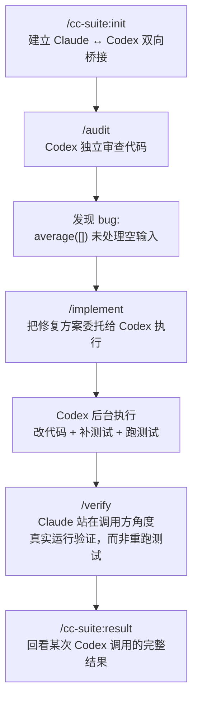

# 我是怎么用 cc-suite 把 Claude 和 Codex 接起来的

> 实践笔记 · 2026-07-28

---

## 今天想解决的问题

一直是 Claude Code 和 Codex CLI 分开用：写代码找 Claude，想让另一个模型挑挑毛病、交叉验证的时候，得手动复制粘贴上下文，很烦。

今天发现一个插件叫 **cc-suite**，作用简单粗暴：把 Claude Code 和 Codex CLI 双向接通，Claude 能把活儿委托给 Codex 干，Codex 也能反过来调用 Claude。核心思路是**分工**——不是谁更强就都听谁的，而是 Claude 当架构师定方案，Codex 当独立的第二双眼睛去审查、去执行，两边互相制衡。

拿一个真实的小项目practice 了一遍完整流程：`/cc-suite:init` → `/audit` → `/implement` → `/verify`。记录一下每一步实际发生了什么。

## 第一步：`/cc-suite:init` 到底在建立什么

跑了一下 `/cc-suite:init`，它做的事情比想象中细：

- 生成 `.cc-suite.md`：项目级配置，记录审计侧重点、默认模型、默认推理强度这些，之后每个命令都会读它
- 生成 `AGENTS.md`（Claude 的 `CLAUDE.md` 反过来 `@AGENTS.md` 引用它）——两边共享同一份项目约定，不用维护两份
- 在 `.mcp.json` 里注册 `codex-cli`，在 `.codex/config.toml` 里注册 `claude-code`——这是真正的"桥"，两个方向都通
- 把 cc-suite 自己的 skills 软链到 `.claude/skills` 和 `.agents/skills`，Codex 也能看到同一套技能

有意思的一点是它会检测本机装了哪些 coding agent（Claude / Codex / Antigravity / Grok / opencode / Qwen / Kimi），只让你桥接真正装了的，没装的可以先跳过，以后再补。

## 第二步：`/audit` —— 让 Codex 当审查员

项目很小，就一个 `calculator.py`：

```python
def average(numbers):
    return sum(numbers) / len(numbers)
```

跑 `/audit`（mini 模式，5 个维度：逻辑正确性、重复代码、死代码、重构债务、走捷径的痕迹），Claude 把文件和审计维度打包丢给 Codex，Codex 独立分析后回传结果。

抓到了一个真实 bug：`average([])` 会直接抛出未处理的 `ZeroDivisionError`，边界条件完全没处理。另外还提了一句——`average()` 隐式依赖 `len()`，传生成器进去会直接 `TypeError`，函数名和实际能接受的类型对不上。

这里体会比较深的是 **provenance disclosure**：Claude 委托给 Codex 的每次调用，prompt 里都会显式告诉 Codex"这是另一个 AI（Claude）写的代码，别因为是 AI 写的就默认它对，该多严就多严"。审计的价值就在于它不是自己人给自己人放水。

## 第三步：`/implement` —— 把修复方案委托出去执行

跟 Codex 说清楚要求：`average()` 要支持 list / tuple / generator，空输入抛 `ValueError("numbers must not be empty")`，同时把边界场景的测试补全（除零、空输入、生成器、负数、浮点数）。

选好模型和推理强度（sandbox 选 `workspace-write`，允许 Codex 在工作目录里改文件）之后，Codex 在后台跑，Claude 转去处理别的事，跑完自动通知。最终 Codex 把 `sum()/len()` 换成了单次 for 循环——这个改动本身就很关键，因为只遍历一次的写法才能同时兼容一次性的生成器。

## 第四步：`/verify` —— 真正跑起来看，而不是只跑测试

这一步刷新了我对"验证"的理解。cc-suite 的 `/verify` 明确规定：**不要靠跑测试来验证**，因为测试是作者自己写的证据，等于自己给自己判卷。真正的验证是把改动跑起来，站在真实调用方的角度去戳它。

针对这次的改动，实际做的探测包括：

- 传一个自定义的可迭代对象，统计 `__iter__()` 被调用了几次——确认 `average()` 真的只遍历一次，不是表面上像单次实际上还是分两段扫
- 传一个一次性 generator，确认能正常算出结果（这正是旧实现会挂掉的场景）
- 空 list / 空 tuple / 空 generator 三种空输入，逐字核对抛出的 `ValueError` 消息是不是精确匹配
- 故意把同一个 generator 用两次（第二次已经耗尽）——这是真实场景里很容易犯的错，看它是不是能正确报错而不是悄悄给出错误结果
- 传非数字类型进去，确认没有画蛇添足加额外的类型校验——改动应该刚好够用，不多不少

## 最后：`/cc-suite:status` 和 `/cc-suite:result`

Codex 的调用是异步跑在后台的，`/cc-suite:status` 能看当前有哪些任务在跑、跑到哪个阶段；跑完之后 `/cc-suite:result` 能把某次调用的完整输出、thread ID 都翻出来，还能用 `/continue {threadId}` 接着追问下去，不用从头重新给上下文。

## 小结

今天最大的收获不是"多学了一个插件怎么用"，而是对 **AI 之间怎么分工协作** 有了具体的画面：Claude 负责理解意图、拆解任务、做最终裁决；Codex 负责在明确边界内独立审查和执行；两边的输出互相是对方的输入，而不是谁全权代劳。跑完 `init → audit → implement → verify` 这一圈之后，比单纯听概念要踏实很多。

## 附：今天走的完整流程



---

*相关笔记：[我是怎么在一天内搞懂 MCP 的](../MCP/我是怎么在一天内搞懂MCP的.md)*
