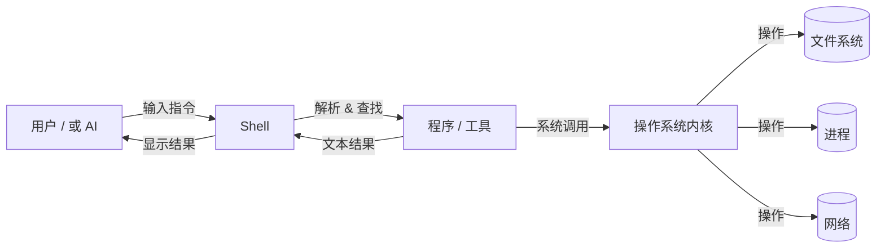
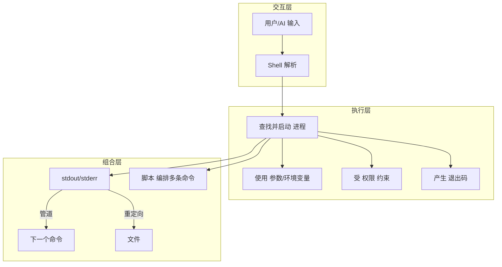
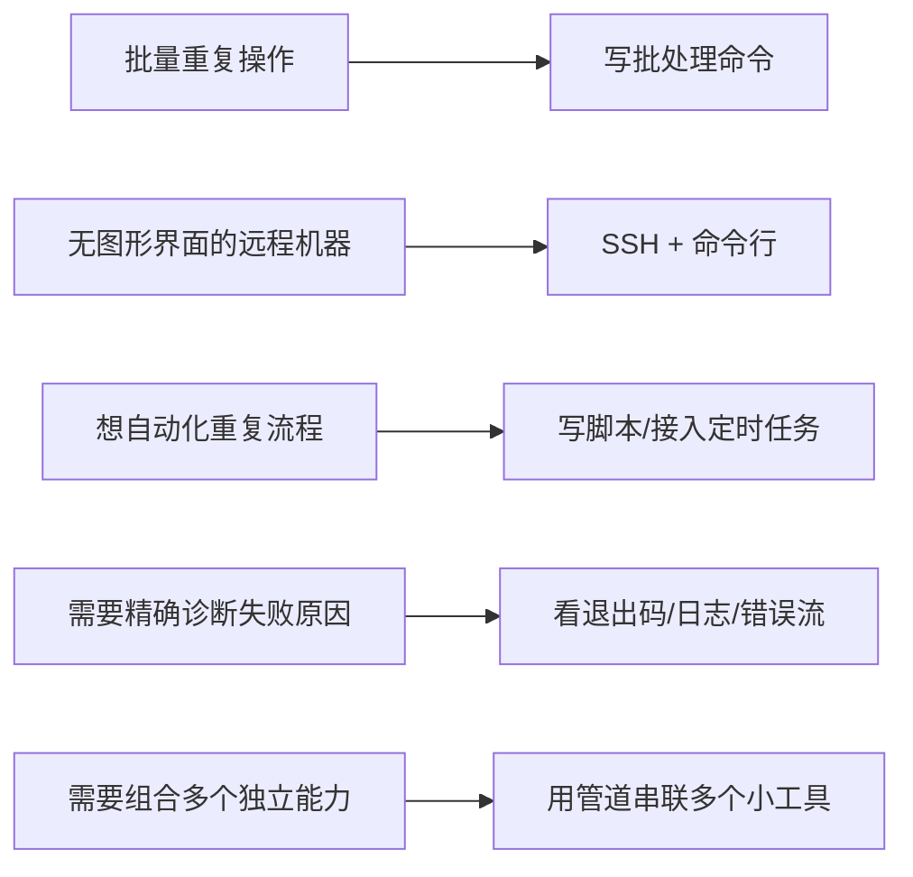
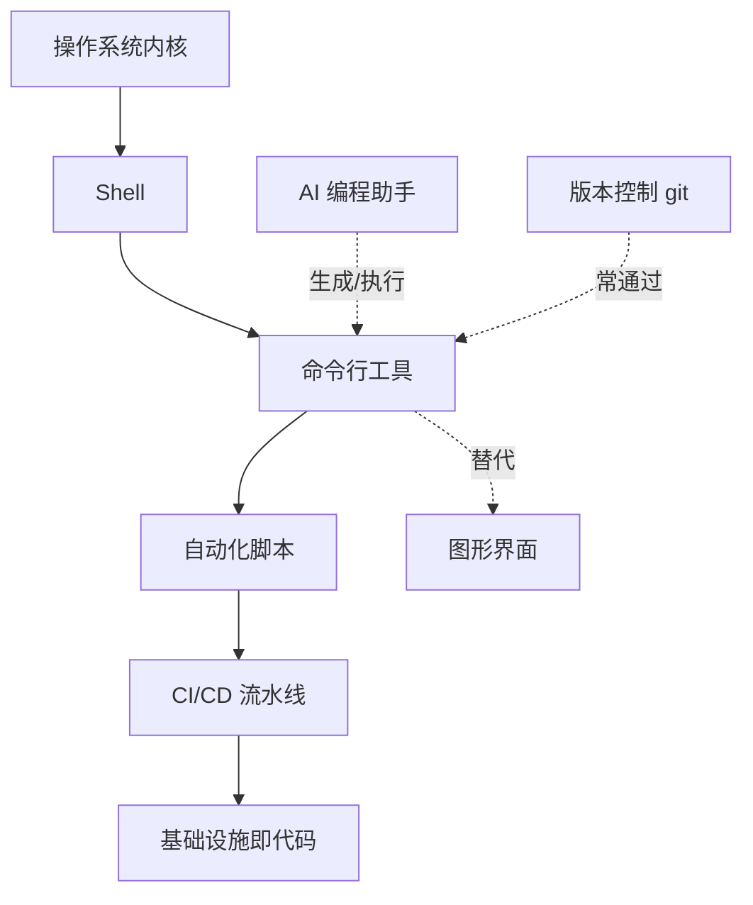

---
vmark:
  id: 019fad16-c689-7122-a5d6-4286cadd805d
---

# AI 时代学习地图：命令行工具（Command-Line Tools / CLI）

> 本文不教你任何具体命令、参数或语法。
> 目标是帮你建立关于"命令行工具"的 **Mental Model** 与 **World Model**：
> 它是什么、为什么存在、你什么时候该想到它、它如何改变你的工作方式、它在整个技术生态中的位置。
> 具体的命令怎么打,交给 AI 就好。

---

# 1. 本质（Essence）

> **命令行工具，本质上是"用文字下达指令、用文字接收结果"的人机交互方式。**

- **为什么它存在？**
  在图形界面（GUI）出现之前，命令行（CLI）就是唯一的人机交互方式。但它没有随着 GUI 的普及而消失，反而在开发者、运维、数据科学领域长盛不衰——因为它解决了 GUI 解决不了的问题。
- **它解决什么根本问题？**
  GUI 的本质是"为人类的眼睛和手设计"：好看、好点、好学。但 GUI 很难被**批量化**、**自动化**、**精确复现**。命令行的本质是"为文本和逻辑设计"：每一个操作都可以被写成一行文字，这意味着它天然具备：
  - **可重复**（同一段命令，跑一百次结果一样）
  - **可组合**（一个工具的输出，可以喂给另一个工具当输入）
  - **可编写成脚本**（把手动操作变成自动化流程）
  - **可远程执行**（没有屏幕、没有鼠标的服务器，也能被操作）
- **没有它时，人们通常怎么做？**
  依赖鼠标点击 GUI 完成的操作，往往意味着：只能一次做一件事、无法批量处理、无法在没有显示器的服务器上运行、很难精确记录"我到底做了什么"。
- **它带来了哪些新的可能？**
  - 把"操作电脑"变成"编写可执行的知识"——一段命令可以被保存、分享、版本控制、复用。
  - 把重复性人力工作变成自动化脚本。
  - 让"远程、无图形界面的机器"（服务器、云主机、容器、嵌入式设备）也能被完全掌控。
  - 是 AI 时代人与 AI 协作的**通用接口**——AI 写代码、写命令，最终大多要通过命令行去落地执行。

---

# 2. 世界模型（World Model）

命令行工具并不是一个孤立的东西，它是一整套"文本世界"的操作系统：

- **对象（Objects）**：文件、目录、进程、环境变量、权限、网络连接、软件包
- **角色（Actors）**：
  - **用户** — 输入指令
  - **Shell（命令解释器）** — 翻译并调度指令
  - **程序/工具** — 真正执行任务的可执行文件
  - **操作系统内核** — 最终执行资源分配（文件读写、进程调度）
- **状态变化（State）**：文件被创建/修改/删除、进程被启动/挂起/终止、系统配置被改变
- **工作流（Workflow）**：从"手动逐步操作"变成"脚本化、可重放的流程"；从"单机操作"变成"可通过 SSH 远程操作服务器集群"
- **交互的系统（Systems）**：文件系统、版本控制系统（如 git）、包管理器、容器（Docker）、云平台、CI/CD 流水线——几乎所有"自动化基础设施"底层都是命令行在跑
- **创造的价值（Value）**：确定性（deterministic）、可自动化、可远程、可组合、轻量（不需要图形渲染），这些是 GUI 难以替代的价值

> **一句话理解它在生态中的位置：**
> 命令行是"人 / AI 意图"与"操作系统实际行为"之间的**文本化中间层**。

---

# 3. 概念地图（Concept Map）

按三层组织：**交互层 → 执行层 → 组合层**

## 第一层：交互层（我和 Shell 之间）

| 概念           | 名词                            | 动词    | 目的             | 与其它概念的关系                     |
| ------------ | ----------------------------- | ----- | -------------- | ---------------------------- |
| Shell        | 命令解释器（bash/zsh/PowerShell...） | 解析、调度 | 把文字翻译成系统能执行的动作 | 是用户与"程序"之间的翻译官               |
| 终端（Terminal） | 显示与输入的窗口/程序                   | 呈现、接收 | 提供文字输入输出的界面载体  | 是 Shell 的"外壳容器"，二者常被混用但不是一回事 |
| 提示符（Prompt）  | 一行等待输入的标志                     | 提示、等待 | 告诉你"轮到你说话了"    | 是 Shell 状态可见化的入口             |

## 第二层：执行层（一条命令如何被执行）

| 概念                       | 名词         | 动词       | 目的                 | 与其它概念的关系               |
| ------------------------ | ---------- | -------- | ------------------ | ---------------------- |
| 命令 / 程序                  | 一个可执行文件    | 被调用      | 完成某个具体任务           | 是"动词"的载体，被 Shell 找到并运行 |
| 参数 / 选项（arguments/flags） | 附加给命令的文字   | 修饰、限定    | 控制命令的具体行为          | 是命令的"配置输入"             |
| 环境变量                     | 全局可见的键值对   | 提供上下文    | 让程序知道"我在什么环境下运行"   | 影响命令能否被找到、如何运行         |
| 进程（Process）              | 运行中的程序实例   | 启动、挂起、终止 | 是命令执行的真实载体         | 命令执行 = 创建一个进程          |
| 退出码（Exit Code）           | 进程结束时返回的数字 | 表示成功/失败  | 让"下一步"知道"上一步"发生了什么 | 是自动化/脚本判断成败的依据         |
| 权限（Permissions）          | 谁能对什么做什么   | 限制、允许    | 保护系统与数据安全          | 决定命令能否执行成功             |

## 第三层：组合层（命令之间如何协作）

| 概念                              | 名词         | 动词    | 目的                 | 与其它概念的关系                  |
| ------------------------------- | ---------- | ----- | ------------------ | ------------------------- |
| 标准输入/输出/错误（stdin/stdout/stderr） | 三条文本流      | 传递数据  | 让程序间可以"对话"         | 是组合的物理基础                  |
| 管道（Pipe，`\|`）                   | 连接两个命令的通道  | 传递、串联 | 把一个命令的输出变成另一个命令的输入 | 是"组合"这个哲学的核心机制            |
| 重定向（Redirection）                | 改变输入输出去向   | 转向    | 把结果存起来或从文件读入       | 让命令能与文件系统对话               |
| 脚本（Script）                      | 一系列命令的文本记录 | 编排、复用 | 把手动操作固化为自动化流程      | 是"组合"的高阶形态，脚本本身也可以被别的脚本调用 |

---

# 4. 决策地图（Decision Map）

专业人士不是"因为要用某个命令"而打开终端，而是因为遇到了某种**情境**。

**情境 1：需要对大量文件做同样的操作**
Situation：要把 500 张图片都改成同一种尺寸
↓
Decision：写一条批处理命令，而不是逐个打开软件手动改
↓
Reason：GUI 一次只能处理一个对象；命令行天然支持"对一批对象重复同一动作"
↓
Expected Outcome：几秒钟内完成，且可以随时复用在下一批 1000 张图片上

**情境 2：需要在没有屏幕的机器上工作**
Situation：需要配置一台远程服务器/云主机
↓
Decision：通过 SSH 用命令行远程连接并操作
↓
Reason：服务器通常没有显示器，GUI 无法运行；命令行只需要文本通道
↓
Expected Outcome：可以在任何地方，通过一个终端掌控整台远程机器

**情境 3：需要把"人做的事"变成"自动重复发生的事"**
Situation：每天要手动跑一遍"拉最新代码 → 跑测试 → 打包 → 上传"
↓
Decision：把这一串操作写成脚本，甚至交给定时任务/CI 系统执行
↓
Reason：命令行操作是文本，文本可以被保存和重放；GUI 点击行为无法被"录制成逻辑"
↓
Expected Outcome：这件事从"我每天做的手工活"变成"系统自己做的事"

**情境 4：需要精确诊断"到底发生了什么"**
Situation：某个自动化流程失败了，需要知道具体哪一步、什么原因
↓
Decision：查看命令的退出码、错误输出、日志文本
↓
Reason：命令行的每一步都有可追溯的文本痕迹（输出、错误、退出码），GUI 的失败往往只有一个模糊的弹窗
↓
Expected Outcome：能定位到"第几步、什么错误"，而不是"重启试试"

**情境 5：需要把多个独立工具串成一条流水线**
Situation：想要"读取数据 → 过滤 → 统计 → 生成报告"
↓
Decision：用管道把几个各自擅长一件事的小工具连接起来
↓
Reason：Unix 哲学——"每个工具只做好一件事，用管道组合出复杂能力"，比找一个"全能软件"更灵活
↓
Expected Outcome：不需要一个工具样样精通，而是像搭积木一样临时拼出解决方案

---

# 5. 搜索空间扩展（Search Space Expansion）

**初学者通常不会想到的问题：**

- "为什么同一个命令，在我这台电脑上能跑，在同事电脑上却报错找不到？"（→ 涉及 PATH / 环境差异）
- "为什么有的操作需要额外权限才能执行？"（→ 涉及用户权限模型）
- "命令执行失败后，'失败'具体是指什么？是崩溃，还是只是返回了一个'不满意'的结果？"（→ 涉及退出码语义）
- "为什么两个命令可以直接'拼在一起'用，而不需要专门写代码去对接？"（→ 涉及标准输入输出的统一约定）

**专家真正关心的问题：**

- 这个操作是否可以被幂等地重复执行？（跑两次和跑一次结果一样吗？）
- 这个流程失败了，能不能自动感知、自动重试、自动告警？
- 这段脚本换一台机器/换一个人执行，还能正常工作吗？（环境依赖是否被显式声明）
- 这个命令的副作用是否可控、可预测、可撤销？

**下一步值得探索的问题：**

- Shell 脚本和"正式编程语言"的边界在哪里？什么时候该升级？
- 命令行工具如何与容器化（Docker）、基础设施即代码（IaC）结合？
- 如何设计一个"好用"的命令行工具（面向未来的自己和他人）？

**决定这个领域上限的问题：**

- 你是否能把"重复发生的人力操作"系统性地转化为"可信赖的自动化"？
- 你是否能在系统出问题时，仅凭文本线索（日志/输出/退出码）快速定位根因？
- 你是否能设计出"可组合"的工作流，而不是每次都从零手搓一遍？

---

# 6. 生态系统（Ecosystem）

- **上游（Upstream）**：操作系统内核（提供进程、文件、权限等底层能力）、Shell 本身（bash/zsh/PowerShell 等，决定语法与交互体验）
- **下游（Downstream）**：自动化脚本、CI/CD 流水线、基础设施即代码（Terraform 等）、容器编排（Kubernetes）——这些几乎都是"命令行操作"的规模化延伸
- **替代方案（Alternatives）**：图形界面（GUI）——在"探索性、低频、需要视觉直觉"的场景更合适；无代码/低代码平台——在"业务人员配置流程"场景更合适
- **互补方案（Complements）**：
  - 版本控制（git）——命令行是操作它的主要方式之一
  - 编程语言（Python/Shell script 等）——命令行工具常被脚本语言调用和编排
  - AI 编程助手——现在越来越多"该敲什么命令"这件事本身也被 AI 接管，命令行成为 AI 落地执行意图的"手"

---

# 7. 可迁移原则（Transferable Principles）

- **第一性原理**：一切交互都可以被还原为"文本输入 → 处理 → 文本输出"，只要接口是文本的，就可以被组合、复用、自动化。
- **可迁移的方法论**：
  - Unix 哲学——做好一件小事，通过组合获得复杂能力
  - 幂等性思维——设计操作时，追求"重复执行结果一致"
  - 可观测性思维——每一步都要留下可追溯的痕迹（输出/日志/状态码）
- **当前实现细节（易变）**：具体是 bash 还是 zsh、具体某个命令的参数拼写、某个工具的版本差异
- **长期稳定的知识**：Shell/进程/权限/管道/文本流这些"世界模型"层面的概念，几十年基本没变
- **容易变化的知识**：具体工具的界面、参数命名、新工具的流行程度（这些正是 AI 最擅长替你查、替你记的部分）

---

# 8. 最小心智模型（Minimum Mental Model）

如果只能记住这些，按重要性排序：

1. **命令行 = 文本化的人机交互接口**（一切的起点）
2. **Shell** — 命令的翻译官和调度者
3. **进程** — 命令执行的真实载体
4. **文件系统** — 命令行操作最常打交道的对象
5. **参数/选项** — 控制命令行为的"调节旋钮"
6. **环境变量** — 命令运行所处的隐形上下文
7. **标准输入/输出/错误（stdin/stdout/stderr）** — 命令之间"对话"的统一协议
8. **管道** — 把简单工具组合成复杂能力的核心机制
9. **重定向** — 让命令与文件系统对接的方式
10. **退出码** — 判断"成功还是失败"的通用信号
11. **权限模型** — 决定"你能不能这么做"
12. **脚本** — 把一次性操作固化为可复用流程
13. **PATH（可执行文件查找路径）** — 解释"为什么命令能/不能被找到"
14. **幂等性** — 判断一个操作是否可以安全地重复执行
15. **Unix 哲学（小工具+组合）** — 理解"为什么命令行不追求大而全"
16. **远程执行（如 SSH 背后的思想）** — 理解命令行如何突破"必须有屏幕"的限制
17. **自动化/CI 的底层其实是命令行** — 理解命令行是现代软件工程自动化的地基

> 排序依据：前几项是"没有它就无法理解任何命令行行为"的骨架概念；中段是"让命令行产生复合价值"的关键机制；后段是"把命令行个人技能升级为工程能力"的桥梁概念。

---

# 9. 常见误区（Common Misconceptions）

- **误区：命令行 = 黑客/极客专属，普通人不需要懂。**
  为什么会有这种误解：命令行的黑底白字界面在影视作品中被符号化为"高深莫测"。
  更准确的心智模型：命令行只是"用文字下达指令"的一种交互方式，本质上不比点鼠标更难，只是**约定**不同、**反馈**方式不同。
- **误区：记住足够多命令，就等于掌握了命令行。**
  为什么会有这种误解：初学阶段最直观的学习方式是"背命令"。
  更准确的心智模型：具体命令是最容易被 AI 替你查、替你写的部分；真正重要的是理解"输入输出如何流动、如何组合、如何判断成败"这套底层模型。
- **误区：终端（Terminal）和 Shell 是一回事。**
  为什么会有这种误解：日常使用中二者总是同时出现，难以区分。
  更准确的心智模型：终端是"显示文字的窗口容器"，Shell 是"在终端里真正解析和执行你输入内容的程序"——终端是壳，Shell 是灵魂。
- **误区：命令行出错就是"电脑坏了"。**
  为什么会有这种误解：GUI 习惯了"出错=弹窗警告"，而命令行的报错是一段陌生的文字，容易被误读为系统故障。
  更准确的心智模型：命令行的报错文本本身就是最精确的诊断信息，它通常在明确告诉你"哪里、为什么"失败，而不是含糊的"出错了"。
- **误区：命令行工具正在被 AI 取代，未来不用学。**
  为什么会有这种误解：AI 确实已经能直接生成并执行命令。
  更准确的心智模型：AI 取代的是"记住具体语法"这一层，但"理解命令行的世界模型"（进程、文本流、组合、幂等）恰恰是你判断 AI 做得对不对、敢不敢放手交给它执行的基础——这层理解不会过时，反而更重要。

---

# 10. 总结（Summary）

> 我真正获得的不是 **一堆命令和参数的记忆**，
> 而是 **一套"如何用文本化、可组合、可自动化的方式与计算机世界对话"的思维模型**。

