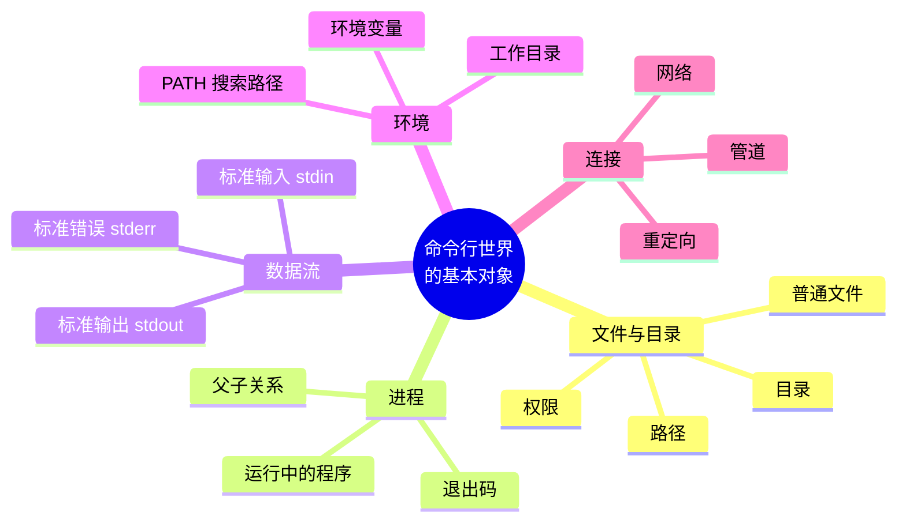
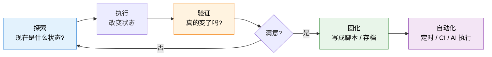
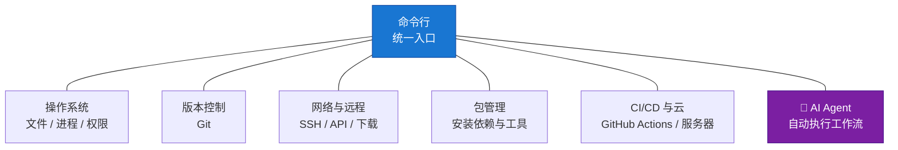
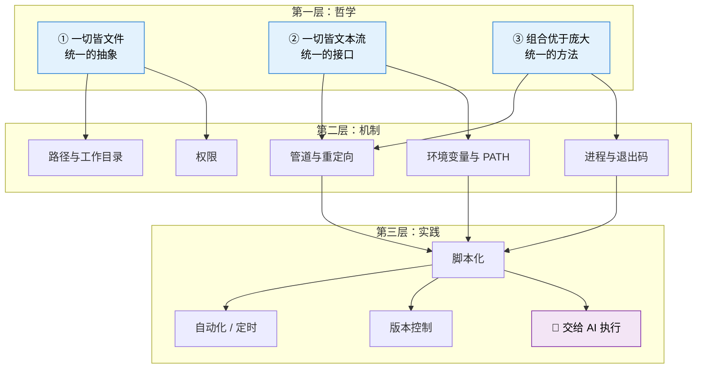
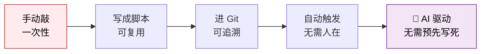
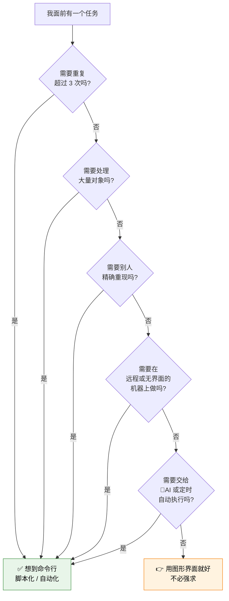
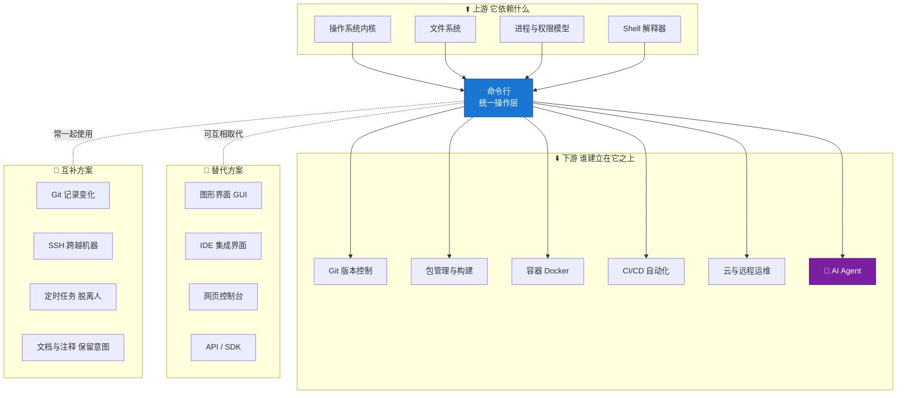
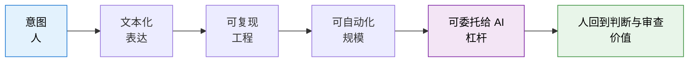

---
vmark:
  id: 019fe007-66fa-79e2-8f61-43d0692006c3
---

# 命令行工具基础 · 学习地图

> 本文不教你「怎么用」，而是帮你建立**心智模型（Mental Model）与世界模型（World Model）**。
> 默认前提：具体的命令、语法、参数由 AI 替你完成。你需要拥有的，是**判断力**——知道它是什么、为什么存在、什么时候该想到它。

---

## 1. 本质（Essence）

> **一句话：命令行是把「意图」表达成文本的接口——而文本是唯一可以被复制、存档、版本管理、以及被程序（和 AI）生成的操作形式。**

### 为什么它存在？

这是最关键的一问，很多人从没想过。

图形界面（GUI）是为**人的眼睛和手**优化的：你看到按钮，你点击它。
命令行（CLI）是为**组合与自动化**优化的：你写下意图，它可以被存下来、被重复、被传给别人、被机器生成。

两者不是「新与旧」的关系，而是**两种不同的优化目标**。

### 它解决什么根本问题？

**操作的「可复现性」问题。**

想象一个场景：你花了两小时，在图形界面里点了 47 次鼠标，终于把一个系统配置好了。

现在请回答：

- 你能把这 47 次点击**发给同事**吗？
- 三个月后你能**一模一样地重做**一遍吗？
- 你能让它**每天凌晨 3 点自动执行**吗？
- 你能查出**上周谁改了哪一步**吗？

答案都是不能。因为鼠标点击是**一次性的、不可言说的、消失即无痕的**。

而命令行的每一次操作都是一行文本。文本可以被复制、被粘贴、被存进 Git、被写成脚本、被 AI 生成。**这就是全部的差别，也是全部的意义。**

### 没有它时，人们怎么办？

| 场景   | 只有 GUI 的做法         | 后果           |
| ---- | ------------------ | ------------ |
| 交接工作 | 写一份「操作手册」，配 30 张截图 | 界面一改版，手册全废   |
| 重复任务 | 每天手动点一遍            | 人力消耗，且必然出错   |
| 排查故障 | 「你截个图我看看」          | 信息丢失，无法精确复现  |
| 批量处理 | 一个一个文件点            | 500 个文件 = 放弃 |

### 它带来了哪些新的可能？

1. **自动化**：能写下来的操作，就能被自动执行
2. **可复现**：同样的输入 → 同样的结果，跨机器、跨时间
3. **可组合**：小工具拼装成大能力（这是它最被低估的特性）
4. **可协作**：操作过程本身可以被评审、版本管理、回滚
5. **⭐ AI 可操作**：**AI 擅长生成文本，所以 AI 天然会用命令行；AI 很难替你点鼠标**

> 💡 **这一点在 AI 时代变得空前重要。**
> 命令行不是因为「AI 来了」而过时，恰恰相反——它是 AI 唯一能够熟练操作的世界入口。
> 今天在 GitHub Actions 里跑的自动化任务、AI Agent 执行的每一步，本质上都是 AI 在用命令行操作世界。

---

## 2. 世界模型（World Model）

命令行不是一个「软件」，它是一个**世界的操作界面**。要理解它，先理解这个世界里有什么。

### 它处理哪些对象（Objects）



### 涉及哪些角色（Actors）

| 角色              | 它是谁     | 你需要理解的关键点                       |
| --------------- | ------- | ------------------------------- |
| **你（人）**        | 意图的来源   | 你负责「要什么」，不负责「怎么敲」               |
| **Shell**       | 翻译官     | 它读你的文本，理解成动作，交给系统执行             |
| **程序 / 工具**     | 干活的工人   | 每个只做一件小事，靠组合产生威力                |
| **操作系统内核**      | 真正的执行者  | 管理文件、进程、权限、硬件                   |
| **🤖 AI Agent** | **新角色** | **能生成文本 → 能操作命令行 → 能替你完成整条工作流** |

### 管理哪些状态变化（State）

命令行的本质是**改变系统状态**。理解「状态」是理解一切风险与收益的钥匙：

- **文件系统状态**：文件被创建、修改、移动、删除
- **进程状态**：程序启动、运行、结束（成功还是失败？）
- **环境状态**：当前在哪个目录、有哪些变量、能找到哪些工具
- **⚠️ 不可逆状态**：删除、覆盖、推送到远程——这类操作没有「撤销」

> 真实案例：文件从一个位置「消失」，本质是**状态变化**；
> 而找回它的方法，是理解状态**变到哪里去了**（比如进了某个隐藏回收站），而不是记住某个命令。

### 改变哪些工作流（Workflow）



这个循环是**命令行思维的核心**：探索 → 执行 → **验证** → 固化 → 自动化

大多数初学者跳过了「验证」，也从不走到「固化」，所以永远停留在「每次都重敲一遍」的阶段。

### 与哪些系统交互（Systems）



**关键洞察**：命令行是这些系统的**共同语言**。
学会它，你不是学会了一个工具，而是获得了通往所有这些系统的**同一把钥匙**。

### 创造哪些价值（Value）

1. **时间杠杆**：一次编写 → 无限次执行
2. **信任**：可复现 = 可验证 = 可信任
3. **规模**：处理 5 个文件和 5000 个文件，成本几乎相同
4. **传递**：能力可以被打包、分享、继承
5. **可委托**：能写成文本的工作，就能交给 AI 去做

---

## 3. 概念地图（Concept Map）

概念的价值不在定义，而在**关系**。以下按 2–3 层组织。

### 第一层：三个底层哲学

这三条是 Unix 的立身之本，理解它们比记住 100 个命令有用得多。



#### ① 一切皆文件（Everything is a File）

- **名词**：文件、目录、设备、甚至网络连接
- **动词**：读、写、打开、关闭
- **目的**：用**一套**规则理解**所有**东西，降低认知负担
- **关系**：因为一切皆文件，所以「权限」这一个概念就能管住所有资源

#### ② 一切皆文本流（Everything is a Text Stream）

- **名词**：stdin（输入）、stdout（输出）、stderr（错误）
- **动词**：流入、流出、连接
- **目的**：让**任意两个**互不认识的程序可以对接
- **关系**：这是「组合」得以可能的**物理基础**——没有统一接口，就没有拼装

> 🔑 **为什么 stdout 和 stderr 要分开？**
> 这是初学者最容易忽略、但极其精妙的设计：
> 正常结果走 stdout（可以被下一个程序接收），错误信息走 stderr（直接给人看）。
> 这样**出错时不会污染数据流**。理解这一点，你就理解了什么叫「为组合而设计」。

#### ③ 组合优于庞大（Composition over Monolith）

- **名词**：小工具、管道
- **动词**：拼接
- **目的**：用有限的零件应对无限的需求
- **关系**：与 ② 互为因果——**统一接口 → 可组合 → 不需要造大而全的工具**

> 对比思考：GUI 软件的思路是「一个软件解决所有问题」（功能越加越多）；
> 命令行的思路是「每个工具只解决一个问题，组合起来解决所有问题」。
> 这是两种**世界观**的差异，不只是技术差异。

### 第二层：五个核心机制

| 机制             | 名词                 | 动词       | 目的                 | 与其他概念的关系                         |
| -------------- | ------------------ | -------- | ------------------ | -------------------------------- |
| **路径与工作目录**    | 绝对路径 / 相对路径 / 当前目录 | 定位、切换    | 回答「在哪里」            | 是**一切操作的坐标系**；90% 的「命令没生效」都是位置错了 |
| **管道与重定向**     | 管道 / 输入输出重定向       | 连接、转向    | 让数据在工具间流动          | ②③ 的直接产物，是「组合」的实现方式              |
| **进程与退出码**     | 进程 / 退出码 / 前台后台    | 启动、等待、终止 | 回答「成功了吗」           | **自动化的地基**——脚本靠退出码判断是否继续         |
| **环境变量与 PATH** | 环境变量 / PATH        | 设置、查找    | 决定「能找到什么」「以什么身份运行」 | 「在我电脑上能跑」问题的根源；也是**密钥存放**的地方     |
| **权限**         | 用户 / 组 / 读写执行      | 授予、拒绝    | 决定「允许做什么」          | 由「一切皆文件」派生；是安全边界                 |

> 🔑 **退出码（Exit Code）是初学者最容易忽略、专家最看重的概念之一。**
> 每个命令结束时都会返回一个数字：`0` 代表成功，非 `0` 代表失败。
> 人看输出文字，**机器只看退出码**。所有的自动化流程，
> 都是靠退出码决定「这一步成功了，可以进行下一步」还是「失败了，中止并报警」。

### 第三层：从操作到能力

- **脚本化**：把一串操作固化成一个文件 → 操作变成**资产**
- **版本控制**：脚本进入 Git → 操作变得**可追溯、可回滚、可协作**
- **自动化**：定时或事件触发 → 操作**脱离人的在场**
- **AI 执行**：把意图写成 prompt → **AI 生成并执行操作**



**这条演进链，就是一个自动化项目从「手工活」长成「基础设施」的完整路径。**

---

## 4. 决策地图（Decision Map）

> 核心问题：**什么情况下，专业人士会自然想到命令行？**

不是「我要学命令行」，而是**某种信号出现时，脑中自动亮起一盏灯**。以下是那些信号。

### 决策树：什么时候该想到它



> ⚠️ **重要提醒**：最后那个「用 GUI 就好」的分支是认真的。
> 命令行不是道德优越性。一次性的、探索性的、强视觉的任务，图形界面就是更好的选择。
> **专业性体现在「知道什么时候用哪个」，而不是「永远用命令行」。**

### 真实场景推演

#### 场景 A：批量整理文件

```
Situation  →  我有 300 个文件需要按日期重命名并分类
      ↓
Decision   →  用命令行（或让 AI 生成一段处理脚本）
      ↓
Reason     →  GUI 下要点 300 次且必然出错；脚本处理 300 个和 3 个成本相同
      ↓
Outcome    →  几秒完成，且这段脚本下次还能用
```

#### 场景 B：交接一套配置流程

```
Situation  →  要把我的环境配置教给同事
      ↓
Decision   →  给一份脚本，而不是截图手册
      ↓
Reason     →  截图会过期、会有理解偏差；脚本是"可执行的文档"，不会说谎
      ↓
Outcome    →  同事一次跑通；且这份脚本成为团队资产
```

#### 场景 C：定时自动任务

```
Situation  →  希望每天早上自动生成一份简报并发布
      ↓
Decision   →  写成命令行流程，交给云端（如 GitHub Actions）执行
      ↓
Reason     →  人不可能每天准时；只有文本化的操作才能被机器托管
      ↓
Outcome    →  长期零人工干预运行
```

#### 场景 D：排查「在我电脑上是好的」

```
Situation  →  同一份代码，我这能跑，服务器上报错
      ↓
Decision   →  比对两边的环境变量、PATH、版本、权限
      ↓
Reason     →  差异几乎总在"环境"里，而环境只有命令行能完整暴露
      ↓
Outcome    →  定位到真实差异，而不是靠猜
```

#### 场景 E：远程服务器

```
Situation  →  需要在一台云服务器上操作
      ↓
Decision   →  只能用命令行
      ↓
Reason     →  服务器通常根本没有图形界面（省资源、可远程、可批量）
      ↓
Outcome    →  这是"不得不"的场景——也是为什么它无法被淘汰
```

#### 场景 F：把工作交给 AI

```
Situation  →  希望 AI 帮我完成一整套多步骤工作
      ↓
Decision   →  把工作流表达成命令行可执行的形式
      ↓
Reason     →  AI 生成文本的能力极强，操作图形界面的能力极弱
      ↓
Outcome    →  AI 成为真正的执行者，而不只是聊天对象
```

---

## 5. 搜索空间扩展（Search Space Expansion）

> 帮你发现「**你不知道自己不知道什么**」——这一节可能是全文最有价值的部分。

### 初学者通常不会想到的问题

| 问题                       | 为什么重要                                   |
| ------------------------ | --------------------------------------- |
| **为什么成功时什么都不显示？**        | Unix 的「沉默是金」原则：无消息即好消息。这样输出才能干净地传给下一个程序 |
| **命令执行完，我怎么知道它真的成功了？**   | 引出**退出码**——自动化的地基                       |
| **同样的命令，为什么在别人机器上结果不同？** | 引出**环境**概念，也是「可复现性」的真正难点                |
| **删除的东西去哪了？**            | 命令行的删除通常**不进回收站**——引出不可逆操作与备份思维         |
| **谁决定了我能不能做这件事？**        | 引出权限模型与安全边界                             |
| **为什么要区分绝对路径和相对路径？**     | 脚本在别的目录下运行时会不会崩？这是脚本健壮性的分水岭             |

### 专家真正关心的问题

初学者关心「怎么做成」，专家关心「**怎么保证不出事**」：

- **幂等性（Idempotency）**：这个操作重复执行 10 次，结果和执行 1 次一样吗？
- **失败处理**：中途某一步失败了，会停下来还是带着错误继续跑完？
- **可观测性**：出问题时，我能不能从日志还原当时发生了什么？
- **副作用边界**：这个脚本会碰哪些文件？会不会误伤？
- **密钥安全**：凭据存在哪？会不会被写进日志、提交进 Git、上传到云盘？
- **可移植性**：换一台机器、换一个系统，还能跑吗？
- **原子性**：操作到一半断电，系统会处于什么状态？

### 下一步值得探索的问题

1. 「**可复现性**」到底有几个层次？（脚本 → 依赖锁定 → 容器 → 完全声明式）
2. 为什么现代工程如此痴迷「**声明式**」而非「命令式」？
3. **文本作为通用接口**的边界在哪？什么时候它反而是错的选择？
4. AI Agent 与命令行结合后，「**权限该给多大**」成为新的核心问题
5. 当 AI 能生成任意命令，人的价值转移到哪里？（→ **审查、判断、边界设定**）

### 哪些问题决定了这个领域的上限

> 这几个问题的答案，区分了「会用工具的人」和「能设计系统的人」：

1. **组合的极限在哪？** 什么时候该停止拼装、转而写一个真正的程序？
2. **自动化的信任边界在哪？** 什么操作永远不该无人值守地自动执行？
3. **可复现性能做到多彻底？** 这决定了工程能扩展到多大规模
4. **抽象泄漏怎么办？** 当底层出问题，上层的便利全部失效——你有多少「向下钻」的能力？
5. **🤖 人机边界如何划分？** AI 负责生成与执行，人负责什么？——**这是 AI 时代最核心的问题**

---

## 6. 生态系统（Ecosystem）



### 替代方案对比：什么时候不该用命令行

| 方案            | 优势           | 劣势              | 何时优于命令行            |
| ------------- | ------------ | --------------- | ------------------ |
| **图形界面**      | 可发现性强、直观、低门槛 | 不可复现、不可组合、无法自动化 | 探索陌生领域、强视觉任务、一次性操作 |
| **IDE**       | 集成度高、有智能提示   | 绑定特定工具、难以脱离环境   | 日常写代码              |
| **网页控制台**     | 无需安装、随处可用    | 慢、无法批量、依赖网络     | 偶尔查看状态             |
| **API / SDK** | 类型安全、逻辑表达力强  | 需要写程序、启动成本高     | 复杂逻辑、需要深度集成时       |

> 一个成熟的判断：**GUI 用来「发现」，CLI 用来「重复」。**
> 第一次做某件事用界面探索，确认要长期做之后转成命令行固化。

### 互补关系：为什么它们总是一起出现

- **命令行 + Git** = 操作可追溯、可回滚
- **命令行 + SSH** = 操作可跨越机器边界
- **命令行 + 定时任务** = 操作可脱离人的在场
- **命令行 + 容器** = 操作可跨越环境差异
- **🤖 命令行 + AI** = 操作可脱离「预先写死的脚本」——AI 现场决定做什么

> 最后一条是本质变化：传统自动化必须**提前想好每一步**；
> AI + 命令行让自动化第一次拥有了**临场判断能力**。
> 一个每天搜集不同内容、却能自动跑通同一套流程的任务，在过去是做不到的。

---

## 7. 可迁移原则（Transferable Principles）

区分「**十年后还成立的**」和「**明年就变的**」，是学习效率的关键。

### 🏛️ 第一性原理（几十年不变）

1. **统一接口产生组合能力** —— 只要接口一致，任意两个东西就能对接
2. **可复现性是信任的基础** —— 不能重现的结果，无法被验证，也就无法被信任
3. **显式优于隐式** —— 明确写出来的，比靠约定和记忆的可靠
4. **失败要响亮** —— 静默失败是最危险的失败
5. **小而专优于大而全** —— 复杂性应该来自组合，而不是来自单个组件

### 🧭 可迁移方法论（跨领域适用）

- **探索 → 执行 → 验证 → 固化 → 自动化** 的循环
- **先让它能跑，再让它可靠，最后让它自动** 的推进顺序
- **幂等设计**：让重复执行是安全的
- **把知识写进可执行物**，而不是写进文档或人脑
- **不可逆操作前先备份**

> 这些原则的适用范围**远远超出命令行**：写作、项目管理、团队协作、个人系统建设，全都适用。

### 🔧 当前实现细节（会变，交给 AI）

- 具体命令名称与参数写法
- 不同 Shell 的语法差异
- 各个工具的具体用法
- 特定平台的路径规则

> **这一类，正是可以放心交给 AI 的部分。不需要背。**

### 📌 长期稳定 vs 容易变化

| 长期稳定（值得投入）        | 容易变化（不必深究）    |
| ----------------- | ------------- |
| 文件 / 进程 / 流 的心智模型 | 某个工具的具体参数     |
| 组合、管道的思维方式        | 某个 Shell 的语法糖 |
| 权限与安全边界的概念        | 各平台的差异细节      |
| 幂等、可复现的工程思维       | 当下流行的工具排名     |
| 判断「何时该自动化」的能力     | 具体的命令记忆       |

---

## 8. 最小心智模型（Minimum Mental Model）

> 如果只能记住 **14 个概念**，就是这些。按重要性排序。

| #      | 概念                          | 为什么它排在这个位置                          |
| ------ | --------------------------- | ----------------------------------- |
| **1**  | **一切操作皆文本**                 | 全部价值的源头。文本可存、可传、可版本化、可被 AI 生成       |
| **2**  | **可复现性**                    | 命令行存在的根本理由。不可复现 = 不可信任 = 不可自动化      |
| **3**  | **状态与状态变化**                 | 你所做的一切都在改变系统状态；理解它才能预判风险            |
| **4**  | **路径与工作目录**                 | 一切操作的坐标系。绝大多数「怎么没生效」都是位置问题          |
| **5**  | **退出码（成功/失败）**              | 人看文字，机器看退出码。**自动化的地基**              |
| **6**  | **stdin / stdout / stderr** | 组合能力的物理基础；也解释了为什么错误要和结果分开           |
| **7**  | **管道与组合**                   | 「小工具拼装」的实现方式，是命令行威力的来源              |
| **8**  | **进程**                      | 理解「正在运行的东西」，才能理解启动、等待、终止、超时         |
| **9**  | **环境变量与 PATH**              | 「在我机器上能跑」的答案所在；也是密钥的存放处             |
| **10** | **权限**                      | 决定「允许做什么」，是安全的第一道边界                 |
| **11** | **不可逆操作**                   | 删除、覆盖、推送——**没有撤销键**。这个意识能救你很多次      |
| **12** | **幂等性**                     | 重复执行是否安全，决定了自动化能不能放心跑               |
| **13** | **脚本化 = 知识固化**              | 把「会做」变成「资产」，这是能力复利的开始               |
| **14** | **🤖 AI 是命令行的新使用者**         | AI 时代最重要的一条：你的角色从「操作者」变为「意图设定者与审查者」 |

> 💡 前 3 个是**世界观**，4–10 是**机制**，11–14 是**工程判断力**。
> 如果时间有限，**深刻理解前 3 个 + 第 5 个 + 第 11 个**，就已经超过大多数人。

---

## 9. 常见误区（Common Misconceptions）

### 误区一：「命令行是过时的老技术，图形界面才是进步」

- **为什么会这样想**：视觉上，黑底白字确实像上世纪产物；直觉认为技术总是「新的取代旧的」
- **✅ 更准确的模型**：两者是**为不同目标优化**的并行方案，不是先后关系。GUI 优化「人的直观操作」，CLI 优化「组合与自动化」。**恰恰因为 AI 到来，CLI 的重要性在上升而非下降**——因为 AI 会写文本，不会点鼠标。

### 误区二：「学命令行就是背命令」

- **为什么会这样想**：入门教程通常是命令清单，给人「量大 = 难」的错觉
- **✅ 更准确的模型**：命令是**词汇**，思维方式才是**语法**。背 100 个命令而不懂组合，不如懂管道和退出码却只会 10 个命令。**而且在 AI 时代，词汇可以完全外包给 AI，语法必须长在你脑子里。**

### 误区三：「命令行很危险，一不小心就删库」

- **为什么会这样想**：确实听过灾难故事；且删除通常不进回收站
- **✅ 更准确的模型**：危险的不是命令行，是**对状态变化缺乏心智模型**。同样的误删在图形界面也会发生，只是命令行**执行得更快、规模更大**，所以要求你的预判能力更强。**答案是建立「先看清、再动手、有备份」的习惯，而不是回避。**

### 误区四：「AI 时代了，还学这个干嘛？」

- **为什么会这样想**：AI 确实能替你写出所有命令
- **✅ 更准确的模型**：AI 替代的是**打字**，不是**判断**。当 AI 要执行一个命令，是你在决定：该不该做、边界在哪、失败了怎么办、它有没有做错。**没有心智模型，你无法审查 AI 的操作——那才是真正的危险。**

### 误区五：「命令行是程序员专属」

- **为什么会这样想**：大多数教程面向开发者
- **✅ 更准确的模型**：它是\*\*「任何需要重复、批量、自动化工作的人」\*\*的工具。写作者批量处理素材、研究者整理数据、运营人员定期生成报表——都适用。**一个每日自动简报系统并不是「编程项目」，而是「自动化的内容生产流程」。**

### 误区六：「我要先全部学会，才能开始用」

- **为什么会这样想**：知识清单看起来很长
- **✅ 更准确的模型**：这是一个**按需展开**的领域。理解前面那 3–5 个核心概念就足以开始；剩下的在遇到具体问题时再学，反而记得更牢。**先有真实场景，再学对应概念**，是唯一高效的路径。

---

## 10. 总结（Summary）

> **我真正获得的不是** ~~一堆能敲出来的命令~~，
> **而是**「**把模糊意图变成可复现、可组合、可交给机器执行的明确表达**」的能力——
> 以及在 AI 替我执行时，仍然**看得懂、拦得住、判断得了**的底气。

---

### 一句话回顾



> **命令行不是终点，是让人的意图能够被机器精确承接的那座桥。** 在 AI 时代，桥的价值不但没有下降，反而因为对岸站着一个能干活的 AI，而变得前所未有地重要。

---

*本文档为长期维护型学习地图，随理解加深可持续修订。*
*生成模型：Claude Opus 5 ｜ 生成日期：2026-08-08*
