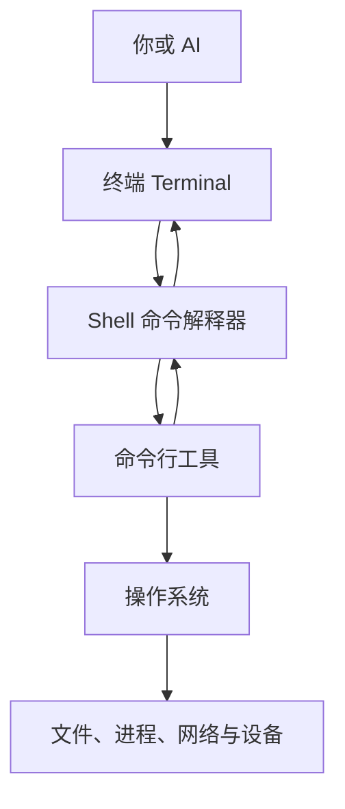
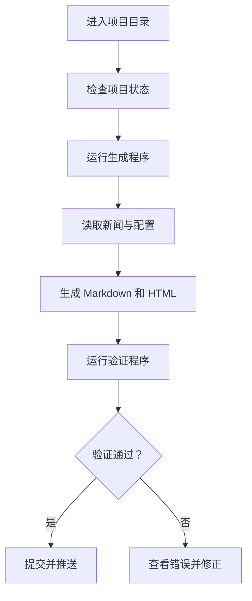

---
vmark:
  id: 019fb1e3-0ddc-7af2-9872-5a16953eed11
---

# 命令行工具基础：先建立心智模型

学习命令行，真正重要的不是背诵 `cd`、`ls`、`git`，而是理解：

> 命令行是一套“用结构化文字向计算机发出指令，并观察结果”的工作方式。

它不仅是一个黑色窗口，更是一种可以组合、记录、重复和自动化的计算机控制系统。

---

## 1. 本质：命令行究竟是什么？

### 一句话定义

> 命令行工具，是通过文字指令接收输入、执行任务并返回结果的程序。

例如：

```bash
git status
```

这句话表达的是：

- `git`：我要调用哪个工具
- `status`：我要它执行什么动作
- 输出结果：当前 Git 仓库处于什么状态

命令行的本质可以简化为：

```text
工具 + 动作 + 对象 + 条件
```

例如：

```bash
git log --oneline README.md
```

| 部分          | 含义        |
| ----------- | --------- |
| `git`       | 使用 Git 工具 |
| `log`       | 查看历史记录    |
| `README.md` | 只关心这个文件   |
| `--oneline` | 使用简洁格式显示  |

### 为什么命令行会存在？

因为图形界面虽然直观，但存在几个限制：

- 大量重复操作很慢
- 不容易精确描述复杂任务
- 操作过程难以保存和复现
- 很难把多个工具连接起来
- 不方便远程管理服务器
- 不利于自动化执行

假设每天需要处理 100 个文件：

- 图形界面：逐个点击、重命名、移动
- 命令行：用一条规则批量完成
- 脚本：把规则保存下来，以后自动执行

所以，命令行解决的根本问题不是“没有鼠标”，而是：

> 如何准确、批量、可重复地控制计算机。

### 它带来了什么新可能？

命令行让操作具备了五种重要能力：

1. **可表达**：复杂任务可以写成明确指令。
2. **可组合**：一个工具的结果可以交给另一个工具。
3. **可重复**：同一条命令可以再次执行。
4. **可记录**：命令可以保存为脚本或配置文件。
5. **可自动化**：可以定时执行，也可以由 AI、服务器或其他程序调用。

这也是为什么 AI 编程工具大量使用命令行：命令行比鼠标点击更容易被 AI 准确调用和验证。

---

## 2. 世界模型：命令行在计算机里的位置

初学者容易把终端、Shell、命令和工具混在一起。它们实际上是不同层次。



### 2.1 终端 Terminal

终端是你输入命令、查看输出的窗口。

macOS 里的“终端”、iTerm2，VS Code 里的 Terminal，都属于终端。

可以把它理解成：

> 你和命令行系统进行文字交流的窗口。

终端本身通常不负责理解 `git status` 是什么意思。

### 2.2 Shell

Shell 负责读取并解释你输入的文字。

macOS 现在通常使用的是 `zsh`，Linux 上常见的是 `bash`。

它像一个调度员：

1. 接收你输入的命令
2. 分析命令结构
3. 找到对应程序
4. 启动程序
5. 把结果显示回来

### 2.3 命令行工具 CLI

CLI 是“Command-Line Interface”的缩写，即命令行界面。

例如：

- `git`：管理代码版本
- `curl`：发送网络请求、下载内容
- `rg`：搜索文本
- `node`：运行 JavaScript
- `python`：运行 Python
- `codex`：调用 Codex 命令行工具
- `claude`：调用 Claude Code
- `gh`：操作 GitHub

它们是各自独立的程序，只是通过命令行接受指令。

### 2.4 操作系统

真正管理文件、内存、网络和进程的是操作系统。

命令行工具通常不会绕过操作系统，而是请求操作系统完成任务。

因此：

```text
终端 ≠ Shell ≠ 命令行工具 ≠ 操作系统
```

一个生活化比喻：

| 计算机概念 | 餐厅比喻        |
| ----- | ----------- |
| 终端    | 点餐窗口        |
| Shell | 听懂并转达要求的服务员 |
| 命令行工具 | 执行具体工作的厨师   |
| 操作系统  | 餐厅的厨房和管理系统  |
| 文件与网络 | 食材、设备和供应系统  |

---

## 3. 命令行处理哪些对象？

命令行工具并不只处理文件。它控制的是计算机中的各种对象。

### 文件和目录

例如：查看文件、创建目录、搜索内容、移动和复制文件、比较不同版本。

### 程序和进程

程序是磁盘上的代码；进程是正在运行的程序。

例如：

```bash
python app.py
```

意思是启动 Python，让它运行 `app.py`。运行期间，系统里会产生一个进程。

### 输入和输出

命令通常接收输入，并产生两类结果：

- 输出内容
- 执行状态

### 网络资源

命令行工具可以请求网页、调用 API、登录服务器、下载软件包、检查网络连接。

### 环境和配置

工具运行时还会受到以下信息影响：

- 当前所在目录
- 环境变量
- 配置文件
- 用户权限
- Shell 类型
- 网络代理

这解释了为什么“同一条命令在别人电脑上可以运行，在我的电脑上却不行”。

---

## 4. 概念地图：命令是怎样工作的？

### 4.1 命令的基本结构

大多数命令可以理解为：

```text
程序  子命令  选项  参数
```

例如：

```bash
git log --oneline README.md
```

| 概念  | 例子          | 作用     |
| --- | ----------- | ------ |
| 程序  | `git`       | 选择工具   |
| 子命令 | `log`       | 选择动作   |
| 选项  | `--oneline` | 调整执行方式 |
| 参数  | `README.md` | 指定处理对象 |

但不是每个工具都严格遵守这套格式。命令行工具的语法由工具开发者决定。

### 4.2 当前目录

Shell 始终处在某个目录中，称为“当前工作目录”。

这是命令行里最重要的隐藏状态之一。同样执行：

```bash
git status
```

在不同目录里可能得到完全不同的结果：

- 位于 Git 项目里：显示仓库状态
- 位于普通目录里：提示这里不是 Git 仓库

所以遇到问题时，首先应该确认：

> 我现在在哪里？我要处理的对象在哪里？

常用命令：

```bash
pwd
```

意思是显示当前目录。

### 4.3 路径

路径是计算机中对象的地址。

绝对路径是从文件系统根部开始写出的完整地址：

```text
/Users/yourname/Documents/daily-ai-news
```

相对路径以当前目录为参照：

```text
./README.md
../another-project
```

其中：

- `.`：当前目录
- `..`：上一级目录
- `/`：目录层级分隔符

### 4.4 标准输入、标准输出和错误输出

命令行程序通常有三条信息通道：

| 通道          | 含义      |
| ----------- | ------- |
| 标准输入 stdin  | 程序接收的数据 |
| 标准输出 stdout | 正常结果    |
| 标准错误 stderr | 警告和错误信息 |

### 4.5 管道

管道符号是：

```bash
|
```

它表示：

> 把左边工具的输出，交给右边工具继续处理。

例如：

```bash
git log | less
```

管道体现了命令行最核心的设计思想：

> 每个工具做好一件事，再通过组合完成复杂任务。

### 4.6 重定向

重定向用于改变输入或输出的去向。

```bash
某个命令 > result.txt
```

含义是：不把结果显示在屏幕上，而是写入 `result.txt`。

需要特别注意：

- `>` 通常会覆盖原文件
- `>>` 通常是在原文件末尾追加

### 4.7 退出状态码

命令结束后，通常会返回一个数字：

- `0`：成功
- 非 `0`：失败或出现特殊情况

人主要阅读输出文字，自动化系统主要读取退出状态码。

---

## 5. 状态变化：一条命令会改变什么？

### 只读命令

只观察状态，不修改内容，例如：

```bash
pwd
git status
git diff
```

### 可逆的修改命令

会修改内容，但通常比较容易恢复，例如新建文件、修改代码、创建 Git 分支、安装项目依赖。

### 高风险或不可逆命令

可能删除、覆盖或发布数据，例如删除目录、强制覆盖文件、强制推送 Git 历史、修改服务器配置、发布到生产环境。

专业人员执行命令前，会问：

1. 它读取什么？
2. 它会修改什么？
3. 修改范围有多大？
4. 是否能够恢复？
5. 我当前是否处在正确目录？
6. 能不能先用只读方式预览？

这是比记忆命令更重要的命令行能力。

---

## 6. 决策地图：什么时候应该想到命令行？

### 需要重复操作

```text
每天都要执行相同操作
↓
把操作写成命令或脚本
↓
文字指令可以保存和重复
↓
减少人工点击与遗漏
```

“每日 AI 要闻”自动生成就属于这种场景。

### 需要处理大量对象

```text
需要批量处理很多文件
↓
使用命令行规则
↓
计算机根据模式批量匹配
↓
几十或几百个文件一次完成
```

### 需要查明问题

```text
程序运行失败
↓
查看路径、配置、日志、进程和网络
↓
命令行暴露系统的真实状态
↓
逐步定位故障发生在哪一层
```

### 需要远程管理服务器

```text
服务器没有桌面界面
↓
通过 SSH 进入命令行环境
↓
文字交互占用资源少且适合远程传输
↓
在本地管理远程 Linux 服务器
```

### 需要让 AI 执行任务

```text
希望 AI 修改并验证项目
↓
让 AI 调用命令行工具
↓
命令具有明确输入、输出和状态码
↓
AI 可以检查、修改、测试并验证结果
```

---

## 7. 命令行生态系统

命令行不是孤立工具，而是整个软件生产体系的连接层。

### 上游：谁产生指令？

- 人
- Shell 脚本
- AI 编程代理
- GitHub Actions
- 定时任务
- 其他程序

### 中间层：谁解释和执行？

- 终端
- Shell
- 命令行工具
- 编程语言运行时
- 包管理器

### 下游：操作哪些系统？

- 文件系统
- Git 仓库
- 数据库
- API
- 云服务器
- 容器
- 部署平台

### 常见互补工具

| 工具类别              | 作用        |
| ----------------- | --------- |
| Git               | 管理版本      |
| GitHub            | 托管和协作     |
| VS Code           | 编辑和查看项目   |
| Shell 脚本          | 保存一组命令    |
| cron              | 定时执行      |
| GitHub Actions    | 在云端自动执行   |
| Docker            | 提供一致的运行环境 |
| Codex/Claude Code | 理解任务并调用工具 |

命令行最特殊的地方是：

> 它不是某一个工作环节，而是连接各种工作环节的通用接口。

---

## 8. AI 时代应该怎样理解命令行？

AI 可以替你生成命令，但不能消除命令的后果。

你不一定需要记住所有语法，但至少要能判断：

- AI 准备在哪个目录运行？
- 它要调用什么工具？
- 它要读取还是修改？
- 它会修改哪些文件？
- 是否会覆盖已有内容？
- 是否会访问网络？
- 是否需要管理员权限？
- 成功的证据是什么？
- 失败后能否恢复？

所以，AI 时代的重点已经从：

> 我能不能凭记忆写出这条命令？

转变为：

> 我能不能理解这条命令的意图、范围、风险和验证方法？

AI 给出一条很长的命令时，可以让它解释：

```text
这条命令调用了哪些程序？
每个参数是什么意思？
会读取和修改哪些位置？
是否存在覆盖或删除风险？
如何先做只读检查？
执行成功后如何验证？
```

---

## 9. 初学者不知道自己不知道什么

### 初学者通常不会想到的问题

- 当前目录会影响命令结果
- 文件名可能包含空格
- 大小写可能有区别
- 同名工具可能存在多个版本
- 图形界面和终端可能使用不同环境
- 环境变量会改变程序行为
- 网络代理可能只对浏览器生效
- 程序“安装了”不等于 Shell“找得到”
- 命令没有输出不一定表示失败
- 有输出也不一定表示成功
- 本地终端和服务器终端不是同一环境
- 管理员权限不能解决所有问题

### 专业人士真正关心的问题

- 操作是否幂等：重复执行会不会出错？
- 是否可观察：失败后能不能找到原因？
- 是否可复现：换一台电脑还能不能运行？
- 是否可回滚：修改后能否恢复？
- 是否最小权限：是否获得了过多权限？
- 是否跨平台：macOS 和 Linux 行为是否一致？
- 是否锁定版本：软件更新会不会导致流程失效？
- 是否保护秘密：令牌和密码会不会进入日志或 Git？
- 是否正确处理失败：中途失败会不会留下半成品？

### 决定能力上限的问题

1. 能否把目标拆成清晰步骤
2. 能否识别对象和状态
3. 能否把多个工具组合起来
4. 能否判断修改范围和风险
5. 能否验证结果而不是相信表面输出
6. 能否把一次操作变成可复现流程

---

## 10. 最小心智模型：最值得记住的 18 个概念

| 排名 | 概念    | 为什么重要        |
| -: | ----- | ------------ |
|  1 | 当前目录  | 决定命令在哪里运行    |
|  2 | 路径    | 决定操作对象在哪里    |
|  3 | 程序    | 决定调用什么工具     |
|  4 | 子命令   | 决定让工具做什么     |
|  5 | 参数    | 决定处理哪个对象     |
|  6 | 选项    | 决定以什么方式处理    |
|  7 | 文件与目录 | 最常见的操作对象     |
|  8 | 标准输入  | 程序从哪里获得数据    |
|  9 | 标准输出  | 程序怎样返回正常结果   |
| 10 | 标准错误  | 程序怎样报告问题     |
| 11 | 管道    | 把多个工具组合起来    |
| 12 | 重定向   | 改变输入输出的去向    |
| 13 | 进程    | 理解程序正在运行的状态  |
| 14 | 环境变量  | 理解隐藏的运行配置    |
| 15 | 权限    | 决定谁可以读写和执行   |
| 16 | 退出状态码 | 判断程序是否真正成功   |
| 17 | 脚本    | 把一次操作变成可重复流程 |
| 18 | 幂等性   | 保证重复执行不会破坏结果 |

如果现在只记三点，就是：

> 先确认自己在哪里，再确认要操作什么，最后确认命令会改变什么。

---

## 11. 常见误区

### 误区一：终端就是命令行工具

更准确的理解：

> 终端是窗口，Shell 是解释者，CLI 工具是执行具体任务的程序。

### 误区二：学习命令行就是背命令

更准确的理解：

> 命令可以随时查，真正需要学习的是路径、状态、输入输出、权限和风险。

### 误区三：命令越长越专业

更准确的理解：

> 专业性来自可理解、可验证和可恢复，而不是长度。

### 误区四：出现错误就是自己操作能力不行

一条命令失败，可能发生在很多层：

- 命令拼写错误
- 当前目录错误
- 文件不存在
- 工具没有安装
- 工具版本不兼容
- 权限不足
- 网络不通
- 代理配置错误
- API 密钥缺失
- 远端服务拒绝请求

错误信息是诊断线索，不是对使用者的评价。

### 误区五：加上 `sudo` 就能解决问题

`sudo` 是临时提高权限，不是通用修复工具。

它无法解决网络故障、路径错误、配置错误、程序语法错误、API 限制和软件版本不兼容，反而可能产生归属为管理员的文件。

### 误区六：命令执行完就代表任务完成

专业的完整流程应该是：

```text
检查现状 → 执行修改 → 验证结果 → 查看差异 → 必要时恢复
```

---

## 12. 用“每日 AI 要闻”项目理解命令行



这里涉及的不是零散命令，而是一套状态变化：

| 阶段        | 关键问题             |
| --------- | ---------------- |
| 进入目录      | 当前工作目录对不对？       |
| 检查状态      | 原来有哪些文件和修改？      |
| 运行生成器     | 调用了什么程序和模型？      |
| 生成文件      | 写入了哪些新内容？        |
| 验证        | 如何证明两份文件完整、链接有效？ |
| Git 提交    | 哪些变化进入版本历史？      |
| 推送 GitHub | 哪些内容会公开到远端？      |
| 自动运行      | 失败后谁能看到、如何重试？    |

这就是命令行真正的价值：

> 它把“做一份 AI 要闻”转化成一条可观察、可验证、可自动运行的生产流水线。

---

## 总结

> 我真正获得的不是一张需要背诵的命令表，  
> 而是一套理解计算机对象、状态变化、工具组合、风险边界和自动化流程的模型。

下一步适合的学习顺序是：

1. 终端、Shell 和 CLI 的区别
2. 当前目录与路径
3. 文件和目录的观察操作
4. 命令的程序、选项与参数
5. 输入、输出、管道与重定向
6. 进程、环境变量、代理与权限
7. Git 和 GitHub 命令行工作流
8. Shell 脚本与自动化
9. 用“每日 AI 要闻”项目完成一次真实演练

这套顺序可以让你先知道“计算机正在发生什么”，再学习具体命令。
