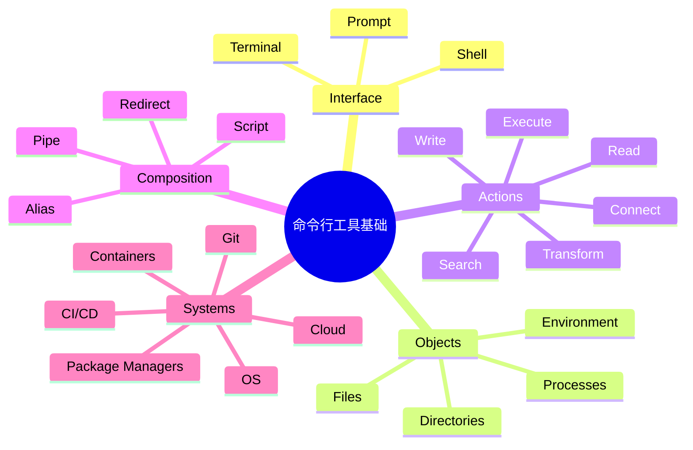
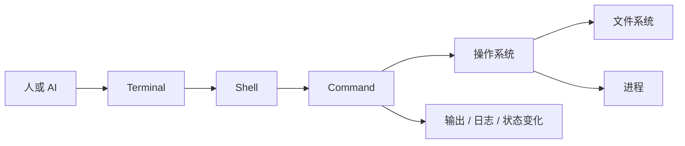

---
vmark:
  id: 019fad04-95a1-7871-a778-26e43a8f65a3
---

# 命令行工具基础：AI 时代学习地图

## 1. 本质（Essence）

> 命令行工具，本质上是用“文本指令”与计算机系统、开发工具和自动化流程进行精确交互的接口。

它存在的原因不是为了让人记住命令，而是为了提供一种可表达、可组合、可复制、可自动化、可审计的工作方式。

没有命令行时，人们通常依赖图形界面：点击按钮、打开菜单、拖拽文件。图形界面对单次操作友好，但对批量任务、重复任务、自动化任务、远程服务器任务不够高效。

命令行带来的新可能是：

- 把操作变成可保存的文本
- 把一次经验变成脚本
- 把人工流程变成自动流程
- 把本地操作迁移到服务器、CI、容器、云环境
- 让 AI 可以稳定地替你执行复杂系统操作

## 2. 世界模型（World Model）

命令行位于“人 / AI / 操作系统 / 工具链”之间，是现代软件工程和系统管理的基础接口。

它处理的对象包括：

- 文件与目录
- 进程与任务
- 输入与输出
- 环境变量
- 网络请求
- 包、依赖、构建产物
- 日志、配置、权限

涉及的角色包括：

- 使用者：人类、AI Agent、脚本、CI 系统
- 执行者：Shell、操作系统、运行时
- 工具：git、npm、python、docker、curl 等
- 目标系统：本地电脑、服务器、容器、云服务

它管理的核心状态变化是：

- 文件被创建、修改、删除
- 程序被启动、停止、后台运行
- 依赖被安装或更新
- 代码被构建、测试、部署
- 系统配置被读取或改变

它改变的工作流是：

> 从“我手动点击完成一次操作”
> 变成
> “我用可复现的文本描述一个操作流程”。

## 3. 概念地图（Concept Map）

### 核心概念关系

| 概念              | 动词    | 目的        | 关系                 |
| --------------- | ----- | --------- | ------------------ |
| Terminal        | 显示、输入 | 提供交互窗口    | 是人与 Shell 之间的界面    |
| Shell           | 解释、执行 | 把文本变成系统动作 | 是命令行的语言环境          |
| Command         | 调用    | 执行一个工具能力  | 是最小操作单元            |
| Argument        | 配置    | 改变命令作用对象  | 告诉命令“对什么做”         |
| Option / Flag   | 调节    | 控制执行方式    | 告诉命令“怎么做”          |
| File            | 存储    | 保存数据或程序   | 是大多数命令的输入或输出       |
| Directory       | 组织    | 管理文件位置    | 决定命令作用范围           |
| Process         | 运行    | 表示正在执行的程序 | 命令执行后通常变成进程        |
| Standard Input  | 输入    | 接收数据      | 可来自键盘、文件、上一个命令     |
| Standard Output | 输出    | 返回结果      | 可显示、保存、传给下一个命令     |
| Pipe            | 连接    | 组合多个工具    | 让一个命令的输出成为另一个命令的输入 |
| Script          | 固化    | 保存流程      | 把一组命令变成可复用工作流      |

## 4. 决策地图（Decision Map）

### 场景 1：需要重复执行同一组操作

Situation

你经常做相同的构建、测试、清理、部署动作。

↓

Decision

使用命令行或脚本表达流程。

↓

Reason

文本流程可以复制、修改、分享和自动运行。

↓

Expected Outcome

人工点击减少，流程更稳定。

### 场景 2：需要处理大量文件

Situation

你要批量重命名、搜索、压缩、转换、移动文件。

↓

Decision

想到命令行工具。

↓

Reason

命令行天然适合“对一组对象应用同一种操作”。

↓

Expected Outcome

几十分钟的手工操作变成几秒钟的批量处理。

### 场景 3：需要让 AI 帮你操作电脑或项目

Situation

你希望 AI 检查代码、运行测试、修改项目、分析日志。

↓

Decision

使用命令行作为 AI 的执行接口。

↓

Reason

AI 最容易可靠操作的是文本、文件、命令和日志。

↓

Expected Outcome

AI 不只是回答问题，而是能真正完成工程任务。

### 场景 4：需要远程管理服务器

Situation

你要部署服务、查看日志、重启进程、排查错误。

↓

Decision

使用命令行连接远程环境。

↓

Reason

服务器通常没有图形界面，命令行是标准控制面。

↓

Expected Outcome

你可以在任何地方管理远程系统。

## 5. 搜索空间扩展（Search Space Expansion）

初学者通常不会想到的问题：

- 命令执行时，当前目录到底是什么？
- 一个命令的输入和输出分别从哪里来？
- 为什么同一个命令在不同机器上结果不同？
- 什么操作是可逆的，什么操作不可逆？
- 为什么权限、路径、环境变量经常导致问题？
- 命令失败时，应该看退出码、错误输出还是日志？
- 命令行和脚本的边界在哪里？
- Shell、Terminal、命令本身是不是同一个东西？

专家真正关心的问题：

- 这个流程是否可复现？
- 是否能在 CI、容器、服务器中运行？
- 是否依赖隐含状态？
- 是否有破坏性操作？
- 是否能失败后恢复？
- 是否能被日志记录和审计？
- 是否可以组合进更大的自动化系统？
- 是否把一次性操作沉淀成了长期资产？

决定这个领域上限的问题：

- 你是否理解“输入 -> 处理 -> 输出”的数据流？
- 你是否能把任务拆成可组合的小工具？
- 你是否能识别系统状态和副作用？
- 你是否能设计可重复、可验证、可回滚的流程？
- 你是否能让 AI、脚本、CI 替你可靠执行？

## 6. 生态系统（Ecosystem）

### 上游

命令行依赖：

- 操作系统
- 文件系统
- Shell
- 用户权限模型
- 环境变量
- 进程模型

### 下游

命令行支撑：

- Git 版本控制
- 软件构建
- 测试自动化
- 包管理
- Docker / 容器
- CI/CD
- 服务器运维
- 云服务管理
- 数据处理
- AI Agent 执行环境

### 替代方案

- 图形界面 GUI
- IDE 按钮和插件
- Web 控制台
- 自动化平台
- 低代码工具

### 互补方案

- 编辑器：VS Code、JetBrains
- 版本控制：Git
- 脚本语言：Python、JavaScript、Bash
- 容器：Docker
- 自动化：Make、Taskfile、GitHub Actions
- AI 工具：Codex、Claude Code、Copilot CLI 类工具

## 7. 可迁移原则（Transferable Principles）

### 第一性原理

- 计算机系统由文件、进程、输入、输出、权限和状态组成。
- 命令行是对这些对象发出精确指令的文本接口。
- 自动化的本质是把可重复操作变成可执行描述。

### 可迁移的方法论

- 把复杂任务拆成小步骤。
- 明确每一步的输入和输出。
- 优先使用可复现流程。
- 对破坏性操作保持警惕。
- 让操作留下日志和证据。
- 先观察，再修改。
- 先小范围验证，再扩大执行。

### 当前实现细节

这些会变化：

- 具体 Shell：bash、zsh、fish
- 具体命令参数
- 操作系统差异
- 包管理工具
- 云平台 CLI
- 工具版本

### 长期稳定的知识

这些更稳定：

- 路径
- 文件
- 目录
- 进程
- 权限
- 输入输出
- 管道
- 环境变量
- 脚本
- 自动化思想

## 8. 最小心智模型（Minimum Mental Model）

如果只能记住 15 个概念，按重要性排序：

1. **Shell**：解释命令的环境。
2. **Terminal**：人与 Shell 交互的窗口。
3. **Command**：一次具体操作。
4. **Argument**：命令作用的对象。
5. **Flag / Option**：命令行为的开关。
6. **File**：系统中最常见的数据对象。
7. **Directory**：文件的组织方式，也是命令的上下文。
8. **Path**：定位文件和目录的地址。
9. **Current Working Directory**：当前命令默认发生的位置。
10. **Process**：正在运行的程序。
11. **Standard Input**：命令接收数据的入口。
12. **Standard Output**：命令返回结果的出口。
13. **Pipe**：把多个命令组合起来。
14. **Environment Variable**：影响命令行为的外部配置。
15. **Script**：把命令流程固化成可重复资产。

核心图景是：

## 9. 常见误区（Common Misconceptions）

### 误区 1：命令行就是背命令

更准确的模型：

> 命令行不是记忆游戏，而是系统交互模型。

真正重要的是理解对象、状态、输入输出和副作用。命令忘了可以查，心智模型错了会做出危险操作。

### 误区 2：图形界面更高级，命令行更原始

更准确的模型：

> GUI 适合探索和单次操作，命令行适合精确、批量、远程和自动化。

两者不是高低关系，而是适用场景不同。

### 误区 3：会敲命令就等于懂命令行

更准确的模型：

> 能判断命令会改变什么状态，才算真正理解。

专业人士关心的不只是“怎么运行”，还包括：

- 会读什么？
- 会写什么？
- 会删除什么？
- 失败后会怎样？
- 能否复现？
- 能否回滚？

### 误区 4：AI 时代不需要学命令行

更准确的模型：

> AI 时代更需要理解命令行的心智模型，但更少需要手记具体语法。

AI 可以帮你写命令，但你需要判断：

- 它是否在正确目录执行？
- 是否会破坏数据？
- 是否需要权限？
- 输出是否可信？
- 失败原因是什么？

## 10. 总结（Summary）

> 我真正获得的不是一组命令，
> 而是理解计算机系统如何被文本化、自动化和可复现控制的能力。

