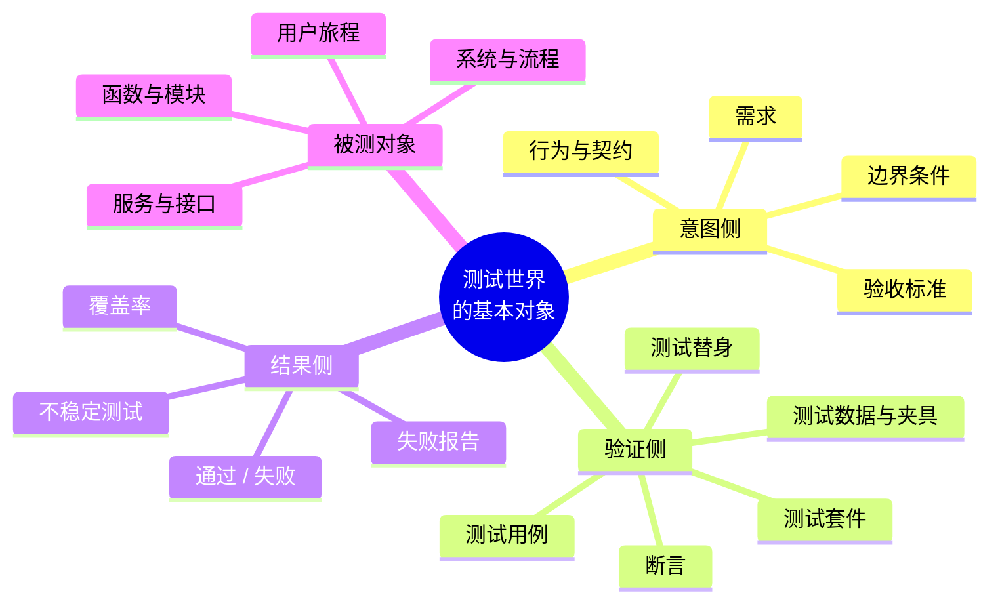
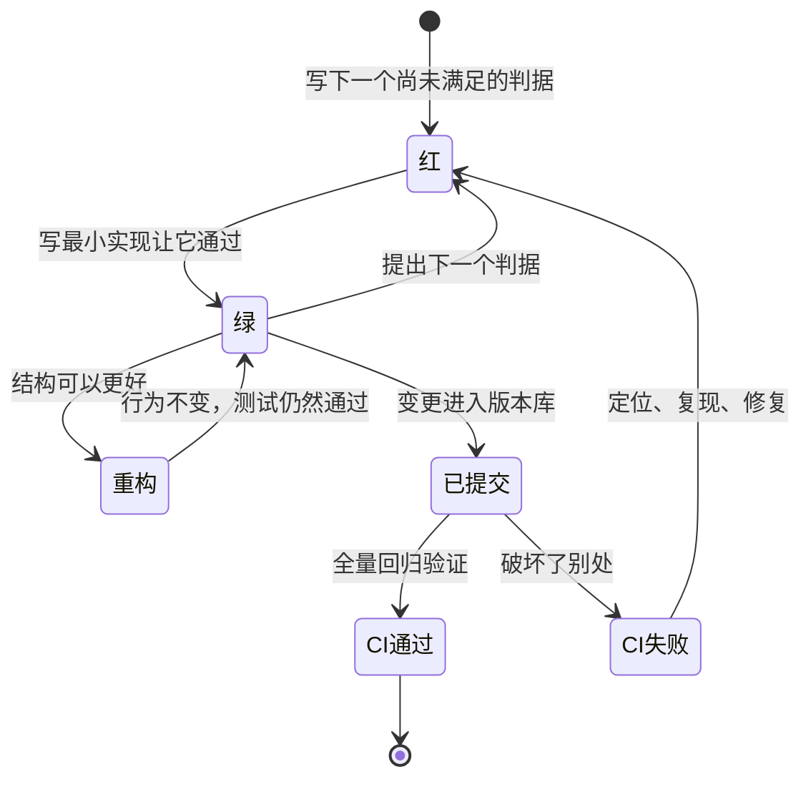
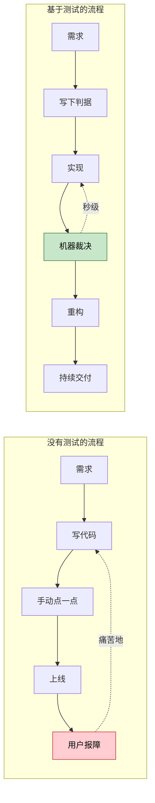
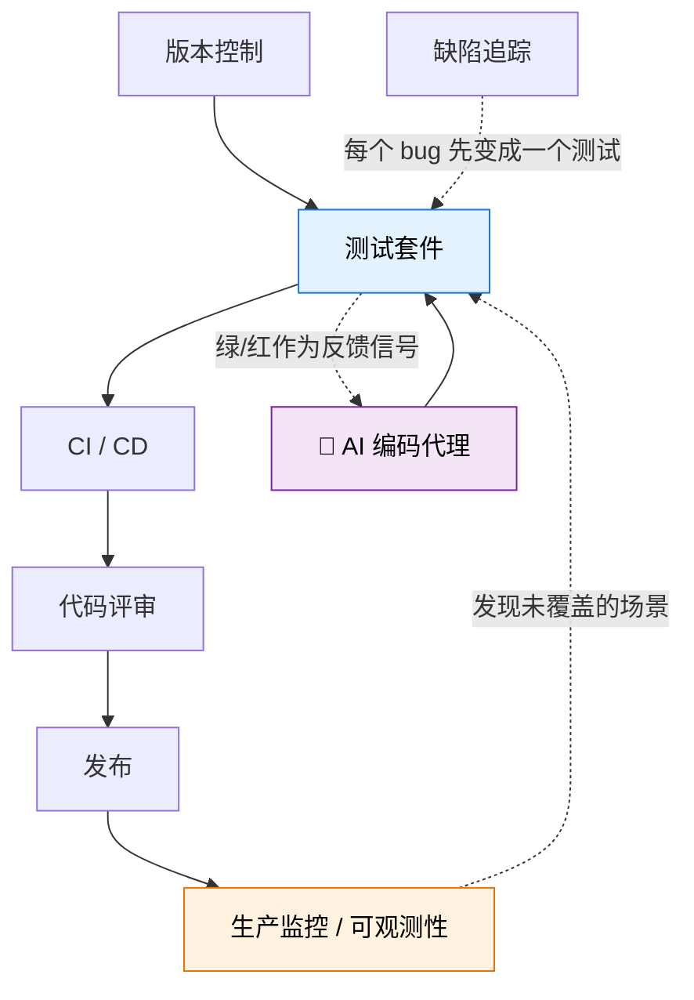
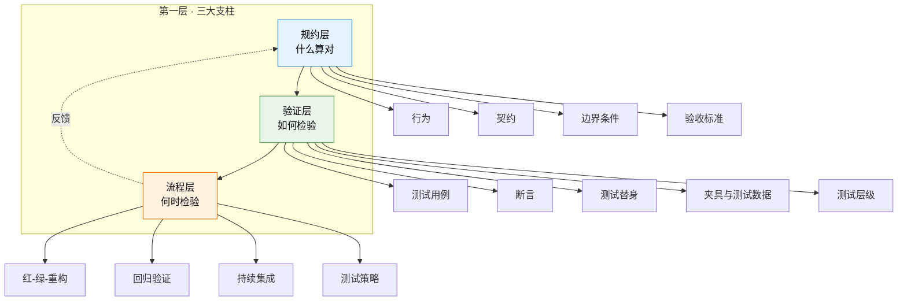
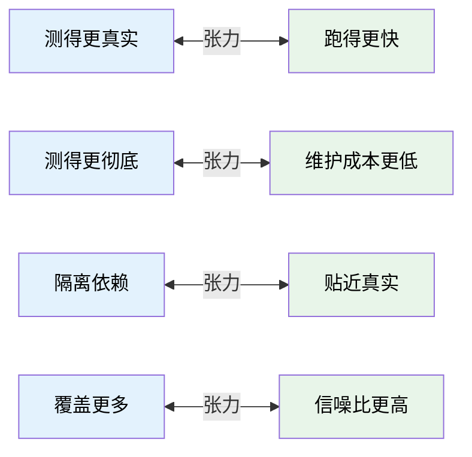
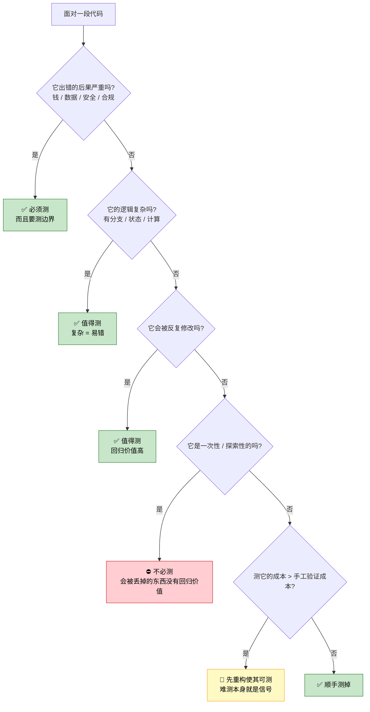
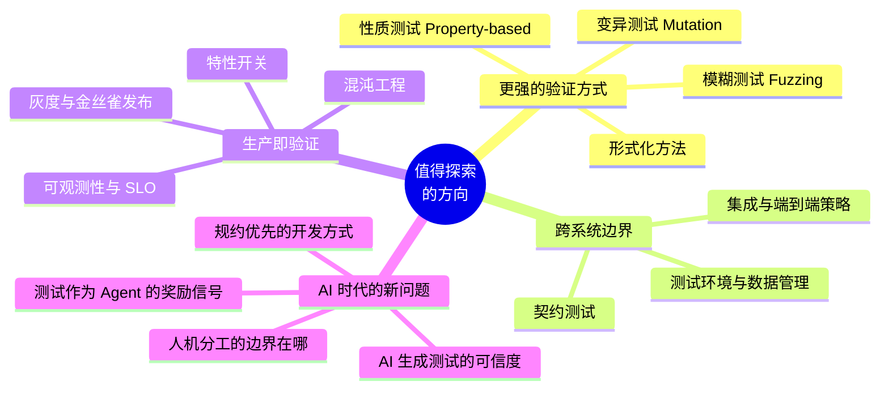
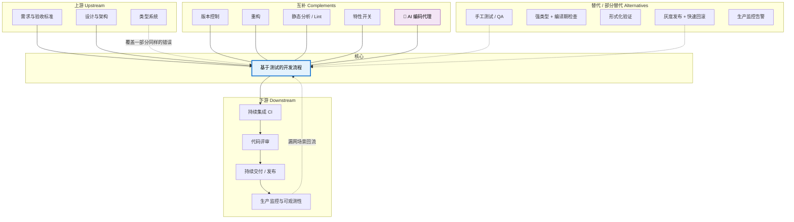

---
vmark:
  id: 019feac4-4f2d-7c41-9add-4fbcd09f1640
---
# 基于测试的开发流程 · 学习地图

> 本文不教你「怎么写测试」，而是帮你建立**心智模型（Mental Model）与世界模型（World Model）**。
> 默认前提：具体的测试框架、断言语法、mock 写法由 AI 替你完成。你需要拥有的，是**判断力**——知道它是什么、为什么存在、什么时候该想到它。

---

## 1. 本质（Essence）

> **一句话：基于测试的开发，是把「怎样才算对」先写成一段可执行的代码，再让实现去满足它——于是「正确」从一种主观感觉，变成了机器可以反复裁决的事实。**

### 为什么它存在？

这是最关键的一问，很多人从没想过。

软件有一个根本困境：**代码会不断改变，但人对代码的信心不会随规模一起增长。**

你写了 100 行代码，改一行，你敢确认没搞坏别的地方。
你写了 100,000 行代码，改一行——你凭什么敢确认？

- 手工验证的成本，随系统规模**指数级**上升
- 需要验证的次数，随修改频率**线性**上升
- 两条曲线相乘，结果是：**只靠人工验证的项目，必然会在某个规模停止改变**

停止改变的软件，不是稳定，是**死亡**。

基于测试的开发存在的理由，不是「为了找 bug」，而是**为了让代码在长期内仍然可以被安全地修改**。

### 它解决什么根本问题？

**「我不知道我有没有搞坏别的东西」这个恐惧。**

想象一个真实场景：你接手一个三年前的项目，产品说要改一个下单逻辑。

现在请回答：

- 你改完之后，怎么知道**退款流程**没被影响？
- 三个月后别人再改这里，怎么知道**你今天的意图**是什么？
- 上线之前，谁来把 200 个业务场景**再走一遍**？
- 如果出问题了，你怎么**证明**是这次改动引起的？

没有测试时，这四个问题的答案分别是：不知道、看运气、没人、靠猜。

有测试时，答案是同一个：**跑一遍，机器告诉你。**

### 没有它时，人们通常怎么办？

| 场景     | 没有测试的做法      | 后果                  |
| ------ | ------------ | ------------------- |
| 验证功能   | 手动点一遍界面      | 只覆盖「我想得到的路径」，边界情况全漏 |
| 防止改坏   | 「我很小心」       | 小心不可复用、不可交接、不可规模化   |
| 回归验证   | 上线前 QA 集中测三天 | 反馈延迟三天，问题堆积到最贵的时刻   |
| 重构老代码  | **不敢碰**      | 技术债永久固化，系统逐渐无法演进    |
| 描述系统行为 | 写一份 Word 文档  | 文档与代码立刻开始漂移，半年后成为误导 |
| 交接工作   | 口头讲 + 看代码    | 「为什么这里要判空」的知识永久丢失   |
| 修 bug  | 改一改，看起来好了    | 三个月后同一个 bug 原样复发    |

### 它带来了哪些新的可能？

1. **安全的重构**：结构可以持续演进，而不是只能不断堆叠
2. **持续集成 / 持续交付**：一天上线十次成为可能，因为验证是自动的
3. **可执行的文档**：测试是唯一一种**不会过期**的文档（过期了它就会失败）
4. **设计的反馈**：难写测试的代码，几乎总是设计有问题——测试是设计的探针
5. **缺陷的早发现**：缺陷成本随发现时间指数上升，测试把发现点提前到「写的当下」
6. **⭐ 工作的可委托性**：**能被自动验收的工作，才能放心交给别人——包括交给 AI**

> 💡 **这一点在 AI 时代变得空前重要。**
>
> AI 可以在几秒内写出上百行代码。真正的瓶颈立刻转移到：**你凭什么相信这些代码是对的？**
>
> 过去，测试是「写完代码之后的保险」。
> 现在，测试是**你对 AI 表达意图的接口，也是 AI 自我纠错的反馈信号**。
>
> 你写判据，AI 写实现，机器裁决对错——这是 AI 编程真正能规模化的唯一形态。
> 没有可执行的判据，你就只能一行行读 AI 写的代码，那样 AI 并没有替你省下什么。

---

## 2. 世界模型（World Model）

基于测试的开发不是「一个工具」或「一种技巧」，它是一套**关于「如何知道自己是对的」的工作系统**。要理解它，先理解这个系统里有什么。

### 它处理哪些对象（Objects）



关键认知：**「行为」是这个世界的核心名词，不是「代码」。**
测试针对的是「系统应该做什么」，不是「代码是怎么写的」。这个区分决定了你的测试是资产还是负债。

### 涉及哪些角色（Actors）

| 角色           | 在这个系统里做什么                        |
| ------------ | -------------------------------- |
| **意图的提出者**   | 决定「什么算对」——产品、用户，也可能就是你自己         |
| **测试的编写者**   | 把意图翻译成可执行的判据（AI 时代，这是人最不该放弃的）    |
| **实现的编写者**   | 让判据变绿——**在 AI 时代，越来越多是 AI**      |
| **CI 系统**    | 不知疲倦的第三方裁判，不看人情、不看资历             |
| **评审者**      | 读测试来理解意图，读实现来判断质量                |
| **未来的维护者**   | 六个月后的别人，或者六个月后的你（同一种人）           |
| **🤖 AI 代理** | 既是实现者，也是测试的生成者——但**不能是判据的最终裁定者** |

> ⚠️ 一个容易被忽略的事实：**测试的真正读者不是机器，是未来的人。**
> 机器只关心它是否通过；人关心它在说什么。

### 管理哪些状态变化（State）



除了这条主循环，你还需要认识几种**危险状态**：

| 状态              | 含义              | 为什么危险                     |
| --------------- | --------------- | ------------------------- |
| **不稳定（Flaky）**  | 同样的代码，有时过有时不过   | 摧毁信任。人会开始「重跑一次试试」，安全网就此失效 |
| **跳过（Skipped）** | 被临时关掉的测试        | 沉默的失败。它不报警，但也不再保护你        |
| **过绿**          | 全绿，但根本没测到关键路径   | 最危险的一种——**它提供的是虚假的安全感**   |
| **过度耦合**        | 改实现细节就挂，改行为反而不挂 | 阻碍重构，把测试从资产变成阻力           |

### 改变哪些工作流（Workflow）



**核心变化：反馈从「上线后由用户提供」，变成「写的当下由机器提供」。**
从几周缩短到几秒。这个数量级的差别，改变的不只是效率，而是**你敢做什么样的事**。

### 与哪些系统交互（Systems）



> 💡 注意那条从**生产监控**回到测试的虚线：线上事故是「现实告诉你测试漏了什么」。
> 成熟团队的标志之一是：**每一次线上故障，最终都会沉淀为一个新的测试。**

### 创造哪些价值（Value）

| 价值        | 具体表现            | 谁受益         |
| --------- | --------------- | ----------- |
| **变更的信心** | 敢改、敢删、敢重构       | 开发者、项目寿命    |
| **反馈的速度** | 秒级知道对错，而不是几天    | 效率、心流       |
| **意图的留存** | 「为什么这里要这样」被固化下来 | 未来的维护者      |
| **设计的压力** | 难测 → 促使解耦       | 系统架构        |
| **风险的前移** | 缺陷在最便宜的时刻被发现    | 成本、用户       |
| **可委托性**  | 工作能被安全地交出去      | 团队协作、**AI** |

---

## 3. 概念地图（Concept Map）

整个领域可以按**三层**组织。重要的不是每个概念的定义，而是它们**互相依赖的方式**。



### 第一层：三大支柱

| 支柱      | 回答的问题 | 核心洞察                         |
| ------- | ----- | ---------------------------- |
| **规约层** | 什么算对？ | 这一层**只有人能决定**，AI 无法替你定义「正确」  |
| **验证层** | 如何检验？ | 技术实现层，**AI 最擅长、最该被委托的部分**    |
| **流程层** | 何时检验？ | 决定反馈循环的长度，也就决定了整个系统的**演进速度** |

> 这三层的关系是：**规约决定价值，验证决定成本，流程决定速度。**
> 大多数人只学了中间那层（怎么写测试），却是两头决定成败。

### 第二层：关键概念（名词 / 动词 / 目的 / 关系）

#### 规约层

| 概念       | 动作      | 目的            | 与谁相关                    |
| -------- | ------- | ------------- | ----------------------- |
| **行为**   | 描述、约定   | 系统对外承诺什么      | 是测试的**唯一合法目标**；对立面是「实现」 |
| **契约**   | 声明、遵守   | 模块之间的边界条件     | 上游是设计，下游是集成测试与契约测试      |
| **边界条件** | 枚举、覆盖   | 找出「正常路径」之外的世界 | 缺陷的绝大多数栖息地              |
| **验收标准** | 商定、可执行化 | 把「做完了」变成客观判断  | 连接产品与工程；也是给 AI 的任务定义    |

#### 验证层

| 概念        | 动作    | 目的             | 与谁相关                   |
| --------- | ----- | -------------- | ---------------------- |
| **测试用例**  | 编写、运行 | 对一个具体场景做出裁决    | 结构固定为 **准备 → 执行 → 断言** |
| **断言**    | 声明期望  | 把「对」写成机器可判定的形式 | 断言的质量 = 测试的质量上限        |
| **测试替身**  | 替换、隔离 | 切断不确定性与外部依赖    | 用得越多，测的越像「自己的假设」而非真实系统 |
| **夹具/数据** | 构造、清理 | 让测试从确定的起点出发    | 决定测试的**独立性**与可重复性      |
| **测试层级**  | 分层、取舍 | 在速度、信心、成本之间做权衡 | 单元 → 集成 → 端到端，越上层越慢越真实 |

#### 流程层

| 概念         | 动作      | 目的            | 与谁相关                 |
| ---------- | ------- | ------------- | -------------------- |
| **红-绿-重构** | 循环推进    | 保证每一步都被验证过    | 微观工作节律；是 TDD 的核心而非全部 |
| **回归验证**   | 全量重跑    | 确认没有破坏既有行为    | 安全网的实际兑现方式           |
| **持续集成**   | 自动触发    | 让反馈不依赖人的自觉    | 上游是版本控制，下游是发布        |
| **覆盖率**    | 度量、解读   | 找出**没被看过的地方** | 是地图，不是分数——见误区三       |
| **测试策略**   | 设计、分配预算 | 决定在哪一层投入多少    | 金字塔 / 奖杯模型；本质是成本曲线问题 |

### 第三层：概念之间的张力（最值得理解的部分）

真正的专业判断，来自理解这些**互相冲突的力**：



| 张力        | 为什么无法两全                  | 通常的解法           |
| --------- | ------------------------ | --------------- |
| 真实 ↔ 速度   | 越真实的测试越接近完整系统，也就越慢       | 分层：底层多而快，顶层少而真  |
| 彻底 ↔ 维护成本 | 测试也是代码，每个测试都要维护          | 只测**重要且易错**的部分  |
| 隔离 ↔ 贴近真实 | 替身让测试稳定，也让它可能测的是幻觉       | 关键路径用真实依赖，边缘用替身 |
| 覆盖 ↔ 信噪比  | 测试越多，噪音（误报、flaky）越多，人越不看 | 宁可少而可信，不要多而无人相信 |

> 💡 **一句话总结这一层：测试不是越多越好，是「信噪比」越高越好。**
> 一套没人相信的测试，比没有测试更糟——因为它同时消耗成本又不提供信心。

---

## 4. 决策地图（Decision Map）

不介绍功能。这一节回答的是：**什么情况下，专业人士会自然地想到「先写测试」？**

### 场景一：需求描述得很模糊

```
Situation：产品说「订单超时要自动取消」，但没说超时从什么时候算、已支付的怎么办
    ↓
Decision：不写代码，先写下三五个具体场景的测试用例，拿去和产品对齐
    ↓
Reason：测试用例逼你把模糊的语言变成具体的输入与期望输出。歧义在这一步暴露，成本是零；
        在代码里暴露，成本是返工；在线上暴露，成本是事故
    ↓
Expected Outcome：需求被澄清，验收标准同时也就写好了，双方对「做完了」的理解一致
```

### 场景二：要改一段没人敢碰的老代码

```
Situation：一个 800 行的函数，三年没人动过，现在必须改
    ↓
Decision：先给它的**现有行为**补上一层测试（哪怕行为本身有问题），再开始改
    ↓
Reason：你需要的不是「证明它是对的」，而是「一张现状的快照」——
        这样任何被你改变的东西都会亮红灯
    ↓
Expected Outcome：从「不敢改」变成「改了会有人告诉我」，重构成为可能
```

### 场景三：线上出现了一个 bug

```
Situation：用户报障，某种情况下金额计算错误
    ↓
Decision：**先写一个能稳定复现这个 bug 的失败测试**，再去修
    ↓
Reason：① 证明你真的理解了问题，而不是碰巧改好了
        ② 修完之后这个测试永久留下，同一个 bug 不会复发
        ③ 如果你写不出复现测试，说明你还没找到根因
    ↓
Expected Outcome：缺陷被真正根除，并转化为永久的防护；测试套件随事故不断变强
```

### 场景四：要让 AI 写一个模块 ⭐

```
Situation：需要一个价格计算模块，逻辑不复杂但规则很多，打算交给 AI 写
    ↓
Decision：自己写测试（或至少亲自审定测试），让 AI 写实现，让它跑到全绿为止
    ↓
Reason：AI 生成代码的速度远超你阅读代码的速度，逐行审查会变成新瓶颈。
        测试把「审查实现」变成「审查意图」——你只需要确认判据是对的，
        剩下的由机器裁决。这也让 AI 获得了自我纠错的反馈信号
    ↓
Expected Outcome：你的注意力集中在最不可替代的地方（什么算对），
                  AI 在一个封闭的验证循环里迭代到正确
```

> ⚠️ **关键纪律：不要让 AI 同时写测试和实现，然后自己都不看。**
> 那等于让考生自己出题、自己判卷。AI 可以起草测试，但**判据必须经过你的确认**——
> 这是你在整个流程中最后、也最重要的把关点。

### 场景五：性能优化

```
Situation：一段代码太慢，想重写成更高效的实现
    ↓
Decision：先确保它的行为被测试覆盖，再动手优化
    ↓
Reason：优化的定义是「行为不变，性能更好」。没有测试，你无法证明前半句，
        那你做的就不是优化，是重写并祈祷
    ↓
Expected Outcome：可以放心尝试激进的优化方案，随时验证行为一致性
```

### 场景六：依赖一个不稳定的外部服务

```
Situation：功能依赖第三方支付接口，对方偶尔超时、测试环境经常挂
    ↓
Decision：用测试替身隔离外部依赖；同时保留少量真实调用的契约测试
    ↓
Reason：不确定性必须被关进笼子，否则测试会变得不可信（flaky）；
        但完全隔离又会让你测不到「对方改了接口」这类真实风险
    ↓
Expected Outcome：日常开发有快速稳定的反馈，同时不对外部契约完全失明
```

### 场景七：团队新人接手项目

```
Situation：新同事问「这个模块是干什么的」
    ↓
Decision：让他先读测试，而不是先读实现
    ↓
Reason：测试描述的是「系统承诺做什么」，实现描述的是「它碰巧是怎么做的」。
        前者是知识，后者是细节。而且测试**不会过期**
    ↓
Expected Outcome：新人以行为而非实现细节建立理解，上手更快也更不容易改坏
```

### 决策树：这段代码，到底该不该写测试？



> 💡 注意最下面那条路径：**「难以测试」不是跳过测试的理由，而是重新设计的信号。**
> 这可能是整个领域最有价值的一条反馈。

---

## 5. 搜索空间扩展（Search Space Expansion）

假设你是初学者。这一节的目的不是回答问题，而是让你看见**你还不知道自己不知道的地方**。

### 初学者通常不会想到的问题

| 问题                    | 为什么重要                                    |
| --------------------- | ---------------------------------------- |
| **测试本身也需要维护，成本从哪来？**  | 测试是代码，会腐化、会阻碍重构。写测试是投资，也是负债              |
| **测试会不会撒谎？**          | 会。flaky 测试、测了假依赖、断言写错——一个错误的绿灯比红灯危险得多    |
| **什么不该测？**            | 取舍能力比覆盖能力更稀缺。测所有东西 = 没有重点                |
| **测试应该在多久内跑完？**       | 反馈延迟决定了你会不会真的去跑它。超过几分钟，人就开始跳过它           |
| **测试挂了，是代码错了还是测试错了？** | 这个判断需要你理解「行为 vs 实现」的区别，否则你会习惯性地改测试来迁就代码  |
| **谁来测试测试？**           | 变异测试就是在回答这个问题——故意改坏代码，看测试能不能发现           |
| **测试和类型系统是什么关系？**     | 两者都在做「提前排除错误」，覆盖的错误种类不同，可以互相替代一部分        |
| **AI 生成的测试可信吗？**      | AI 倾向于测「代码现在的样子」而不是「它应该的样子」——会把 bug 固化下来 |

### 专家真正关心的问题

- **信噪比**：这套测试里有多少是真的在保护我们，多少只是在制造噪音和维护成本？
- **反馈延迟**：从写下一行代码到知道对错，中间隔了多久？这个数字是工程效率的**根本变量**。
- **耦合度**：我们的测试，是在「改实现时挂」还是「改行为时挂」？前者是负债，后者是资产。
- **可测试性即设计**：系统难测的地方，是不是就是设计最糟的地方？测试是设计质量的**免费探针**。
- **不确定性的边界**：时间、随机、并发、网络、外部系统——这些不确定性被隔离在哪一层？
- **测试的成本曲线**：在单元层多花一小时，能省下集成层的几小时？边际收益在哪里递减？
- **生产环境算不算测试环境**：灰度、金丝雀、特性开关、可观测性——它们是测试策略的延伸，还是替代？
- **⭐ 意图的可编码程度**：我们能把多少「什么算对」写成可执行判据？这个比例，直接决定了**能把多少工作安全地委托给 AI**。

### 下一步值得探索的方向



### 哪些问题决定了这个领域的上限？

1. **反馈循环能压缩到多短？** —— 这是软件工程效率的第一性变量，比任何工具选择都重要
2. **意图能被编码到什么程度？** —— 决定了自动化与委托（给人、给 AI）的天花板
3. **可测试性能否成为设计的默认约束？** —— 决定系统是越改越好还是越改越烂
4. **验证的成本能否低于犯错的成本？** —— 这个不等式一旦成立，整个方法论就自动成立；不成立时，硬做就是浪费

---

## 6. 生态系统（Ecosystem）

孤立地理解「测试」会走偏。它在一张更大的网里。



### 上游：谁在为它提供输入

| 上游          | 关系                                   |
| ----------- | ------------------------------------ |
| **需求与验收标准** | 测试是验收标准的可执行形式。需求越清晰，测试越好写——反之亦然      |
| **设计与架构**   | 解耦的设计让测试便宜，耦合的设计让测试昂贵。**两者是同一件事的两面** |
| **类型系统**    | 编译期就能排除一整类错误，测试就不必再管它们。两者是**分工**不是竞争 |

### 下游：它使谁成为可能

| 下游       | 关系                           |
| -------- | ---------------------------- |
| **持续集成** | 没有自动化测试，CI 只是「自动编译」，价值有限     |
| **代码评审** | 评审者读测试理解意图，把注意力从「对不对」转到「好不好」 |
| **持续交付** | 一天上线十次的前提，是每次上线的验证成本接近于零     |
| **可观测性** | 生产环境的「测试」——它发现的问题应该回流成新的测试用例 |

### 替代方案：什么情况下可以不用它

诚实地说，测试并非唯一手段，也不总是最优解：

| 替代方案            | 什么时候它更合适                   | 代价                     |
| --------------- | -------------------------- | ---------------------- |
| **手工测试 / QA**   | 探索性验证、体验判断、一次性活动页面         | 不可复用、不可回归、不可自动化        |
| **强类型 + 编译期检查** | 结构性错误（拼写、类型、空值）——这类根本不该写测试 | 只能覆盖形状，覆盖不了业务语义        |
| **形式化验证**       | 关键算法、协议、安全边界，正确性的价值极高时     | 成本极高，适用范围窄             |
| **灰度 + 快速回滚**   | 变更快、影响可逆、用户容忍度高的场景         | 用真实用户承担风险，只适合影响可控的变更   |
| **生产监控告警**      | 你无法在测试环境复现的问题（真实流量、真实数据规模） | 反馈最晚、成本最高，但**无法被完全替代** |

> 💡 **正确的心智模型不是「要不要测试」，而是「把验证放在哪一层最划算」。**
> 测试、类型、评审、灰度、监控——它们是同一条防线上的不同位置，各自拦截不同的错误。

### 互补方案：谁让它更强

- **版本控制** —— 测试让你敢改，版本控制让你敢撤销。两者合起来才叫「安全网」
- **重构** —— 没有测试的重构是赌博；没有重构的测试是浪费（因为你不敢用它换来的自由）
- **静态分析** —— 拦截测试懒得管的低层次问题，让测试专注于业务语义
- **特性开关** —— 让「未完成的东西」可以安全地进入主干，与持续集成配合
- **🤖 AI 编码代理** —— **测试是 AI 的验收边界与反馈信号；AI 是测试的加速器**。这是当前最重要的一组互补关系

---

## 7. 可迁移原则（Transferable Principles）

区分「**十年后还成立的**」和「**明年就变的**」，是学习效率的关键。

### 🏛️ 第一性原理（几十年不变）

1. **反馈越早越便宜** —— 缺陷的修复成本随发现时间**指数上升**。这是整个方法论的经济学基础
2. **可验证性是委托的前提** —— 不能验收的工作，无法安全地交给任何人（包括 AI），也无法自动化
3. **意图与实现必须分离** —— 混在一起，你就无法在不改变意图的前提下改进实现
4. **只有自动化的判据才能规模化** —— 依赖人的自觉的东西，一定会在压力下第一个被放弃
5. **难以验证，通常意味着设计有问题** —— 测试的困难是设计的诊断信息，不是测试的问题
6. **一个不被信任的信号等于没有信号** —— flaky 测试、噪音告警，比不存在更糟

### 🧭 可迁移方法论（远超软件领域）

- **先定义「什么算完成」，再开始做** —— 写文章、做项目、谈合作，全都适用
- **小步前进，每步可验证** —— 大步跳跃时，你无法定位是哪一步错了
- **先复现，再修复** —— 不能稳定复现的问题，你修的可能只是它的影子
- **每次踩坑，都留下一个不会再踩的机制** —— 把教训固化成检查，而不是固化成「记住」
- **把知识写进可执行物** —— 而不是写进文档、写进流程手册、写进人脑
- **区分「测行为」与「测实现」** —— 对应到任何领域：**考核结果，还是考核动作**

> 这几条的适用范围远远超出写代码：**招聘（先定义什么是好候选人）、写作（先定义读者读完应该获得什么）、
> 团队管理（先定义可观测的成功标准）、个人系统建设**——本质上是同一件事。

### 🔧 当前实现细节（会变，交给 AI）

- 具体的测试框架与断言语法
- mock / stub 库的用法
- 覆盖率工具的配置
- CI 平台的 YAML 写法
- 各语言测试文件的组织约定

> **这一类，正是可以放心交给 AI 的部分。不需要背。**

### 📌 长期稳定 vs 容易变化

| 长期稳定（值得投入）      | 容易变化（不必深究）  |
| --------------- | ----------- |
| 反馈循环的思维方式       | 某个框架的断言写法   |
| 「行为 vs 实现」的区分能力 | mock 库的 API |
| 判断「什么该测、什么不该测」  | 覆盖率工具的配置项   |
| 测试层级的成本 / 信心权衡  | 当下流行的测试框架排名 |
| 把模糊需求转成具体判据的能力  | CI 平台的具体语法  |
| 对不确定性的隔离直觉      | 测试目录的命名约定   |

---

## 8. 最小心智模型（Minimum Mental Model）

> 如果只能记住 **15 个概念**，就是这些。按重要性排序。

| #      | 概念                 | 为什么它排在这个位置                         |
| ------ | ------------------ | ---------------------------------- |
| **1**  | **测试 = 意图的可执行编码**  | 全部价值的源头。它不是「检查代码的工具」，是「把正确写下来」的方式  |
| **2**  | **反馈循环及其长度**       | 决定你敢做什么。几秒 vs 几天的差别，改变的是行为而不只是效率   |
| **3**  | **变更的安全网**         | 测试存在的**根本理由**——不是找 bug，是让代码可以持续被改动 |
| **4**  | **测行为，不测实现**       | 决定测试是资产还是负债的**单一最重要判断**            |
| **5**  | **红 → 绿 → 重构**     | 微观工作节律：先定义对，再实现，再改好。顺序本身就是方法       |
| **6**  | **先复现，再修复**        | 把每个 bug 变成永久防护；也是「你是否真的理解问题」的检验    |
| **7**  | **测试层级与权衡**        | 快而假 vs 慢而真。不理解这个权衡，测试策略必然失衡        |
| **8**  | **确定性与隔离**         | 时间、随机、网络、并发必须被关进笼子，否则测试不可信         |
| **9**  | **准备 → 执行 → 断言**   | 每个测试的通用骨架。结构清晰的测试，才是可读的文档          |
| **10** | **覆盖率是地图，不是分数**    | 它告诉你「哪里没被看过」，不告诉你「看过的地方是对的」        |
| **11** | **不稳定测试是负资产**      | 它同时消耗成本和信任。**要么修好，要么删掉，不要留着**      |
| **12** | **可测试性 = 设计质量的镜子** | 难测不是测试的问题，是设计在向你报警                 |
| **13** | **测试也是代码，有维护成本**   | 这个意识让你从「多写测试」转向「写对的测试」             |
| **14** | **知道什么不该测**        | 取舍能力比覆盖能力稀缺得多。会做减法才算入门             |
| **15** | **🤖 人定判据，AI 写实现** | AI 时代最重要的一条：你的角色是**规约的作者与判据的裁定者**  |

> 💡 前 3 个是**世界观**，4–11 是**机制**，12–15 是**工程判断力**。
> 如果时间有限，**深刻理解第 1、2、4 条 + 第 15 条**，就已经超过绝大多数只会写测试的人。

---

## 9. 常见误区（Common Misconceptions）

### 误区一：「测试是为了找 bug」

- **为什么会这样想**：直觉如此——跑测试，发现问题，修掉，看起来就是在找 bug
- **✅ 更准确的模型**：找 bug 只是副产品。测试的主要价值是**让未来的修改变得安全**。一个测试一生中最有价值的时刻，不是它第一次发现问题，而是三年后某人改代码时它突然亮红灯。**测试保护的不是今天的代码，是明天的自由。**

### 误区二：「基于测试的开发就是『先写测试』」

- **为什么会这样想**：TDD 常被简化为一句口号
- **✅ 更准确的模型**：「先写」只是手段，目的是**让你在写实现之前，被迫先想清楚「什么算对」以及「这东西怎么被使用」**。它本质上是一种**设计方法**——先站在使用者的角度，再站在实现者的角度。理解了这个，你就知道什么时候可以不严格「先写」，什么时候必须先写。

### 误区三：「覆盖率越高，质量越好」

- **为什么会这样想**：覆盖率是唯一一个看起来客观、可比较的数字，于是被当成 KPI
- **✅ 更准确的模型**：覆盖率衡量的是**代码被执行过**，不是**行为被验证过**。一个不含任何断言的测试可以拿到 100% 覆盖率。正确的用法是**反着读**：看那些**没被覆盖的地方**，问一句「这里为什么没人测？」——覆盖率是一张地图，标出你没去过的地方，仅此而已。

### 误区四：「写测试会拖慢开发速度」

- **为什么会这样想**：写测试确实要花时间，而且这个成本立刻可见；节省的成本却分散在未来，不可见
- **✅ 更准确的模型**：它拖慢的是**第一次写完的时刻**，加速的是**之后的每一次修改**。项目越长、改动越多，收支平衡点越早到来。**短期项目、一次性脚本，不写测试是对的**——这不是妥协，这是正确的成本判断。误区在于把一个「取决于时间跨度」的问题，当成了一个非黑即白的原则问题。

### 误区五：「有了 AI，就不需要测试了」⭐

- **为什么会这样想**：AI 写代码又快又像模像样，看起来能力已经足够
- **✅ 更准确的模型**：**恰恰相反——AI 让测试从「好习惯」变成了「必需品」。** 当代码的产出速度提升十倍，而你阅读和理解代码的速度没变，唯一的出路是**把验证也自动化**。测试是你对 AI 表达意图的接口、是它的验收边界、是它自我纠错的反馈信号。**没有可执行的判据，你只能选择「逐行审查」或者「盲目信任」，两条路都走不通。**

### 误区六：「测试挂了，那就改测试让它过」

- **为什么会这样想**：红灯挡路，改测试是最快让它变绿的方法
- **✅ 更准确的模型**：红灯是在提出一个问题：**「行为变了」还是「行为没变但测试写错了」？** 只有确认是后者，才应该改测试。习惯性地改测试迁就代码，等于慢慢拆掉自己的安全网——最后你会拥有一套永远全绿、但什么也不保护的测试。

### 误区七：「所有代码都应该有测试」

- **为什么会这样想**：听起来严谨、正确、无可指摘
- **✅ 更准确的模型**：测试是有成本的投资，应该投在\*\*「出错代价高」× 「容易出错」× 「会被反复修改」\*\*的地方。给一个一次性的数据迁移脚本、一个探索性的原型写完整测试，是把资源花在了没有回报的地方。**专业性体现在取舍，不在覆盖。**

### 误区八：「测试环境全绿 = 线上不会出问题」

- **为什么会这样想**：绿灯给人的心理暗示太强
- **✅ 更准确的模型**：测试只能验证**你想到的场景**。真实流量、真实数据规模、真实并发、真实的用户奇怪操作，永远有你没想到的部分。所以成熟的做法是**多层防线**：测试拦住已知的，灰度限制未知的影响面，监控发现漏网的，然后**把漏网的补回测试里**。

---

## 10. 总结（Summary）

> **我真正获得的不是** ~~一套写测试的技巧和框架用法~~，
> **而是**「**把『什么算对』提前变成可执行判据**」的能力——
> 以及由此带来的三种自由：**敢改、敢删、敢把活交出去**。

---

### 一句话回顾


> **测试从来不是「写完代码之后的作业」，而是「你如何知道自己是对的」这个问题的工程化答案。**
>
> 在 AI 时代，这个问题的重要性上升到了前所未有的高度：
> 当写代码这件事的成本趋近于零，**定义「什么是对的」就成了人类剩下的、也是最核心的工作。**
>
> 你不再是那个写实现的人，你是那个**说清楚什么算对、并让机器替你反复确认**的人。

---

*本文档为长期维护型学习地图，随理解加深可持续修订。*
*生成模型：Claude Opus 5 ｜ 生成日期：2026-08-10*
